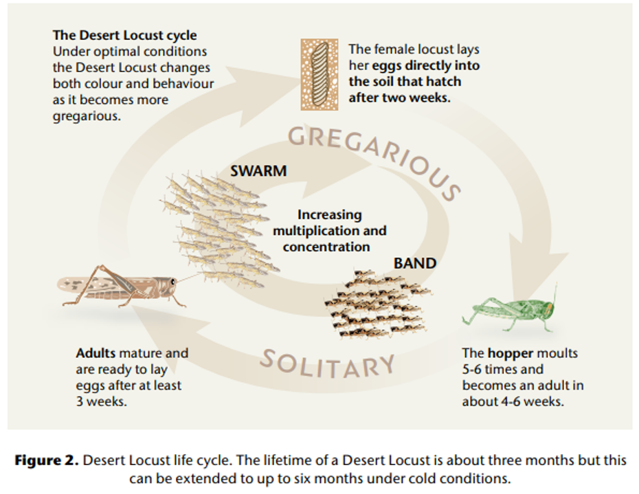
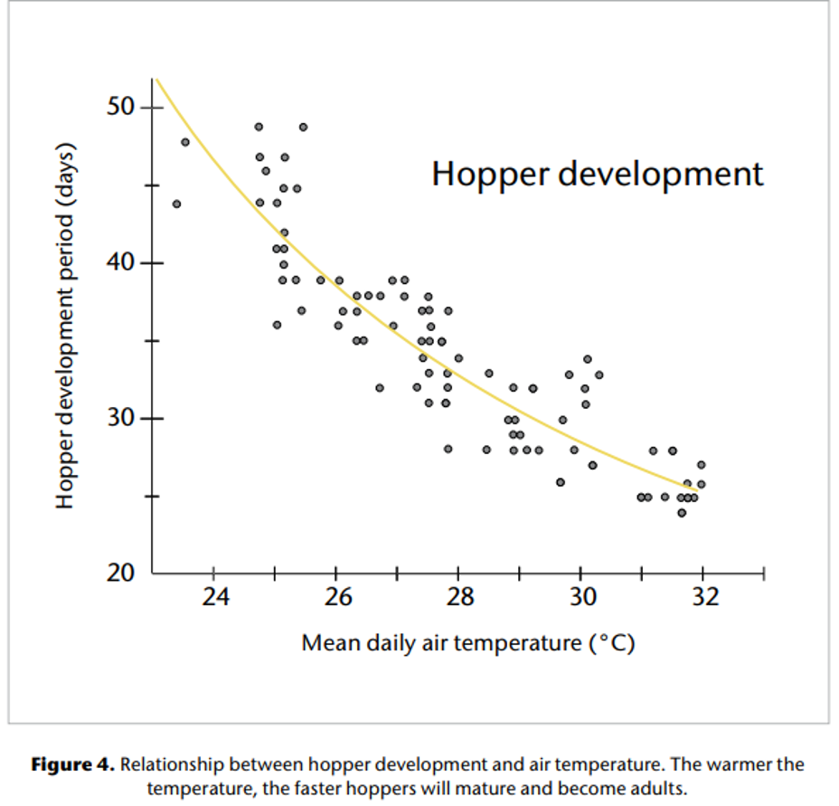
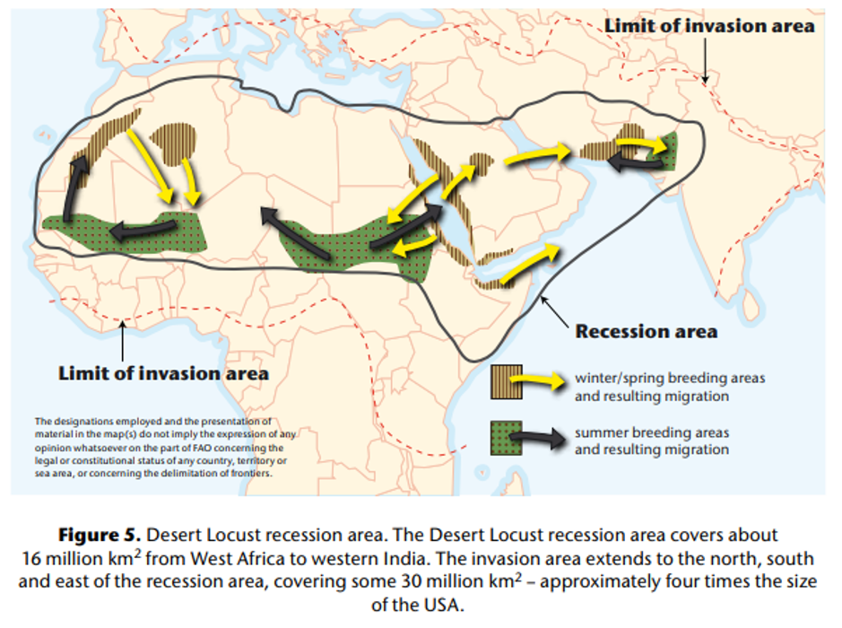
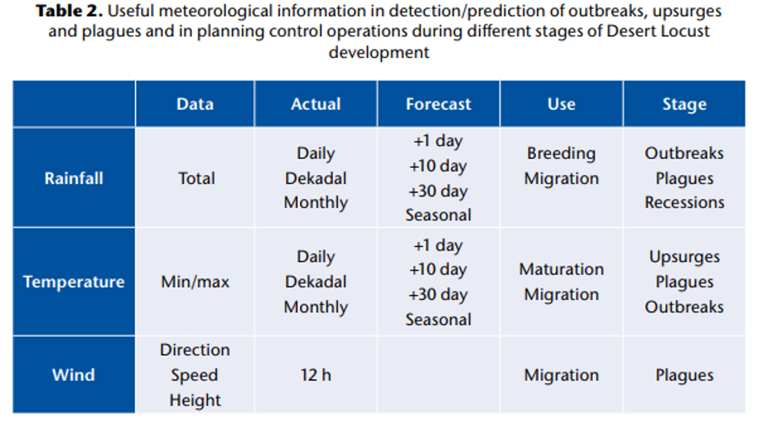
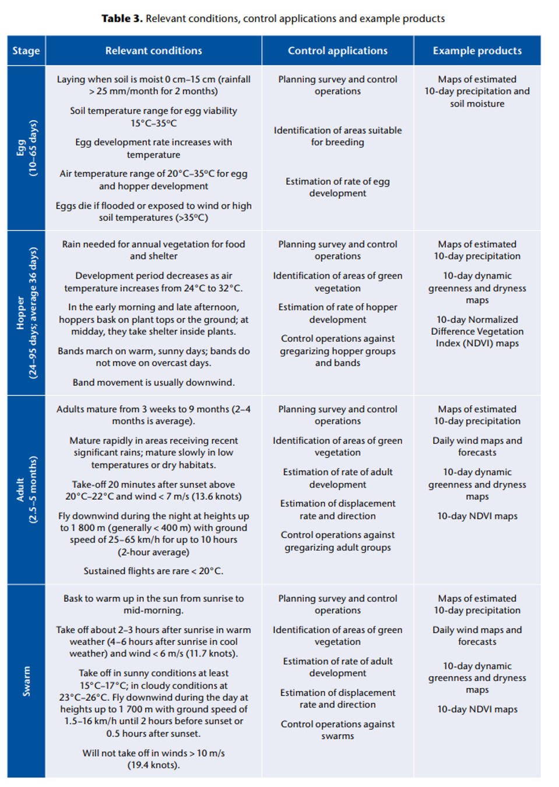
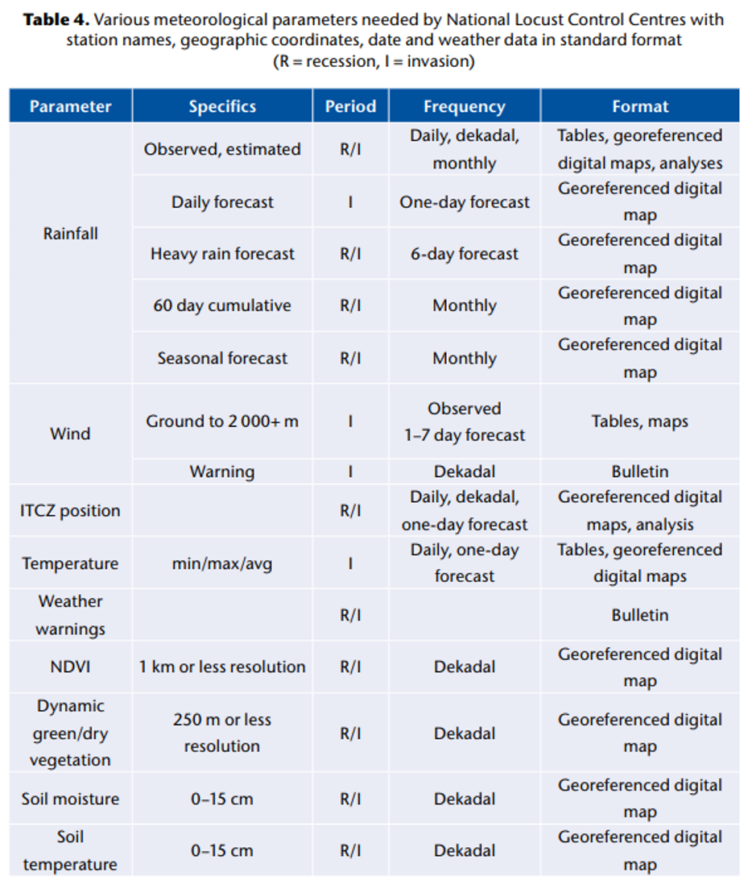

# 沙漠蝗

本文简单记录了联合国粮农组织的 [Weather and Desert Locusts](http://www.fao.org/3/i6152en/i6152en.pdf) 一文的主要内容。主要介绍了 Desert Locusts 的生物行为信息，历史事件，影响蝗灾发展的天气因素以及如何使用天气信息。

过去30多年，蝗灾在非洲，近东和西南亚地区对粮食安全产生的负面影响造成了严重的损失。蝗灾是不定期，短时的，这种特点造成 人类为此准备的力量并不充足 的局面，包括人员无经验，除害设备不足等。根据以往防灾经验看，现有的预防措施并不完善，而未来势必还会有蝗灾，因此FAO 出台了一系列指导和操作手册。关于气候变化对沙漠蝗的影响仍在研究中，各地决策者需要做长期考虑。也需要加强国际合作来更好的研究沙漠蝗在变化气候气象条件的行为模式，并制定适应性的调整策略。

沙漠蝗控制是一个国际性问题，因为沙漠蝗繁殖移动范围极广，蝗灾蔓延很快。这迫使受灾国家要联合起来共同应对。

FAO和世界气象组织WMO 从1951年开始就共同致力于沙漠蝗问题，那时就设置了 Technical Assistance Mission for Desert Locust Control 。蝗群移动假说认为其主要发生在下风朝向和有表面气流会聚的区域。WMO的气象学家已加入 WMO和FAO 的国家沙漠蝗计划来提高应对蝗灾的协作控制能力。

FAO是沙漠黄检测和控制及运作沙漠蝗信息服务（DLIS）的领导机构。所有蝗虫影响的国家传输蝗虫和环境数据以及调查和控制结果，还有天气和栖息地数据及卫星图像到DLIS中来分析，以评估当前的蝗虫态势，提供达6个星期的预报并发布早期预警。FAO 会准备蝗虫月报并定期更新预报规模，位置和国家范围的蝗虫迁移时机及产卵情况。这些信息组成了早期预警系统来警示各个国家灾害的发展。信息通过email，[Locust Watch网站](http://www.fao.org/ag/locusts)，和社交媒体来发布。

FAO实行了野外评估任务，协助调查和控制策略以及灾时帮助等以与受影响国家的合作。FAO 已经给了一个高优先级的特殊计划： the Emergency Prevention System for Transboundary
Animal and Plant Pests and Diseases ， 以加强国家治灾能力。

作为联合国系统中天气，水和气候方面的权威，WMO 给FAO提供了很有价值的帮助来确保WMO成员和他们的NMHSs 来为蝗灾国家提供近实时的气象数据和预报。WMO也维护了一个转为蝗灾控制的气象信息网页，该网页在 [World AgroMeteorological Information Service (WAMIS) 网站](http://www.wamis.org/locust/index.php)上。WAMIS是一个由WMO成员提供的农业气象产品 web服务。

## 沙漠蝗

蝗虫是蝗科的成员，大多数是短角蚂蚱。蝗虫和蚂蚱的区别在于在一定气象条件它们能改变自己的行为和生理机能，尤其是其形态（颜色和形状），以响应虫群密度的变化。亿万成年蝗虫能聚集成群。不能飞的hopper阶段的蝗虫也能聚集到一起，称作hopper bands。

沙漠蝗常出现在西非国家毛里塔尼亚和印度之间的沙漠地区。数量少时是个体形态 (solitarious phase)，而多时，就会表现为集群 (gregarious phase)。颜色和形状可以作为区别的特征。

当有充足降雨和绿色植物时，沙漠蝗可以迅速增加，一到两个月就能开始成群。一次爆发通常在5000平方公里内。

如果邻近地区广泛或不寻常的大雨出现，从而创造有利的繁殖条件，那么不受控制的暴发可发展成高潮。如果一个高潮不受控制，且生态条件仍有利于繁殖，那么蝗群会继续增加，当两个区域被同时影响时，一次灾害就发生了。

outbreaks 常有而upsurge不多，upsurge也很少会形成plague，但是一旦形成，破坏惊人，可能威胁全球10分之一的人口。1平方公里的虫群能吃掉35000人一天的口粮。

控制蝗虫的复杂在于：

- 虫群高速移动，一天50－100km；
- 总入侵期通常发生在相对较短的时间内，有时短至一个月，但很少超过3个月
- 虫群在时间上分布不均匀，因此非常大的虫群可能只存在几天，随后相当长的一段时间内没有虫群
- 虫群大小变化，最大可至几千亩
- 因为蝗灾不定期发生，受蝗灾影响的国家往往缺乏防治经验、资金和物资。

沙漠蝗的生命周期如下图所示。

### 蛋

蛋通常产在裸露的沙土上，需要前期降雨。一般情况下，除非地表以下5 - 10厘米的土壤湿润，否则沙漠蝗不会产卵。在柔软的沙质土壤中，只有在深度低于12厘米的地方才有水分，沙漠蝗会产卵。在产卵前，沙漠蝗通常会探测土壤，插入腹部的尖端以确定是否有足够的水分。

沙漠蝗经常密集地产下卵荚，每平方米有数十甚至数百个卵荚。每个卵荚在群居期含有不到80个蛋，而在独处期通常含有90到160个蛋。产卵只发生在少数明显合适的地点。在理想的温度和栖息地条件下，一只雌蝗虫在一个世代内最多可繁殖16只－20只蝗虫。

### 生长

沙漠蝗几乎总是把卵产在足够湿润的土壤里，让卵吸收足够的水分来完成发育。如果产在干燥的土壤里，它们就会变干(变干)，除非不久之后下雨。卵的生长和温度之间的关系如下：

也就是说温度越高，孵化的越快。因此从气温甚至其长期平均值都可以令人满意地预测卵的发育速度。因为在大多数繁殖地区，某一特定地点和时间的年与年之间的温度变化不大。然而，也有例外，尤其是在冬季，天气可能异常温暖，使得卵发育得以继续。

hoppers的发展与气温有关，如下图所示。

温度越高，生长越快。蝗虫群经常出现在开阔的、不太均匀的栖息地，那里有大片的植被，植被相对密集，被大片的裸土隔开。

随着hoppers聚集，蝗虫开始形成bands。在温暖和晴朗的日子，hopper bands遵循一种行为模式，即在一天中交替栖息和行进。多云的时候，bands通常不会运动太远。一天之内，bands移动的方向通常不会变。方向通常都是下风向。

一旦能飞，个体态的蝗虫会在高于20-22°C，风速小于7米/秒(13.6节)时，在夜间迁徙。它们通常在日落后20分钟起飞，飞行时间可达10个小时，通常一次只飞行几个小时。有的被雷达在高达1800米探测到。

### 受影响区域

在平静时期，沙漠蝗灾通常出现在西非和印度之间的25个国家的大约1600万平方公里的沙漠地区(如下图)。在蝗灾期间，国家的数量和潜在受影响地区的面积增加了一倍，约占地球陆地面积的20%。在衰退地区，也就是在平静时期正常的地区，蝗虫随风而动。它们在夏季(萨赫勒和印度-巴基斯坦沙漠)和冬季/春季(非洲西北部、红海沿岸、俾路支省(巴基斯坦)和伊朗伊斯兰共和国)进入特定区域。如果大雨连续不断地落在季节性的繁殖地，蝗虫就会变绿，除非受到控制、干旱或迁移到不合适的栖息地，否则就会发生蝗灾。一般认为，连续两个月雨量超过25毫米，便足够蝗虫繁殖和发展

如果以下回答是yes，那么蝗虫很大概率会迁徙：

(a) Can the locusts fly?
(b) Is the temperature warm enough?
(c) Is the wind not very strong?
(d) Are ecological conditions dry where the locusts are now?

## 天气

蝗虫的全生命期内各阶段都需要理想的气象条件。气象条件对于评估当前态势和预测未来走向都很有帮助。像温度，气压和风的数据通常都是有价值的。

对降雨，土壤含水量，土壤和空气温度，风和天气尺度模式和大气的对流状态都是有价值的。

降雨量数据可以用来确定哪些地区适合繁殖，或者哪些地区可能有绿色植被和蝗虫。

温度数据可以用来估计虫卵和hoppers的发育速度，也可以用来指示成虫是否有足够的温度起飞和飞行。

当成虫或群可能迁移或估计是否有来自邻国的虫入侵威胁时，风和大规模(天气)数据是有用的。

在衰退期间，最重要的监测变量是降雨量、植被和土壤湿度。在爆发、高潮和灾害期间，更多的环境条件发挥了作用。

### 重要的天气信息和条件

需要三类信息： climate, actual weather and forecasts. 

根据这些信息可以判断：

(a) Where breeding is likely to occur;
(b) When the next generation is likely to be flying;
(c) Where and when that generation is likely to reach areas at risk of invasion;
(d) Effects of weather on logistics of survey and control – the moving of staff and materials, as well as ground and aerial control operations against hoppers and swarms. 

在国家和国际两级收集和报告数据的方式上的差异以及气象数据的稀疏覆盖可能导致不准确的预报和错误的安全。例如，降雨在观测站之间插值，给人以精确的印象，然而降雨的变化性质可能导致其空间分布的巨大差异。经验表明，在定期提供确切性质的明确气象产品方面，仍然有重大差距。

nlcc需要具体的气象参数，如在为受蝗灾影响国家举办的关于蝗虫监测和控制气象信息的区域培训讲习班上表示的那样，这些气象信息是根据蝗虫的类型、频率、形式以及是入侵(I暴发、暴发或鼠疫)还是衰退(R)时期得出的。这些参数如下表所示。

### Soil moisture content

Research is underway to use remote-sensing imagery to monitor soil moisture on an operational basis. This could help to identify areas that are potentially favourable for Desert Locust egg-laying.
