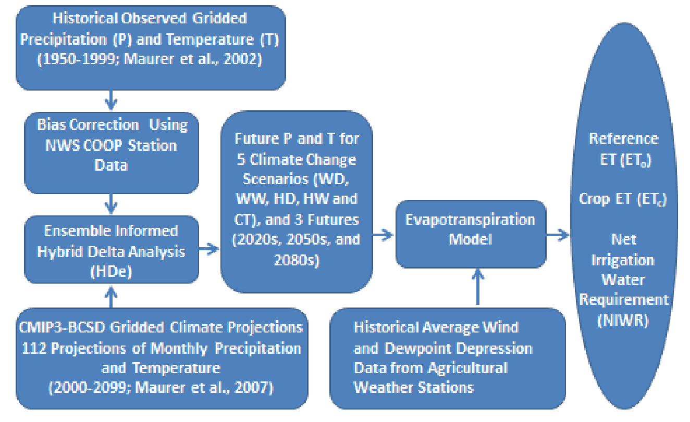
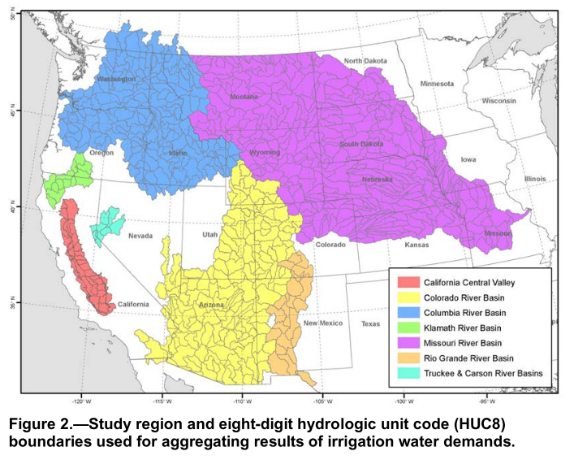
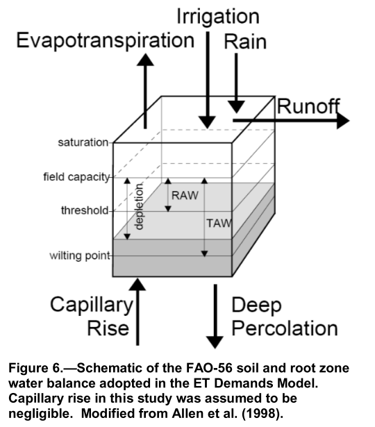
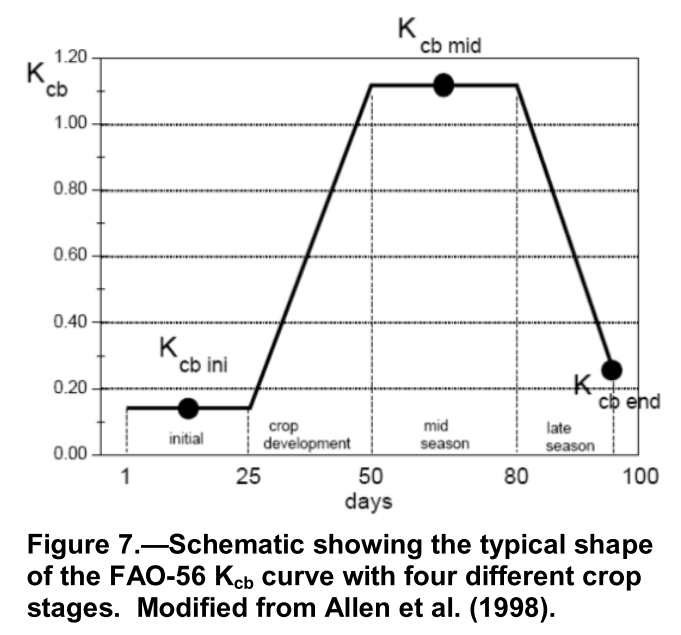

# 蒸散发之作物需水估计

前面的FAO56主要对ET相关计算做了说明，接下来看看灌溉需水方面的计算。本文主要参考以下资料，并对其中内容做简单翻译记录。

- [usbr/et-demands](https://github.com/usbr/et-demands)
- [Historical and Future Irrigation Water Requirements for Select Reclamation Project Areas](https://www.usbr.gov/watersmart/baseline/docs/historicalandfutureirrigationwaterrequirements.pdf)
- [Huntington et al. (2015) West-Wide Climate Risk Assessments: Irrigation Demand and Reservoir Evaporation Projections](https://www.usbr.gov/watersmart/baseline/docs/irrigationdemand/irrigationdemands.pdf) 
- [Allen and Robison (2009)](http://www.kimberly.uidaho.edu/ETIdaho/)

以前想要在大范围内根据climate projections模拟计算未来的$ET_o$,$ET_c$,NIWR 的时间序列数据是基本不可能的，现在随着开源数据、代码的发展，这些都已经变得可能，因此，美国农垦局开发了相应的软件，即现在看到的ET-Demands，来估计historical和future的reference ET， crop ET和NIWR，也为考虑大气二氧化碳增加对蒸腾减少的影响做一些工作。

## Introduction

蒸散发是水循环的重要部分，也是农作物net irrigation water requirements（NIWR ）的主要驱动因素。量化ET和NIWR对区域农作物管理，流域水平衡估计都有很重要的意义。

另外，气候变化下的NIWR也是未知的，而这对长期的水资源规划管理是具有重要意义的。美国的安全水法案section 9503 授权了 美国农垦局在“major Reclamation river basins” 的气候变化对水和环境资源的风险。所以提供一个科学的能被广泛接受的估计历史和未来irrigation water demand 的方法是必要的。

## Previous work

基于Huntington et al.(2015) 的工作，他们使用开发的ET Demands工具（应该就是github上这一套）估计了crop ET和NIWR，不过那时候还不能计算各种climate projections下的情况，现在Python版本的开发等使得其可行。

建立在ASCE和FAO开发的灌溉需水模型基础上的ET Demands model很适合regional scale上的应用，已在很多地区得到应用。其增强了FAO-56的reference ET和dual crop coefficient approach：

- 模型基于FAO-56 reference ET和dual crop coefficient
- 广泛应用于美国西部的主要流域
- 考虑non-growing season soil moisture accumulation 和 变化的growing season lengths，灵活模拟future irrigation water demands
- 应用于West Wide Climate Risk Assessment（WWCRA） 研究（代码主要计算方法都在这篇报告里，稍后补充）

## Objectives

这个报告的主要目的是开发，应用开源crop ET 软件（ET Demands），帮助满足农垦局开发和应用ET 软件来估计历史climate和未来气候场景下的crop ET和NIWR 的需求。

## Approach

此研究实现了Huntington et al. (2015) ET Demands model的Python版本，并开发了针对多农年代表地区和历史未来气候的年的crop ET和NIWR估计。分析包括开发crop ET和NIWR 估计，结合World Climate Research Programme Coupled Model Intercomparison Project5 (WCRP CMIP5)  的气候projections。

## Methods

接下来记录一些细节。包括climate data， ET Demands 方法， 在历史和未来气候下的应用及结果。只是一些大致的过程，具体的细节可以更多参考Huntington et al.(2015) ，本blog最后面再补充。

### Reference ET

该值的计算还是基于FAO56或者ASCE-PM的计算$ET_o$的方式。然后乘上$K_c$得到$ET_c$。然后融合到ET Demands model。前面evapotranspiration1文件里主要参考了FAO56的彭曼公式，不过美国很多ET数据都是基于ASCE-PM公式计算的，因此，有必要补充一下ASCE-PM的背景。

主要参考了：[ASCE’s Standardized Reference Evapotranspiration Equation](https://ascelibrary.org/doi/pdf/10.1061/40499%282000%29126)。

出现ASCE-ET 计算的方法有多方面的动机，最早是美国Irrigation Association（IA）提出请求，希望ASCE能够建立一套标准参考的蒸散发计算公式，这样美国广大科研社区，工程师，政策制定者等都有一个标准依据，并且能帮助灌溉管理和 crop coefficients的应用。ASCE-ET 公式的全名是 ASCE Standardized Reference Evapotranspiration Equation. 用到了两个 standardized reference ET surfaces：（1）a short crop（similar to grass）（2）a tall crop（similar to alfalfa），有小时和日两个尺度的计算公式。

ASCE-ET 社区 备选的公式有：ASCE-PM (grass w/h =0.12m and alfalfa w/h=0.50m), FAO-56 PM公式(grass), 1982 Kimberly Penman(alfalfa)等多种。经和lysimeter比较，ASCE-PM 公式更精确。彭曼公式的形式如下：
$$ET=(\frac{\triangle (R_n-G)+K_{time}\rho _a c_p \frac{e_s -e_a}{r_a}}{\triangle +\gamma (1+\frac{r_s}{r_a})})/\lambda$$
其中，ET 是 reference evapotranspiration（$mm\ d^{-1}$或者$mm\ h^{-1}$）；$R_n$ 是 net radiation（$MJ\ m^{-2}\ d^{-1}$或$MJ\ m^{-2}\ h^{-1}$）；G是soil heat flux（$MJ\ m^{-2}\ d^{-1}$或$MJ\ m^{-2}\ h^{-1}$）；($e_s-e_a$)表示vapor pressure deficit of the air（kPa）；$e_s$是saturation vapor pressure of the air（kPa）；$e_a$是actual vapor pressure of the air（kPa）；$\rho _a$是常压下平均空气密度($kg m^{-3}$)；$c_p$ 是specific heat of the air($MJ\ kg^{-1}\ ^{\circ} C^{-1}$)；$\triangle$是饱和蒸汽压与温度关系的斜率；$\gamma$是psychrometric constant（$kPa\ ^{\circ} C^{-1}$）；$r_s$是bulk surface resistance( $m^{-1}$)；$r_a$是aerodynamic resistance$（m^{-1}$）；$\lambda$是latent heat of vaporization($MJ\ kg^{-1}$)；$K_{time}$是单位转换（86400 $s\ d^{-1}$ for ET in $mm\ d^{-1}$ and 3600 $s\ h^{-1}$ for ET in $mm\ h^{-1}$）

根据两个标准化的surface下的计算，简化之后得到了如下的彭曼公式：
$$ET_{ref}=\frac{0.408\triangle (R_n-G)+\gamma \frac{C_n}{T+273}u_2(e_s-e_a)}{\triangle +\gamma (1+C_d u_2)}$$
其中，$C_n$是特定reference type和计算步长下的分子上的常数，是时间步长和aerodynamic resistance（即crop type）的函数， $C_d$是特定reference type和计算步长下的分母上的常数，是时间步长，bulk surface resistance和aerodynamic resistance的函数。在日尺度下，对于$ET_{os}$，$C_n$为900，$C_d$为0.34；对于$ET_{rs}$，$C_n$为1600，$C_d$为0.38

下面是FAO56的PM公式，可以简单做个对比。
$$ET_o=\frac{0.408\triangle (R_n-G)+\gamma \frac{900}{T+273}u_2(e_s-e_a)}{\triangle +\gamma (1+0.34u_2)}$$
可以看到FAO56的公式就是只有$ET_{os}$的，具体公式是一样的。

### Climate Data

历史气候数据集从University of Idaho的METDATA 数据集获取，其是 gridded data，包括daily maximum and minimum air temperature, solar radiation, humidity, 和 wind speed。融合了North American Data Assimilation System(NLDAS)和the Parameter Regression on Independent Slopes Model (PRISM)。Point locations，又称为 Metnodes, 代表农业位置，是基于HUC8 区域 和 USDA cropland data layer (CDL) information的，用来提取历史和未来气候条件下的location的时间序列数据。

ET Demands model 在每个Metnode 上运行，使用从METADATA获取的1979-2015年的历史气候数据来计算 基于ASCE-PM 的$ET_o$，并且和基于天气站计算的$ET_o$比较。因为METADATA 没有考虑农业的evaporative cooling effect， 所以推求的$ET_o$会有biased high。为了去除偏差，$ET_o$计算使用了从18个农业天气站的数据，并计算了站点推求的$ET_o$和METADATA计算的$ET_o$的月尺度上的比值。然后用这个比例来消除这个偏差。

用Transient climate impacts methods involve 将time series climate projections转换为time series projections of weather inputs for impacts modeling。然后the Multivariate Adaptive Constructed Analogs (MACA) dataset 用到ASCE Standardized Penman-Monteith equation 来计算$ET_o$。MACA approach 包括校正映射daily General Circulation Model (GCM) data 到 网格数据的偏差。暂时不特别关注climate projection，所以暂略这部分。

### ET Demands Model Overview

ET Demands model 的核心是FAO-56 dual crop coefficient model。ASCE-PM-based grass reference ET0 用来作为baseline。每个Metnode上的Actual ET for a range of crop types 使用FAO-56 dual crop coefficient approach 计算：
$$ET_c=(K_sK_{cb}+K_e)ET_o$$
其中，

- $ET_o$ is ASCE-PM grass reference ET
- $K_{cb}$ is the basal crop coefficient
- $K_e$ is a coefficient representing evaporation from the soil surface

$K_{cb}$和 $K_e$是dimensionless的，变化从0到1.4。日$K_{cb}$值随season变化，这通常参考the crop coefficient curve。The stress coefficient ($K_s$) 从0到1，1表示没有water stress。ET Demands中一个daily soil water balance 用来模拟effective root zone以计算$K_s$。当为灌溉作物计算$ET_c$和 NIWR时，$K_s$通常为1，当降水较少时也会小于1。ET Demands 估计了冬天的$K_s$，对于休眠期的齐备mulch和grass，休眠期是没有灌溉的，所以冬天$K_s$小于1.第二个daily soil water balance for用来估算e upper 0.1 m of soil的$K_e$。这里假定 upper 0.1 m zone是唯一为土壤表面蒸发供水的部分。

NIWR 估算由 $ET_c$ 减去 保留在 root zone中的降水得到，即$P_{rz}$。保存在root zone中的Precipitation就是渗入土壤并保留在root zone用于蒸散发的消耗的那部分的gross reported precipitation。虽然$P_{rz}$包括了蒸发的降水，不过$ET_c$也包括降水的蒸发，因此 $ET_c - P_{rz}$ 可以代表the net irrigation water requirement，而不是让$ET_c$减去$P_{rz}$ 中用于蒸腾的部分代表。$P_{rz}$计算由$P-Runoff-D_{percp}$得到，其中P是gross reported precipitation，Runoff是模拟的surface runoff，$D_{percp}$是深度下渗到最大root zone下的那部分降水。更多细节稍后在Huntington et al. (2015)中详细看。

### Soils Data

ET Demands需要的Soil attributes从NRCS State Soil Geographic (STATSGO) database获取。STATSGO是一个空间土壤GIS数据库，包括了soilds物理特征属性，能用来估计土壤持水和渗透参数，并用于ET Demands model的dual soil and root zone water balance and runoff modules。STATSGO中关于available water capacity, and sand, silt, and clay fractions 的属性用于估计total evaporable water的空间分布和用于surface soil layer water balance的readily evaporable water以及用于root zone water balance的total available water and readily available water。这些参数都影响irrigation scheduling 的估计，soil的蒸发损失，deep percolation from root zones，antecedent soil moisture condition, and runoff from precipitation。Gridded soil attributes for available water capacity and sand, silt, and clay fractions 平均到 60-inch (150-cm) depths，然后和irrigated crop land areas 求交集, 并在空间上平均到每个 HUC8。

### Crop Coefficients

basal crop coefficient（$K_{cb}$）曲线来自Allen and Robison 并应用到应用到 ET Demands。Allen-Robison curves 是Wright的lysimeter-based $K_{cb}$ 曲线的继承，并且是基于taller alfalfa reference ET ($ET_r$)的。基于以下内容定义了不同的$K_{cb}$ 曲线：

1. 从 planting或者greenup到effective full cover的 ) normalized cumulative growing-degree-days，这个比例会持续到 the cropping period结束; 
2. 从 planting 到 effective full cover的时间百分比, 这个比例会持续到 the cropping period结束; 
3. 从 planting 到 effective full cover，然后再到之后一定天数（种植结束前）的时间百分比 

这些$K_{cb}$方法允许时间插值和特定crop的$K_{cb}$曲线作为cumulative growing degree days (CGDD) 和 temperature dependent planting or greenup estimates（比如，30 day moving average air temperature ($T_{30}$)）的函数，而不是特定的恒定的日历天。CGDD已经再很多研究中被用于定义planting and greenup times，crop coefficient development, scaling of development periods, 以及transferring $K_{cb}$ curves among regions。决定Kcb curves的planting，greenup，effective full cover和harvest stages的crop stage的参数的率定由运行ET Demands model来决定，该模型在每个Metnode中使用历史METDATA ihou时间序列，为每种crop确定最优的$T_{30}$，时间和到effective full cover 或 termination/harvest 的CGDD来拟合观测到的planting, greenup, 以及 development dates。当模拟的crop stages和每个流域子流域上记录的日期比较匹配时就得到最优值。

关于未来climate projections下的模拟还有未来二氧化碳影响的更多细节，这里暂不赘述了。

### ET Demands Model Application

ET Demands 模型用历史METDATA 时间序列来率定 $K_{cb}$ 曲线 和校正 $ET_o$的偏差。然后用来运行40个不同的MACA climate projection 1950-2100的时间序列来推求baseline（1950-2005）和projected（2006-2100）的各个metnode的年均温度，solar radiation，humidity， wind speed和totel precipitation，以及$ET_o$,$ET_c$和NIER。

Python代码模拟了每个$ET_o$，growing-season 和 non-growing-season soil 以及 root zone water balance components ($K_{cb}, K_s, K_e$),irrigations, 和 $ET_c$ 还有 NIWR，都是在日时间尺度上。$ET_o$ 在每个Metnode上计算，包括所有相关的信息，比如soil信息，crop type，和crop acreage，并用来计算$ET_c$和NIWR rates for 每个ET cell（比如HUC8 area）。日$ET_c$和NIWR rates 以及每个ET cell的volumes都使用从CDL data for 2010推求的unique irrigated crop types 和 associated areas计算。计算每个 ET cell (i.e. HUC8 area) 的 Crop area加权的 annual $ET_c$ 以及 NIWR rates ($ET_c – P_e$) 作为总的 annual ETc 和 NIWR volume。

## West-Wide Climate Risk Assessments: Irrigation Demand and Reservoir Evaporation Projections 相关内容补充

主要关注其中和ET Demands计算相关的内容，并且我主要关注HUC8流域上的baseline NIWR 的计算。它主要结合了Penman-Monteith (PM) reference ET method 和 FAO56的 dual crop coefficient method。ASCE-EWRI 2005 也用了FAO56的PM公式来计算cool season的clipped grass的$ET_o$。

计算实际蒸散发时选择的是–dual crop coefficient approach。改方法能更好地估计NIWR。

ET Demands model首先计算HUC8流域地各个点站点的日$ET_o$。

irrigated lands的空间平均的土壤参数也作为ET Demands的输入。

然后日crop ET 作为 $K_{cb}$ 和 $K_e$ 以及 $K_s$的函数进行计算。一个$K_s$是给流域内所有crop type用的。

最后NIWR rate or depth由 $ET_c$ 减去 effective precipitation residing in the root zone ($P_{rz}$) 得到。NIWR同义于这些名词： irrigation demand, net consumptive use, and precipitation deficit。$P_{rz}$计算是以 daily precipitation (from the climate data set)，antecedent soil moisture prior to a precipitation event, deep percolation of precipitation, and precipitation runoff.函数的形式得到。Soil moisture is也是根据流域内农业面积的情况土壤类型加权的moisture-holding capacity的函数得到的。产流是根据NRCS curve number method 得到的。

灌溉模拟是当crop root zone moisture content 下降到 crop-specific maximum allowable depletion threshold 时发生的。Irrigation depths 指定为 fill the root zone by the difference between field capacity and the cumulative soil moisture depletion depth amount.

流域上的NIWR 和 $ET_c$ 是按照作物类型面积加权得到的。

接下来记录一些更具体的过程，注意结合到代码里看（fork usbr/et-demands项目代码，更多内容详见：https://github.com/OuyangWenyu/et-demands）。

### 背景

一些关于water demands 评估的技术背景。主要将climate projections 和 估计未来irrigation water requirements 和 reservoir evaporation 。

#### 技术方法

ET 是农作物irrigation water requirement 的驱动。量化作物和区域的ET和NIWT对灌溉系统的设计，流域水平衡估计等都是很需要的。NIWR定义为annual crop ET 排除掉 进入root zone的有效降水。NIWR是被作物消耗的 总灌溉需求的一部分。

为了研究气候变化的影响，有必要将climate projection和水资源评估联系起来评估灌溉需求。联系气候变化和水资源管理由两大类方式：

- 从transient methods扩展来的Period change 方法，包括：（a）identifying projection context下的气候变化场景，并且（b）为分析影响的模型（impacts modeling）生成根据场景下气候变化调整的反映历史观测天气的气象输入来作为为了天气的代表。一个变化场景可能由一个或多个气候projections得到，当使用多个projections时，结果被成为 ensemble-informed scenario。气候变化的定义本身也是一种选择；通常使用的定义是降雨和温度的月均值或月分布的变化。
- Time-evolving projection，或者transient 方法，这类将时间序列climate projections 转化为 为了分析影响模型（impacts modeling，比如 水文，灌溉需求，水面蒸发等）的气象输入时间序列projections。这类方法通常需要调整时间分辨率。

扎个报告中第三章介绍climate projections的选择以及如何使用其构建climate change scenarios。第四章介绍了确定irrigation 和 水库蒸发 需求的方法。

虽然我暂时不需要气候变化这些分析，不过还是了解下。

##### Climate Projections and Scenarios

Contemporary climate model projections 用来开发ET 和 NIWR 需求。climate model projections 是不能直接用到这些评估中的，因为其时间和空间分辨率都不够。从climate model 尺度（100-250 km）到impacts assessment scale（10km）的转换即为降尺度。值得注意的是 气候模型生成了大量的气候变量来定义projections，而在 impacts assessment中的projected climate 变量只有降水和温度，因为这是主要的改变灌溉需水的变量。

CMIP3 archive的降水和温度的Climate projections 使用统计算法bias correction and spatial disaggregation（BCSD）被降尺度。月BCSD climate projections包含了用16个不同CMIP3 气候模型模拟的三种未来不同排放场景下的112个projections（月尺度八分之一度网格）。

接着就是用这些projections 驱动impacts assessment。理想状态下，是运行每个climate projection到影响分析模型中。不过因为农垦局分析的这些流域里，crops，农业实践这些比较多样，因此计算量太大，所以将112个projections 归为5类场景来评估：

- warm-dry（WD）
- warm-wet（WW）
- hot-dry（HD）
- hot-wet（HW）
- central tendency

##### Irrigation Demands

整个过程如下图所示：

当前或baseline的灌溉需求估计的开发是基于目前最近可用的crop data和气候条件。crop types和quantities 从USDA农业统计服务数据和USDA报告中获取。历史气候数据从Maurer数据集获取。

Baseline NIWR 估计对每个流域的HUC8子流域计算。baseline NIWR 估计基于Idaho等开发的ET Demands模型开发。

ET Demands模型使用了PM reference ET 和 dual crop efficient 方法，即PM-dual crop coefficient方法。其将蒸腾和蒸发分开的做法对考虑winter soil moisture 对蒸发的影响有益。

ET Demands 首先计算每个HUC8流域的指定天气站的日ETo，其是气候数据集中的最高温和最低温的函数。其他PM公式需要的数据根据ASCE-EWRI的方法估计。

每个HUC8 irrigated lands的空间平均土壤参数被输入到ET Demands model。土壤信息从STATSGO数据库获取。土壤参数，主要是upper 和 lower limits of soil water holding capacities， layering 和 infiltration rates。这些参数影响irrigation schedules的估计，土壤蒸发损失，deep percolation from root zones，前期土壤含水量，和降雨产流。

日ETc在ET Demands模型中计算，它是一个HUC8流域内两个主要crop系数Kcb和Ke以及针对所有作物类型的crop stress 系数Ks的函数。
$$ET_c=(K_sK_{cb}+K_e)ET_o$$
其中$ET_o$是ASCE-PM grass reference ET，$K_{cb}$是basal crop coefficient，$K_e$是soil water evaporation coefficient，$K_s$是stress coefficient（其在soil water不足够提供full ET时被调用）。$K_{cb}$和$K_e$是无量纲的，从0到1.4变化。一个季节的日$K_{cb}$值通常指的时 the crop coefficient curve，其代表了由于crop phenology变化带来的vegetation cover，leaf area，以及vegetation height 变化对crop ET的影响。这些属性在growing season期间会变化并且会根据growing season的 start，duration和termination 有年际变化，而这些都和温度相关。$K_s$也是无量纲的，变化范围是0到1，1表示没有water stress。一个模拟的有效root zone的日土壤水量平衡是ET Demands模型的关键构成，用以计算$K_s$。大多数情况下，ET Demands计算ETc和NIWR时，都假定full water supplies条件下运行，所以通常$K_s$为1。不过在dormant season（winter）时，当降水少时，$K_s$小于1.

一个给定crop的$K_{cb}$的值通常是根据模拟的plant phenology而随季节和年度变化的。Plant phenology依次受solar radiation，temperature，precipitation，和agricultural practices的影响。模拟在 green-up或planting 的时机，effective full cover，harvest和termination的实践 的年际变化的能力对整合温度对growing-season长度，crop growth和development 的影响是必要的，尤其是在气候变化scenarios。ET Demands模型为每种作物模拟vegetation cover和maturation的季节性和年际变化，方式是每种作物$K_{cb}$是air temperature的函数，这个函数是基于 cumulative growing degree days（GDD）的。在年作物种植或者多年作物出现后，$K_{cb}$的值会随着温度的增加逐渐增加直到crop达到full cover。一旦其发生，并经过growing season的middle stage，$K_{cb}$值会保持不变，或者减小到模拟cuttings和harvest。从middle stage 到 growing season的结束，$K_{cb}$减少到模拟作物衰老。关于GDD如何计算在第四章种有介绍。

在ET Demands模型中，NIWR rate或depth是 ETc减去Prz。NIWR和irrigation demand，net consumptive use以及precipitation deficit 是一个概念。Prz是日降水，前期土壤含水量，deep percolation of precipitation以及precipitation runoff的函数。Soil moisture 是 一个HUC8流域内农业区域加权平均的土壤类型输入到模型中的moisture-holding capacity的函数。precipitation runoff根据NRCS curve number 方法基于日降水来计算。

灌溉在ET Demands中是在crop root zone moisture content 调到 crop-specific maximum allowable depletion threshold时被模拟。Irrigation depth 指定为通过field capacity和累计土壤函数depletion depth amount的差值填充root zone。

HUC8流域内每个作物的NIWR 和 ETc rates 乘以这个作物面积在整个流域面积的比例，然后加起来成为HUC8流域的加权NIWR：
$$HUC8\ subbasin\ rate = \sum_{i=1}^{i=n} crop\ ratio\ i * crop\ rate\ i$$
historical baseline结果在第五章展示，包括平均年降水，温度，风速以及dewpoint depression，ETo，ETc和NIWR

未来灌溉需水估计在第三章的未来场景下计算，因为未来变化不确定性太大，所以考虑了两类场景。一类假设静态的phenology $K_{cb}$曲线，historical baseline温度被使用GDD方法来模拟planting，crop development 以及 harvest dates。其中$K_{cb}$曲线会年际比变化，不过没有变化趋势。第二种就是非静态的了。细节在第四章。

未来变化在第五章。

##### Reservoir Evaporation Demands

使用 Complementary Relationship Lake Evaporation（CRLE）模型来计算8个流域12个代表水库的估计历史和未来蒸发率。CRLE时一个开放水面蒸发模型，用来估计月蒸发，其中，蒸发是solar radiation，humidity，air temperature，water temperature，albedo，emissivity，以及depth-controlled heat storage的函数。第四章有细节。

计算的时候，年平均水库深度根据历史数据计算，并且假定为恒定的。第五章有更多介绍。

#### Programmatic 背景

农垦局的流域研究计划包括 流域研究，WWCRAs以及LCCs的参与等。这些组成了气候变化对水供应风险评估的不同部分。

WWCRAs提供了baseline projections。其成果对多个流域做了评估。

LCCs有很多机构来做，强调气候变化对生态区的影响。

通过流域研究，农垦局判断了流域内满足需水的额能力，分析了气候变化的影响。

### Climate Projections and Scenarios

简单了解下这方面的基本知识。

描述未来大气，陆地海洋条件影响的未来降水、温度和其他气候变量的projections，是由General circulation models，即全球气候模型模拟19世纪末到21世界末的全球气候条件得到的。这些耦合大气海洋的GCMs使用全球三维网格建模了物理过程。其能提供100-250km网格分辨率的模拟。1860到1999，GCMs 用估计的历史大气条件来约束，而未来的就需要生成一系列的可能的气候系统驱动了。GCMs模拟了响应几种气候系统驱动轨迹的气候系统，比如温室气体（GHG）排放。耦合的模拟比较计划阶段3（CMIP3）气候实验就是指几种不同的排放场景。CMIP5是指representative concentration pathways（RCPs）。

因为尺度不一样，所以需要降尺度。两类方法：

- 动态的：区域气候模型模拟区域的气候过程
- 统计的：直接统计降尺度GCM的结果到区域的

这里用的是统计降尺度 BCSD方法。

### Developing irrigation water demand and open-water evaporation projections from climate projections

在美国西部流域已经有一些不同的模型被应用。有许多影响灌溉需求模型选择的因素。比如：

- 水量平衡分析的分辨率
- 空间尺度和soil类型多样性等
- 作物特性对土壤变化等的动态响应
- 对气象驱动数据的需求
- 计算能力
- 模型复杂度
- 时间步长
- 率定目标

#### Considerations in Selection of Irrigation Water Demands and Open-Water Evaporation Models

灌溉需水模型的选择考虑主要是 要使用一种广泛被认可的对ETc和NIWR估计的方法，在美国西部有成功应用记录的，更稳定的应用的。有两类模型满足：

- 使用ETo，dual crop coefficients，日土壤水量平衡和ASCE及FAO的ETc方法
- 考虑水，氮，碳平衡的full crop 模拟和crop growth 模型

前者更适合历史和未来气候区域尺度的稳定的应用，在主要的美国西部流域有广泛应用。

水库蒸发需水计算也有多种方法，对于日，周，月尺度的调度目的的蒸发估计，aerodynamic mass transfer 方法似乎是最稳定的，因为其需要的输入最少，不过aerodynamic mass transfer 方法的最准确的应用需要准确的天气数据，水面数据，会使得其应用有些挑战。

报告采用的是一种基于 combined energy and aerodynamic equations 的方法，CRLE。

#### ET Demands and Open-Water Evaporation Model Background and Applications

先看看ET Demands 模型的描述及其参数。模型基于常见的reference ET-crop coefficient 方法。最常用计算ETo的方法是FAO56和ASCE-PM。

计算ETc使用的是dual crop coefficient 和 daily soil water approach。

Kcb曲线可以追溯到农垦局的[AgriMet program](http://www.usbr.gov/pn/agrimet/)以及 FAO56。

下面是更多细节。

首先是 Reference ET Estimation，其使用了ASCE-EWRI 2005.short grass的标准ETo：
$$ET_o=\frac{0.408\triangle(R_b-G)+\gamma \frac{C_n}{T+273}u_2(e_s-e_a)}{\triangle + \gamma(1+C_du_2)}$$
选择short grass 的ETo，而不选择与之不同taller alfalfa 的原因主要是基于之前的农垦局的研究。BCSD 历史和未来气候projections只有最高最低日气温和日降水，所以需要对日露点温度，solar radiation，windspeed等进行估算以计算ETo。所以需要一些质量控制。

农业天气站数据从564个天气站和14个不同的农业及研究天气网络下载。数据集包括每个站点的日最高最低温，日平均露点温度，日平均太阳辐射，日平均风速，然后根据ASCE-EWRI的准则来校核质量。

最常见的需要校正的量就是Rs，即日平均太阳辐射。在43个农业天气站测量的Rs用来率定一个general empirical formulation，来帮助根据Thornton and Running 方法计算Rs。Rs常被高估或低估，因为debris on the pyranometer window，a non-level base plate, sensor miscalibration or drift, or obstructions. 测量的Rs的校正使用theoretical clear sky solar radiation$R_{so_b}$ 来完成。特定时间窗口（通常30-90天duration）的$R_s/R_{so_b}$日比例被排序，然后计算前百分之十。这百分之十的平均ratio用来scale 特定时间窗口内所有天的Rs。该scaling通常用于校正校准错误、不水平度或仪器弄脏。根据Rs和$R_{so_b}$的目视检查，这些校正程序被应用到用户指定的时期。

露点温度(Tdew)的定义是一团空气必须被冷却直到成为饱和水汽的温度。在灌溉设定下，日最低温度通常能达到露点温度，因为地表的条件，尤其是早晨风冷地湿的时候。这篇报告中，baseline和projected 气候的日平均露点温度用 $T_{dew}=T_{min}-K_{o(i)}$。其中，$K_{o(i)}$是每个月的offset coefficient（也就是最低温减去露点温度），此法经常用于发区域研究和网格天气数据集比如PRISM中来帮助humidity估计。

在干旱半干旱地区供水条件好的时候露点温度通常比最低气温低2到8度。本报告中，月平均Ko在每个流域每个月来估计，使用可用的农业站网络的天气数据，为每个站点计算月平均Ko，然后空间插值到所有点，然后每个HUC8流域上做平均。这一HUC8流域均值可以被分配给其HUC8 Met Nodes。（关于Met Node，HUC8这些信息可以参考[Irrigation Demand and Reservoir Evaporation Projections：Appendix](https://www.usbr.gov/watersmart/baseline/)）

通常，月平均和年平均Ko的空间分布是随降雨分布降雨量变化的。可用水多的时候会更低，而水受限时会更高。来自农业天气站推求的Ko的空间分布是有利的，因为它对较低的气团的湿度有一个简单的近似，这是一致的并代表了农业地区，同时保持区域和局部平流和干燥效应。此外，最近的研究表面当利用月平均Ko和Tmin估计湿度时，估计实际ET和ETo有好效果。ASCE-PM公式里$e_a$的计算是用到露点温度的。
$$e_a=0.6108exp[\frac{17.27T_{dew}}{T_{dew}+237.3}]$$

Thornton和Running的经验公式用来估计日平均Rs：
$$R_s=R_{so_b}[1-0.9exp(-B(T_{max}-T_{min}))^{1.5}]$$
$$B=b_0+b_1exp(b_2\triangle T_{month})$$
其中，$R_{so_b}$是理想晴天太阳辐射，其会随$e_a$变化。B是经验公式，有三个系数$b_0$,$b_1$,$b_2$，分别为0.023，0.1和-0.2。$\triangle T_{month}$是月尺度的长期最高温最低温差值。

此法的准确度基于cloud cover减少日最高温或降低最低温（因为白天减少的Rs）和夜间由云增加的向下发射的长波辐射。Thornton和Running的经验公式的改进版本是通过针对特定地区率定B的系数来实现。这篇报告也用了类似的方法来针对流域优化B的系数。该方法通过蒙特卡洛抽样模拟，找到了station-specific的系数集，优化的目标是产生最小的43个农业气象站历史时期预测和观测的Rs的差的平均值。

564个农业气象站的风速数据用来估计2m高的日风速。未来的风速估计使用月平均观测来估计，并和局部地形河地表能量平衡条件相关。

接下来是Crop ET Estimation。

使用baseline和projected Tmax和Tmin以及以及基于历史农业气象站数据估计的Rs，Tdew和u2为每个Met Node的baseline和projected 气候数据集计算ASCE-PM grass reference ET。然后在每个Met Node针对一系列作物类型估计实际的ET，方法是FAO56的dual crop coefficient方法：
$$ET_c=(K_sK_{cb}+K_e)ET_o$$

NIWR 估计为ETc减去Prz。Prz计算是P-Runoff-DPercp。P是毛降雨，Runoff是产流地表流，DPercp是深度下渗的

日土壤和根系水量平衡时基于一个两阶段干旱过程。计算需要的土壤属性数据来自STATSGO数据库。FAO56 root zone水量平衡如下图所示：

**Gridded soil attributes 在150cm深度上做平均，然后和irrigated crop land areas空间相交，然后在每个HUC8流域做空间平均**。Spatially averaged cropland HUC8 soil attributes 和 coincident HUC8 Met Nodes 相交的参数被输入到ET Demands 模型中。

**每个作物Root growth估计为time的函数**，并用来计算root zone volume for soil water balance calculations。Root growth 假定为在planting或grennup模拟时间从一个特点的初始深度开始，然后一段特定时间后获取最大的有效root depth。Borg and Grimes root growth 函数被用来估计sinusoidal root depth rate as a function of time。

虽然大多数农业地区相对平，大降雨时间后runoff还是明显的，这在估计NIWR时要考虑。产流的量级和持续时间受soil影响。由于这一过程非常复杂，所以不使用复杂的物理模型，**直接使用USDA-NRCS 的curve number（CN） 方法**。CN方法需要的数据使soil texture-based properties, crop type 以及日降雨深度。日土壤水量平衡用来估计前期土壤含水条件（ASC）。Curve number 水文土壤分组由每个HUC8流域上农业区域的空间平均百分比的sand，silt 和clay比例决定。如果超过百分之五十是sand，type就是A，clay 超过百分之40就是C，其他的是B。前期土壤水含量影响CN值，为了估计其影响，ET Demands根据降水前土壤含水条件调整CN 值。调整方法基于USDA-SCS等。利用Hawkins等人(1985)的表达式在ET Demands中根据前期土壤含水量 来scale 干湿条件之间的CN值。

ET Demands中，**灌溉事件的模拟是发生在root zone 干旱到crop-specific maximum allowable depletion (MAD) threshold时，也就是stress发生时**。对于大多数灌溉作物，**假设有无限的供水，而灌溉计划在MAD开始的时候进行**。**Irrigations被指定为根据the difference between field capacity and the cumulative soil moisture depletion depth amount 来fill the root zone**。**crop-specific initial和growing-season 的MAD值参数化是根据之前的研究**(也就是说是定好的)，并对一些作物修改来更好地模拟典型的观测的灌溉频率。

通过root zone的Deep percolation 假定为因为降雨在soil water content 超过field capacity时发生。**在模拟灌溉当天，灌溉深度的10%被模拟为深层渗透**。由于灌溉造成的深层渗透在实际农业中是典型的，能使根系在整个季节都能在湿润的土壤中生长。ET需求中灌溉的深层渗透并不会增加NIWR，而只是基于水文目的进行估算。

另外，灌溉会影响 Ke，Ks 两个水量平衡的计算，所以要注意里面稍微复杂一些的逻辑。

最后重点关注下Crop Coefficients。

植被物候是受solar radiation, temperature, precipitation, and agricultural practices 的季节性和年度变化影响的。vegetation cover和maturation的季节性变化是用crop coefficient curves模拟的。下面是一个典型的Kcb曲线：

年作物种植或多年生作物出现之后短期内，Kcb的值就会从一个初始值逐渐增加0.1到0.2，在growing season 随着vegetation的生长，叶面积增加，Kcb 曲线会增加直到vegetation 达到full cover。在growing season的中期阶段，Kcb曲线通常是不变的，或者因为模拟的cuttings和harvest减少。从growing season中期到末期，Kcb曲线随时间减小来模拟叶子的老化和凋零。

这篇报告使用的basal crop coefficient来自之前的研究。Allen-Robison curves 很大程度可以溯源到lysimeter-based Kcb curves of Wright，并基于the taller alfalfa reference ET (ETr). 更多的Kcb曲线基于FAO56值添加到ET Demands模型中，组成了总共49种crop-specific的Kcb曲线。每个作物具体的Kcb曲线来源，值，和图可以参考附件5. 因为ET Demands模型种相对更广泛使用的是ASCE 标准OM short reference 方法，从Wright推求的Kcb曲线要从ETr计算的值转为ETo的，需要给Kcb曲线乘以1.2，这是一个标准的从tall reference ET转为short 的比例。标准气候下的转换后，ET Demands模型还模拟了干旱和平流条件对Kcb值得影响，方法是FAO56的方法，这会基于估计的日相对湿度，风速和模拟的作物高度增加日Kcb。

空气和土壤温度也会调整几乎所有的plant functions。所以，**植被物候 和thermal heat units更相关**，而不是calendar dates。因此，cumulative growing degree-days（CGDD） 概念被广泛的应用，用来作为ET Demands中的主要方法。特定时间区间和growth points之间的Kcb不是通过线性插值获取的，而是用**time-based 方法**。ET Demands使用了基于thermal heat units和normalized time的三个互补的方法。**Thermal heat unit 方法主要用来模拟空气和土壤温度对vegetation发展和一年生长季节和非生长季节时期的开始过程和结束的影响**。三个方法定义了Kcb曲线的改善（简而言之就是Kcb曲线有几个特定时期的值，现在不用线性插值的方式拓展到所有时间点，而是用几种基于时间的用thermalheat unit的方式算的），基于：

1. normalized cumulative growing-degree-days（NCGDD） from planting or greenup to effective full cover, with this ratio extended until termination of the cropping period; 
2. percent time from planting to effective full cover, with this ratio extended until termination; 
3. percent time from planting to effective full cover and then number of days after full cover to termination.

这些Kcb的计算方法允许时间插值和特定作物的Kcb曲线形状为**cumulative growing degree days（CGDD） 和与温度有关的对planting或greenup的估计**的函数，而不是指定到恒定的日历日期。具体方法可以参考附件5.CGDD 已经被很多研究用于定义planting 和 greenup 时间，crop coefficient 发展和scaling of 发展时期，以及迁移Kcb曲线到各个地区。The **growing-degree-day (GDD)** value is estimated in ET Demands following Mitchell (1997) and Wright (2001) as：
$GDD=max(\frac{T_{max}+T_{min}}{2}-T_{base},0)$
其中，$T_{base}$是特定作物的base温度。如果最低温度远低于$T_{base}$而引起平均温度低于$T_{base}$，那么GDD为0.上面这个公式Wright建议在cold nighttime temperatures 会限制生长的地方使用，对半干旱气候下的许多作物都实用。一个常见的GDD的形式，玉米的GDD公式如下：
$$GDD_{corn} = (\frac{max(min(T_{max} ,30),10)+ max(min(T_{min} ,30),10)}{2}) -10$$
该公式假设一天空气温度超过30度的部分是没有growth的，温度低于10度时，也没有negative adjustment。The **normalized cumulative growing-degree-day (NCGDD)** is adopted in ET Demands following Wright (2001); it is：
$$NCGDD=\frac{CGDD_i}{CGDD_{EFForTERM}}$$
其中，$CGDD_i$是一个crop的growing period第i天的cumulative growing-degree-day total，$CGDD_{EFCorTERM}$是指定的和作物相关的CGDD值，时间范围是**从种植或绿化时起至达到有效的完全覆盖**，EFC 意思是effective full cover，term 意思是termination。NCGDD在种植或绿化到有效全覆盖期间范围为0 ~ 1，在有效全覆盖到收获或灭霜期间范围为1 ~ 2。**NCGDD用作定义Kcb随时间变化的基础**。这通常通过**为NCGDD的值每增加10%时为Kc指定值来实现**。基于百分比时间的曲线的公式与NCGDD类似，但是是基于时间的。根据Allen和Robison(2009)之前的应用，给作物分配NCGDD或基于时间的参数。根据附录5的概述，**大多数作物是采用NCGDD的**。**根据NCGDD或根据时间百分比对Kcb值进行插值，每天计算 Basal Kcb 作物系数曲线**。**通过评估何时达到特定作物的CGDD值，或根据种植或greenup后的特定时间百分比，在ET需求中估计作物的收成或终止**。在某些情况下，终止是在有效的全面覆盖几天之后。对于大多数作物来说，当killing frost发生时，这个季节就结束了。killing frost温度因作物类型而异。ET Demands中GDD积累的起始日期为1月1日，用于估算紫花苜蓿等作物的greenup。除冬小麦外，CGDD一般从所有作物的greenup或种植开始，冬小麦的开始日期指定为前一年的10月1日。

绿化和种植的时机强烈依赖于root depth或苗床的土壤温度。由于空气温度和土壤温度在周至月的时间尺度上高度相关，在ET Demands中使用两种依赖空气温度的方法来**估计每一种作物的greenup或planting dates**。

- 第一种方法是使用前30天的日平均气温的移动平均数(即30天的平均数，截止到第30天)，称为T30。
- 第二种方法是CGDD从1月1日开始。

**简而言之，就是要估计 beginning and end of growing seasons**（更多内容参考[Allen和Robison(2009)](http://www.kimberly.uidaho.edu/ETIdaho/ETIdaho_Report_April_2007_with_supplement.pdf)），春季多年生植物的绿化(绿化)会受到短期天气条件的强烈影响，主要是受气温、某种程度上受湿润事件和一般太阳辐射的影响。气温、湿度和云量之间存在较强的相关性，一般可以作为多年生植物春季开始绿化的预测因子。同样，一年生作物的种植日期也受到一般温度条件的影响。**种子深度的土壤温度对种植影响很大**，一些作物已经建立了相关关系。然而，土壤温度通常不是在合作的NWS气象站测量的，只有在区域类型的气象站才可以测量。因此，由于土壤温度与空气温度在很长一段时间内具有很强的相关性，因此**将30天平均日空气温度作为土壤温度的替代品**。有一些日期被用作**T30日期的一般基础**，用于估算新作物的生长期。

T30（再重申一次，T30 就是 30天平均日气温。用来估计starts of growth periods for many types of crops）和CGDD值是[Allen和Robison(2009)](http://www.kimberly.uidaho.edu/ETIdaho/ETIdaho_Report_April_2007_with_supplement.pdf)和Huntington和Allen(2010)采用的方法，之后在校准过程中进行了调整，以fit文献或个人通信和观测的局部观测。

**要将温度的影响与生长季节的开始和长度以及作物的生长和发育结合起来，特别是在气候变化的情况下，必须能够模拟出greenup或栽植的时间、有效的完全覆盖的时间、收获和终止的时间的年变化**。用于定义greenup和栽植日期的T30方法以前曾在华盛顿(James et al. 1982)、爱达荷(Allen and Brockway 1983)和爱达荷(Allen and Brockway 1983;艾伦和罗宾逊2009)，和内华达州(亨廷顿和艾伦2010)得到应用；CGDD方法最近在爱达荷州(Wright 2001;Allen和Robison 2007年)，德克萨斯州(Marek等人2006年)，俄勒冈州(Mitchell 1997年)和内华达州(Huntington和Allen 2010年)得到了应用。由于随机的人类行为和市场因素，实际的农场和田间实践与模拟的greenup、种植、有效的全覆盖时间、收获和终止日期有很大的不同。因此，ET要求模拟的确定不同作物阶段的日期应该虽然被认为是真实的，但这是近似的。

率定确定种植,greenup,有效的全覆盖,和收获时间的crop stage参数是通过使用在每个Met Node的历史BCSD气温,并为每个作物的T30和时间,和$CGDD_{EFForTERM}$ 拟合观察的种植，greenup和开发日期确定最优值来driving(forcing)ET Demands模型，进而完成的。将模拟作物分期与每个流域主要农业区的记录日期进行比较，得出最佳值。T30、time和$CGDD_{EFForTERM}$的值最初采用Allen和Robison(2009)和Huntington和Allen(2010)的方法，并在对每个流域和作物的率定过程中进行了相应的修改。对于苜蓿和草料作物，通过调整$CGDD_{TERM}$参数来率定模拟的季节收获时间，从而使模拟的cutting日期记录每个流域的典型cutting日期。由于规模和气候学的空间变化，将科罗拉多和密苏里流域ET Demands模型分为上科罗拉多和下科罗拉多、西部、北部和东南部密苏里流域的多个子模型，以便更好地模拟各子流域的作物期。相应地区的记录的作物阶段日期来源于公布的数据以及口头和书面交流。表2列出了主要来源，这里不赘述，详见原文。模拟的绿化、种植、扦插和收获日期被假设为代表平均条件，能认识到由于随机耕作方式和扦插轮作而产生的实际扦插、收获和终止日期的巨大差异。校准结果表明，考虑到各流域和子流域内气温空间变化较大，历史平均绿化、种植、采伐和收获可以较好地模拟。每一种作物和流域的模拟作物分期一般在记录的分期的±15天内。

由于一年生作物的种植和收获日期依赖于温度，并且使用T30和GDD方法进行模拟，因此在模拟未来时间段的种植、发育和收获日期时，特别是在接近2080的时间段，会有变化。在气候变暖的情况下，预测一年生作物未来耕作方式的变化，例如可能更早种植和更快发展和收获，是不确定的。这些潜在的变化可能高度依赖于未来的作物品种、水的可用性和经济。由于这些原因，除了模拟未来时间段的基于热量的Kcb曲线外，还模拟了未来时段的“静态物候”Kcb曲线，使用基线温度模拟种植、作物发育和收获日期，采用前面所述的T30和GDD方法。使用两套Kcb曲线提供了一个估计的影响,气温的变化对生长期的长度等。包括年度作物的“静态物候学”方法允许住宿一系列作物变化——将没有变化和热单位变化——在模拟作物种植,发展,收获在未来条件下日期。实际上，在静态物候Kcb方法下，所有情景和时间段都具有相同的基线作物依赖的季节Kcb形状，且随基线温度逐年变化，由于日ET0和降水量的差异，仅在日等程度上存在差异。

在估计ET demands和NIWR时，特别是考虑到 growing-season 对作物总耗水量的影响时，需要再次注意到**灌溉用水充足以满足作物用水需求的假设**。这一分析表明，随着气候变暖，假设没有水短缺对作物周期的限制，那么其他速率将增加，植物物候可能发生变化，生长季节可能缩短、扩大或保持不变，这取决于作物类型。

非生长期在ET Demands中表示为生长周期Kcb曲线末端开始的时期，或killing frost发生的时期，在同一作物开始种植或绿化时终止。尽管在选择作物轮作时农民的行为存在不确定性和广泛的范围，但在模拟中使用相同的作物来促进一致性。**非生长季ET对于估算年有效降水量和净灌溉需水量非常重要**。通过模拟ET以及土壤和根区水分平衡计算冬季土壤水分，对于估算在生长季节开始时可供植物利用的非生长期降水量积累是必要的。非生长季ET变化很大，取决于有效能量、土壤湿度、冻土、积雪以及休眠植被的条件和数量。很少有研究从休眠的农业植被中测量非生长期的ET; 不过，那些研究提供了在ET Demands中近似非生长季节ET所需的baseline信息。Wright(1991, 1993)在爱达荷州金伯利进行了一系列非生长季节ET的测量，使用双精度称液量计系统对clipped fescue草和裸露的土壤条件(盘状苜蓿、盘状小麦残茬、盘状土壤、休眠苜蓿、休眠苜蓿和冬小麦)进行了一系列ET的测量。他的结论是，对于a grass reference basis，即使在土壤水分供应充足的时期，非生长期的Kc(即Kcb + Ke)也很少接近于1.2。Allen(1996)在犹他州Logan附近使用两台paired weighing lysimeters测量了休眠fescue草的非生长季ET，得出的结论是，当每天估算的ET按数周到数月进行汇总时，冬季平均Kc=0.5可以提供可接受的结果。Sammis等人(1979)在新墨西哥州使用浸水仪测量了非生长季节et，并使用Penman et方程(Penman 1948)发现休眠苜蓿的Kc范围为0.05 - 0.5。Guitjens和Goodrich(1994)汇编了大量美国内达华州Fallon休眠期紫花苜蓿非生长期水分平衡仪测量数据集，发现非生长期休眠期紫花苜蓿的年平均Kc约为0.35，裸地土壤的Kc约为0.15。新墨西哥南部和内华达州北部冬天的降水量比犹他州北部和爱达荷州南部要少，这是Kc值较低的原因。

根据之前对美国西部非生长期农业蒸散发的研究结果，将裸地条件、覆盖一定数量的覆盖物表面和休眠草丛的蒸散发需求的Kcb分配为0.12。非生长期的假定Kcb为0.12，表示裸地、覆盖和休眠草表面干燥，但深层有效水分也能提供一些扩散蒸发的条件。在长期无降水条件下，土壤含水量变干时，计算时根据stress系数(Ks)降低Kcb。采用日土壤水分平衡法，模拟蒸发组分Ke，使总Kc在Kcb之外增加，其中裸地、覆盖和休眠草的非生长期Kc max(即充足供水条件下Kcb + Ke)分别限制在1.1、1.0和0.96。草的低值可以解释休眠草较高的反照率和保温效果。假设覆盖物代表裸露和长满草的情况之间的表面。估算暴露土壤表面积和Ke的ET需求中假设的有效覆盖度为裸地0，覆盖为0.4，休眠草为0.7。以前在区域尺度上应用这种方法时，将非生长季节的平均模拟Kc等估算值与溶析仪测量值进行比较，取得了令人满意的结果(Allen and Robison 2009;Allen和Wright 2009;亨廷顿和艾伦2010)。Allen和Wright(2009)概述了一个简单的方法在有每天积雪报告时来考虑雪的积累和融化时;但由于缺乏积雪信息，这篇报告的研究未考虑积雪和融雪。未来对ET需求的增强将包括一个基于降水和温度的简单的雪积累和融化模块，以提供非生长季节ET和土壤水分积累的更好的表征。Allen和Robison(2009)和Allen和Wright(2009)详细介绍了用于估计非生长季节ET的一般ET需求方法的背景和应用。

暂时先不介绍水面蒸发的计算，先来看实例。

#### Use of ET Demands and CRLE Model Applications to Develop Irrigation Water Demand and Open-Water Evaporation Estimates

12km 网格单元被选座NWS COOP 天气站，即 Met Nodes的位置，用来表示更大的HUC8区域和感兴趣的水体。这里暂时重点关注 ET Demands 应用。

使用Excel中的Visual Basic for Applications (VBA)开发的数据管理器，将ET需求模型应用于推导每个流域的baseline和projected气候。数据管理器对NWS COOP气象站的历史Tmax、Tmin和降水量进行偏差校正，并进行第3章所述的HDe计算。一旦历史基线数据进行了偏差修正，HDe场景的数据进行了组织和格式化，ET Demands VBA manager就执行ET Demands VB.net程序来读取输入基线和预测气候(Tmax、Tmin和降水量)，以估计所需的Rs、Tdew和风速数据。然后，该模型在每天的时间步长上，模拟ET0、生长期和非生长期土壤和根区水分平衡成分(Kcb、Ks、Ke)、灌溉、ETc和NIWR。**ET0是在每个Met Node计算**，**之后所有值都是在指定的每个ET cell和作物类型上计算**。**ET cell包含土壤类型、作物类型和面积等空间信息，这些信息与Met Node估算的ET0一起用于估算每个ET Cell的ETc和NIWR**。在所有流域中，除Central Valley使用指定的Planning Areas外，**ET cell都等同于HUC8区域**。附录11总结了每个流域和所有HUC8地区的作物类型和英亩数。

简单说，HUC8 是 流域划分里的一级，在USGS网站上可以查询，这个GAGES-II里面站点对应的流域是有所不同的，需要留意。

现在这些代码已经有了python版本。

利用特定的灌溉作物类型及其相关区域(即crop mix)计算每个ET cell的日NIWR率。不同流域的灌溉crop mix来源不同，这取决于是否有详细的开垦作业模型支持数据。流域中没有详细的灌溉作物混合信息的,用USDA Cropland Data Layer (CDL)2010年数据(2010 USDA-NASS)来估算**每个cell内crop mix**。在non-irragted CDL作物的地区,如哥伦比亚河流域，华盛顿东部和西部的爱达荷州存在大量的雨养农业，不受灌溉的作物混合区域从cell总作物混合区域中移除。

每个ET cell的面积加权日ETc和NIWR率(ETc - Pe)计算为：
$$ET\ cell\ rate=\sum_{i=1}^{i=n}crop\ proportion\ i*crop\ rate\ i$$
其中，ET cell rate 是crop mix 区域加权ETc或NIWR rate，n是一个ET Cell的crop mixture的crops的数目，crop proportion i 是ET Cell中第i种crop的面积的比例。crop rate i 是crop i的ETc或NIWR rate。典型地，ET cell data的计算是日尺度的。

综上所述，也就是说每个气象站点是一个Met Node，计算时候最初的对象是ETo，然后基本上每个ET Cell对应一个HUC8流域，不过这个流域里可能对应了多个Met Node，那计算的时候选择哪一个的计算结果？查询网站数据：[Irrigation Demand Projections](https://usbr.maps.arcgis.com/apps/MapJournal/index.html?appid=f08c6c521fe64e259b3da9771b948204)，可以发现，计算结果都是针对MetNode的，即是针对气象站点的，每个站点计算ETo，然后对应到自己的流域上，使用流域整体的下垫面信息，根据state的不同，确定要计算的crop，然后计算不同作物的ETc，所以只要在一个metnode文件夹里的同一种crop的ETc结果都是一样的，但是如果是不同MetNode的，即使在同一个流域，ETc也不同。那么问题就来了，一个流域里面有两个MetNode，里面有相同的crop，那么计算ET Cell整体的rate时，用谁的ETc呢？

#### Assessment of ET Demands and CRLE Model Applications for Baseline Period

在估计灌溉用水需求和敞水蒸发的预测之前,基于被模拟的历史ET0和敞水蒸发与使用观测的forcing：Ta,Tdew, Rs和U2估计的ET0和敞水蒸发的比较，对ET Demands和CRLE模型性能进行评估。NWS Met Node和农业气象站基于彼此位置接近程度和高度相似而配对。用于比较各个时间段内计算的根据估算的forcing和实测forcing计算ET0的Met Node和农业气象站站点列于附录6,CRLE开放水蒸发量比较列于表3。Maurer等人(2002)使用每个Met Node的baseline 1950-1999年变量：Tmax、Tmin和P来估计ET Demands和CRLE模型的必要的forcings，使用各自的模型估计ET0和开放水域蒸发。如果估算数据周期与实测数据周期不存在重叠时间段，则分别比较ET0和开放水域蒸发量的年平均值。比较结果表明，利用经验推导的天气forcing能很好地模拟ET0和开放水域的蒸发。从50个配对的节点和农业站计算的ET0估计值 与ET0测量值(例如,使用测量营力)的比率的年平均值在0.86 到 1.15范围,平均为1.03,标准差为0.06,平均每年根均方误差估计ET0 3.7 英寸/年(94毫米/年)(附件6,表6 - 1)。估算的CRLE年平均蒸发量与计算的蒸发量之比范围为0.87 ~ 1.06，平均值为0.99，标准差为0.05(附录6，表6-2)。考虑到ET Demands和CRLE对ET0和蒸发的估计依赖于 根据优化的TR方程估计的Rs、空间分布的月平均Ko，和U2，这些结果(以及附录6、表6-1所示的月和日比率)被认为是好的。没有发现与河流流域、海拔或其他与流域相关的变量相关的显著趋势。

下面将总结比较ET需求和CRLE估算等和开放水域蒸发和来自蒸渗仪、波文比能量平衡和涡流通量站的测量。

之前已经比较了 ET Demands和FAO-56双作物系数对ETc的预测 和 加利福尼亚州和内华达州的特拉基河和卡森河流域以及帝王谷和加州中央谷的研究的估计。亨廷顿和艾伦(2010)等比较了ET Demands模型 NWS COOP 站估计的生长期和non-growing季节的苜蓿、牧草的ETc 和先前在特拉基卡森流域对各个作物类型和时间段的测量, 发现估计与测量的比率平均值为1.04,标准差为0.12。苜蓿和牧草等的测量来源于trucki - carson的9项研究，这些研究的长度从2年到12年不等，依靠水分平衡浸取计、土壤水分耗散、波文比能量平衡和涡流通量站(Huntington and Allen 2010)。

Allen et al. (2005b)使用了水量平衡估计帝国谷整个项目的ETc，并将这些估计数与对30种作物等的FAO-56 ET0双作物系数估计数进行了比较。Allen et al.(2005)用于估计ETc等的FAO-56土壤和根区水分平衡方法和算法与本工作中使用的et demands模型同样有效。艾伦et al。(2005 b)估计：估计的水平衡的年ETc的准确性在95%置信水平上有±6%范围 ,而且**ET0双作物系数的估计超过水平衡估计8%**(即1.08估计比测量，范围是7年时间内的年水平比较)。这些作者将这种高估归因于这样一个事实，即并非项目区的所有作物都受益于充足的水可用性、deficit stress、积极的管理等。在特拉基河和卡森河流域，以前对ETc的研究估计也可以得出类似的结论。

类似于由艾伦et al。(2005 b)做的应用,伯特et al .(2002)在中央谷应用ET Demands模型的早期版本对不同FAO-56模型成分：ET0,双作物系数和土壤和根区水平衡参数,灌溉系统类型和作物面积 进行了详细的不确定性分析。他们得出的结论是，在中央山谷进行的项目范围内的估计95%的置信水平是±14%。Burt et al.(2005)和Mutziger et al.(2005)对FAO-56水平衡模型估算的裸地蒸发与在Bushland and Temple，TX(Howell et al. 1995;里奇1972)，戴维斯，CA (Parlange and Katul. 1992)和金伯利，ID (Wright 1982)研究估算的蒸发进行了比较。他们还研究了Fort Collins，CO(Farahani and Bausch 1995)的Bowen比率能量平衡估算。Burt等人(2005)得出结论，FAO-56日模拟平均蒸发量与日“测量”平均蒸发量的比值为0.98，累积研究期间的平均百分比差异总计为4.7%(绝对值)。

最近，Allen(2011)比较了金伯利地区FAO-56日土壤水分平衡模型估算的裸地蒸发与测渗仪测量的裸地蒸发，以及基于Richards非饱和流方程的Hydrus-1D模拟的裸地蒸发。他发现原始的FAO-56裸土蒸发模型相当稳健，其结果与Hydrus-1D和Kimberly lysimeter测量的结果相差不到15%。