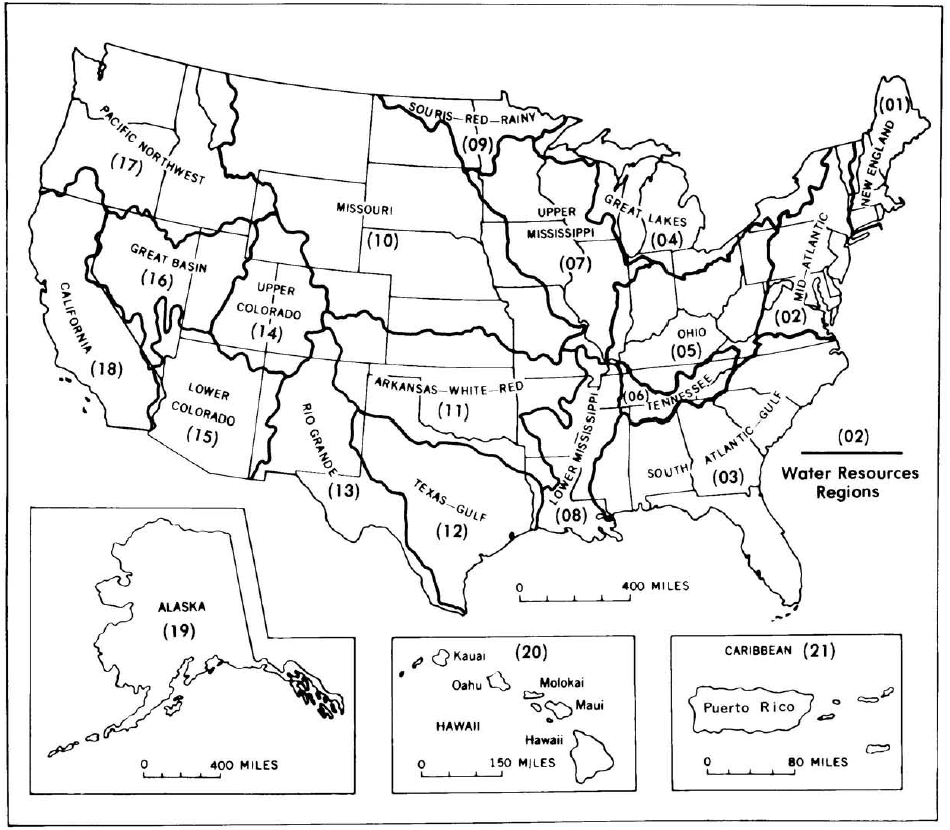

# Hydrologic Unit, Ecoregion, Hydrologic landscape

在了解GAGES数据集的过程中，看到了很多不同的region划分方式，有一些术语有必要了解清楚，这里主要针对三种：Hydrologic Unit, Ecoregion, Hydrologic landscape

## Hydrologic Unit Maps

这部分主要参考了文献 [Hydrologic Unit Maps](https://pubs.usgs.gov/wsp/wsp2294/)。

Hydrologic Unit(HU) Maps本身是由USGS编制的一系列用以描述美国河流流域单元的标准地图。其一共包括四级，如图所示：

- 21个major水资源regions；
- 222个由美国水资源council设定的subregions；
- 352个USGS国家水数据网络的accounting units；
- 2149个USGS的水数据信息分类的cataloging units。
  
接下来，首先描述绘图的技术考虑，从源头上给出对于地图的解释；然后基于此对数据进行稍详细的描述。

### Techinical Criteria

首先，流域边界要基本上都在美国境内；其次所有下一级的units面积都小于上一级的。

大多数用于绘制流域边界的技术标准都从公开的资源获取。这里只挑几条说明显示，以说明基本的思路即可。

- 主要参考了美国水资源委员会等的相关标准；
- 主要区域的选择：subregions、accounting units及cataloging units之间的关系有图示说明；
- 流域大小都大于700平方英里；
- 地下水区域：地下水认为和地表分区一致。

### Hydrologic Unit Codes

一个示例即可说明：

01-the region
0108-the subregion
010802-the accounting unit
01080204-the cataloging unit

在最后一个8位HU编码中，从前到后，每两位数字分别代表：Region/Subregion/Accounting Unit/Cataloging Unit.

总的来说，hydrologic unit更像一个纯粹的地理因素上的流域概念。

## Ecoregion
