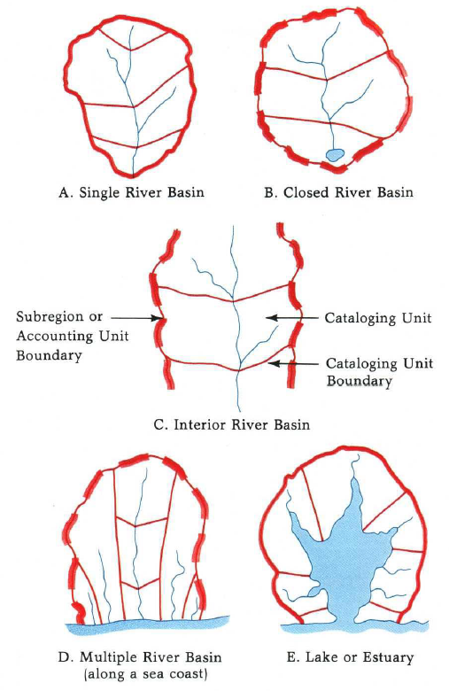
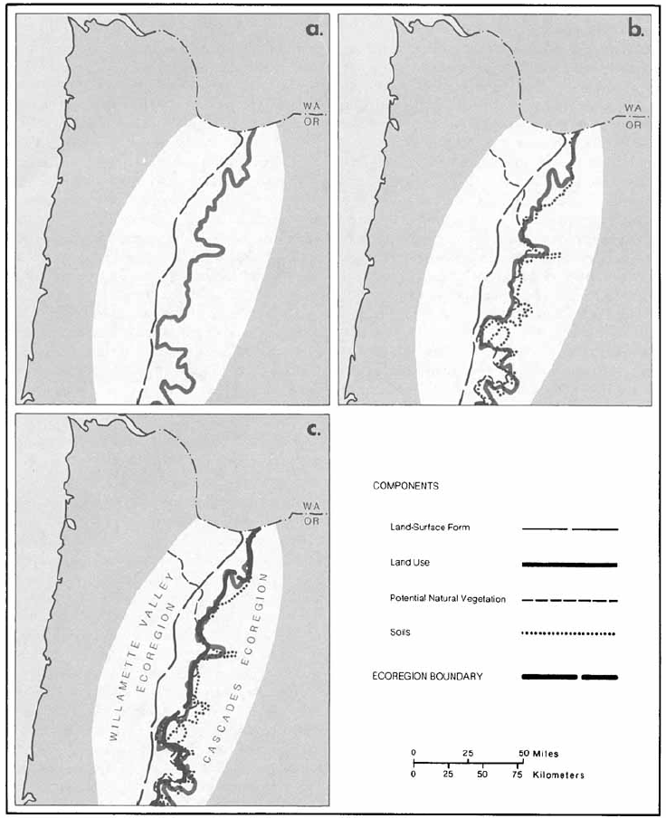
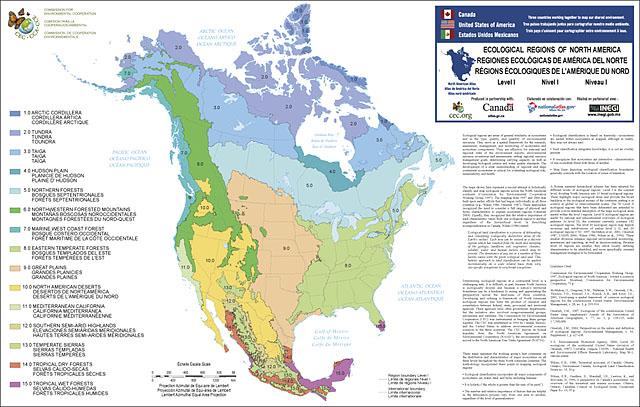
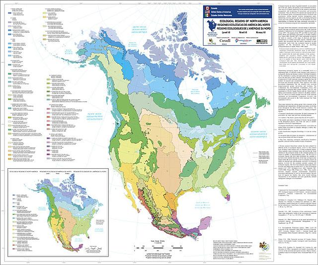
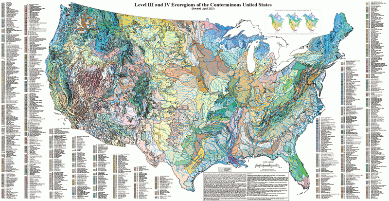
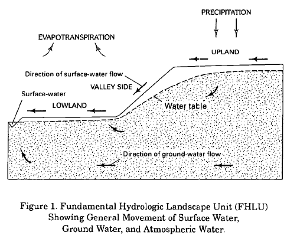
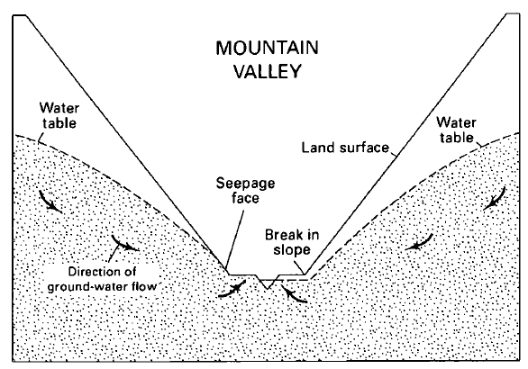
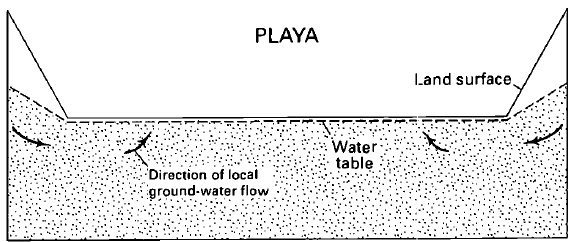
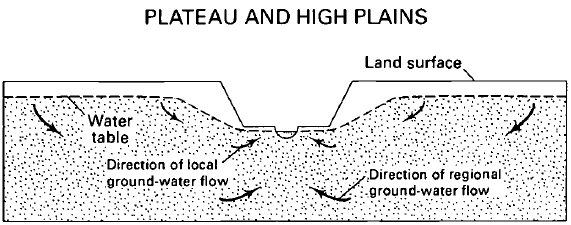
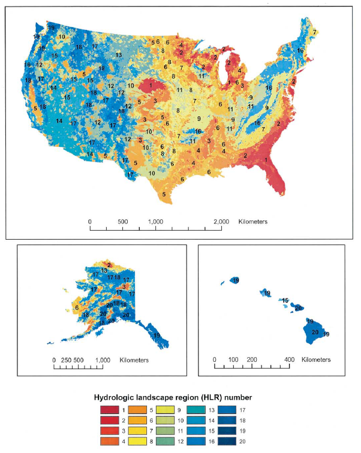

# Hydrologic Unit, Ecoregion, Hydrologic landscape

在了解GAGES数据集的过程中，看到了很多不同的region划分方式，有一些术语有必要了解清楚，这里主要针对三种：Hydrologic Unit, Ecoregion, Hydrologic landscape

## Hydrologic Unit Maps

这部分主要参考了文献 [Hydrologic Unit Maps](https://pubs.usgs.gov/wsp/wsp2294/)。

Hydrologic Unit(HU) Maps本身是由USGS编制的一系列用以描述美国河流流域单元的标准地图。其一共包括四级，如图所示：

- 21个major水资源regions；
- 222个由美国水资源council设定的subregions；
- 352个USGS国家水数据网络的accounting units；
- 2149个USGS的水数据信息分类的cataloging units。
  
接下来，首先描述绘图的技术考虑，从源头上给出对于地图的解释；然后基于此对数据进行稍详细的描述。

### Techinical Criteria

首先，流域边界要基本上都在美国境内；其次所有下一级的units面积都小于上一级的。

大多数用于绘制流域边界的技术标准都从公开的资源获取。这里只挑几条说明显示，以说明基本的思路即可。

- 主要参考了美国水资源委员会等的相关标准；
- 主要区域的选择：subregions、accounting units及cataloging units之间的关系有图示说明；
- 流域大小都大于700平方英里；
- 地下水区域：地下水认为和地表分区一致。

### Hydrologic Unit Codes

一个示例即可说明：

01-the region
0108-the subregion
010802-the accounting unit
01080204-the cataloging unit

在最后一个8位HU编码中，从前到后，每两位数字分别代表：Region/Subregion/Accounting Unit/Cataloging Unit.

总的来说，hydrologic unit更像一个纯粹的地理因素上的流域概念。

## Ecoregion

这部分主要参考文献[Ecoregions of the Conterminous United States]( https://doi.org/10.1111/j.1467-8306.1987.tb00149.x)

根据参考文献的摘要总结，ecoregions是基于包括land use, land surface form, potential natural vegetation和soils在内的综合因素来分类的。

对区域进行ecoregion划分的动机在于研究自然条件和人类活动对生态系统的影响。local的模型如何应用到更广的范围里，获取更普适的分析方法是一大问题，如果可以进行有效的分类，那么同样的pattern下，一个local的model是可以用到另一个区域的。所以才有动机去研究对生态系统区域模式的理解。

接下来依然首先阐述ecoregions划分的方式方法：

### Ecoregion Delineation

参考文献的划分方法基于一定的假设：

生态系统和其成分显示了一些反映在其影响因素的空间变量组合的区域模式中。

这些影响因素有：climate/mineral availability(soil and geology)/vegetation/physiography.

通过分析这些因素及其组合，可以区分出生态系统的区域模式。

接下来，首先定义了单因素的地图：major land uses、Land-Surface form类别图、Potential Natural Vegetation图和soils地图。这些地图均有相关文献已经制作得到。

其中，Potential Natural Vegetation意思是假如人类从所在地移走，植物会怎么样。当然这个图示估计的，不会那么精确。

有了4个重要的component的maps，接下来就是将它们拿来一起分析来描绘出在这四个方面homogeneous的regions。

对于4个特征都很清楚地和周围不同的region是很好区分的，但其他地区则不那么明显，它们之间的区别是一些特征更广泛的类别，或者是更少的特征。

首先，进行粗略的界限绘制。规定了ecoregions的大小等，将容易区分的区域划分开来。

接着就delineate边界。比如：

图a表示了land use和land surface form的边界；
图b阐述了land use、potential natural vegetation和soils边界的相似性；
由于这两种land surface form与植被、土地利用特征之间的联系，两种soils边界的真正走向可能更接近于其他成分的走向。所以划分的时候主要考虑右边的界限，得到图c。

最后再对区域上色，即可得到ecoregions的图。

### Ecoregions Maps

最后依据这套方法得到的结果文献中没有提及，但是可以在[EPA网站](https://www.epa.gov/eco-research/ecoregions)上查阅。

根据官网资料可知：

Ecoregions是生态系统 (and the type, quality, and quantity of environmental resources)相似的区域。其分析框架就是前述方法，地图最后的制作是EPA regional offices, other Federal agencies, state resource management agencies, and neighboring North American countries等共同完成的。

地图是用来作为一个spatial framework for the research, assessment, and monitoring of ecosystems and ecosystem components。

ecoregions表示了areas of similarity in the mosaic of biotic, abiotic, terrestrial, and aquatic ecosystem components with humans being considered as part of the biota.

这些regions are critical for structuring and implementing ecosystem management strategies across Federal agencies, state agencies, and nongovernmental organizations that are responsible for different types of resources within the same geographic areas.

Ecoregions are identified by **analyzing the patterns and composition of biotic and abiotic phenomena that affect or reflect differences in ecosystem quality and integrity**. These phenomena include **geology, landforms, soils, vegetation, climate, land use, wildlife, and hydrology**. The relative importance of each characteristic varies from one ecological region to another regardless of the hierarchical level.

ecoregions和HU一样也是分了四级。分别是Level-I/II/III/IV，从general到详细的。

Level I - 12 ecoregions in the continental U.S.
Level II - 25 ecoregions in the continental U.S.
Level III -105 ecoregions in the continental U.S.
Level IV - 967 ecoregions in the conterminous U.S.

具体这些regions的制作方式比前述文献更详细更精确了一些，这里暂时不表。
Explanations of the methods used to define these multi-agency ecoregions are given in Omernik and Griffith (2014), Omernik (1995, 2004), and CEC (1997)。

具体图如下所示：

官网提供了相关的GIS图可以在GIS软件中进行查阅。

总之，ecoregions更多的是从影响径流化学条件的因素角度进行的分类，而**不是**主要针对**水文特征**来进行分类的。或者更准确地讲，它是被用来识别影响**生态过程**的**生物和非生物因素的模式**的。

## Hydrologic Landscapes

这部分主要参考了文献[THE CONCEPT OF HYDROLOGIC LANDSCAPES](https://doi.org/10.1111/j.1752-1688.2001.tb00973.x)和[Delineation and Evaluation of Hydrologic-Landscape Regions in the United States Using Geographic Information System Tools and Multivariate Statistical Analyses](https://link.springer.com/article/10.1007/s00267-003-5077-9)。

Hydrologic Landscapes是基本的hydrologic landscape unit的组合或变种。基本的hydrologic landscape unit是基于**land-surface form, geology和climate**定义的，如下图所示。land-surface form是由一个斜坡及其分隔的lowland和upland构成。基础hydrologic landscape unit有一个完整的**水文系统**，包括地表径流、地下径流和与它们有交互的大气水。

以**land-surface slope, hydraulic properties of soils以及geologic framework，和降雨蒸发差值**等来描述actual landscape，那么actual landscapes的水文系统就可以以一种统一方式概念化。

接下来主要从概念详细解释、landscape maps制作及呈现两个方面阐述。

## The Concept

首先，创建hydrologic landscape的动机是由于用不同的概念作为基础得到的科研结论很难被整合以得到广泛应用，因此需要一个统一的概念框架应用于水文系统中的数据网络设计、研究等。这篇文献将以往的一些相似但不全面的（比如只描述地表水）landscape概念更进一步地推广为一个客观概念化**不同类型terrain下的地下水、地表水和大气水运动**的框架。基于此，可以研究这些terrains的水文系统。

更具体一些讲，是USGS的National Water-Quality Assessment(NAWQA) Program第二期经费有限，只能调查40个区域，为了保证这40个区域的代表性，必须对流域进行分类，这样才便于选择代表区域。

为了制作这样的一个地图，定义了hydrologic landscape。

首先，简单单一的物理特征是所有landscapes的基石，这个物理特征就是fundamental hydrologic landscape unit，其定义前面已述。

其次，FHLU的水文系统由也只由三个主要部分组成：

- 地表水运动，由slopes和landscope的permeability决定；
- 地下水运动，由地质framework的水力学特性控制；
- 大气水交换，由气候决定。

因此，HL的概念中只考虑land-surface form、geologic和climate。像土地利用等都不在考虑范围内。

然后，所有HLs都是HLU的组合或者变种。类型有很多，这里不一一列举，给出几个例子。

1. mountainous terrain
   狭窄的lowlands和uplands及陡峭的slope
   
2. basin-and-range physiography 和 basins of interior drainages
   广阔的lowland和狭窄的uplands以及陡峭的slope
   
3. plateaus and high plains
   狭窄的lowland，宽阔的upland以及多种坡度的slopes
   

## Delineation of Hydrologic-Landscape Regions

这部分在'THE CONCEPT OF HYDROLOGIC LANDSCAPES'一文中完全没有提及，而是由前述另一篇文献'Delineation and Evaluation of...'进行了详细的描述。因此本小节完全参考了这篇文献。简述如下：

首先，利用DEM数据生成全美的流域图；

然后量化land-surface form、geologic和climate。

- 对land-surface form，有四个变量，分别是relief（流域内最大高程差），slope<%1 的区域占流域总面积的比例，高程大于流域高程中值的平地面积占流域比例，高程小于等于中值的平地面积占流域比例；
- 对geologic texture：用土壤中沙的比例和基岩的类型值平均数来表示；
- 对climate characteristics：用PET，即平均年降雨-潜蒸发表达。

接着使用PCA对七个变量进行分析，选择5个主变量。
然后又分析这5个主变量和七个变量的关系，看看5个主变量都主要考虑了哪些变量。

利用NN聚类算法和这5个主元将所有watershed分成20组。这样就得到了最后的HLR图，如下图所示。

以上就是三种region各自介绍。简单总结：

HU是一种基本的地形几何分类方法；
ecoregions是一种化学生物分类方法；
HL是一种水文分类方法。
