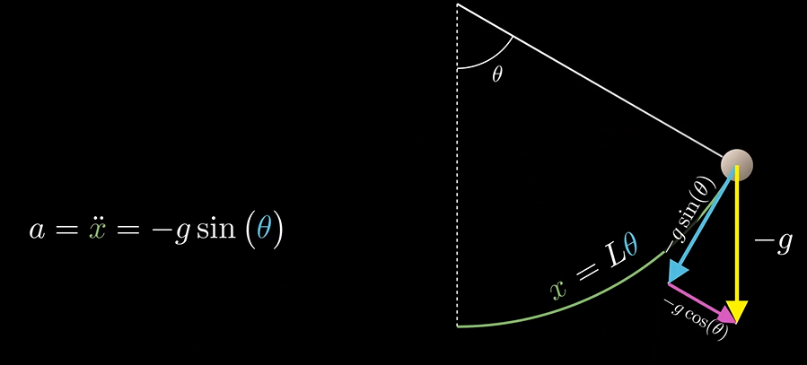
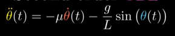
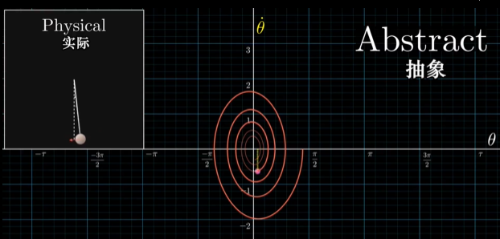
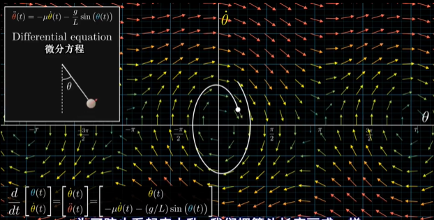
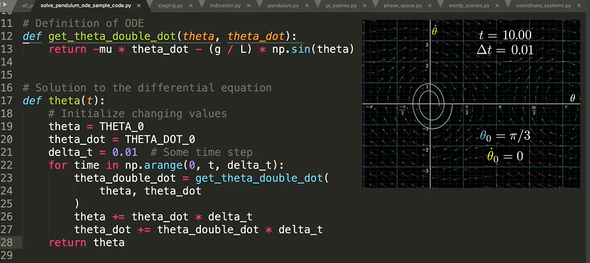

# 微分方程

一些关于微分方程的基本知识回顾。先阐述下了解这些基本概念的动机之一。实际工程中，在计算入库流量时，现有的方法虽能满足当前任务需要，但是不能够用于精细化调度，后面一定会有一些改进，而这种改进我估计是会和SWOT卫星的计算方法有些相似，可能会更多地结合地面观测来辅助，但是基本思想一定还是差不多的，而SWOT仅凭观测到的河道几何型态就能推算流量，自然是用了很多基本物理方程，这些物理方程自然少不了微分方程的基本知识，所以这里回顾下微分方程的基本知识做一些知识储备，从最基本的概念到水文水资源中常见的方程表达，日常积累中。个人复习基础知识的套路：科普型资料 -> 上课类资料 -> 书本类资料 -> 论文类资料，这样能由浅入深地了解概念，最后结合到自己的专业领域。

主要参考一些易懂的资料，比如：

- [3Blue1Brown--微分方程概论](https://www.bilibili.com/video/BV1tb411G72z)
- [MIT—微分方程与线性代数](https://ocw.mit.edu/resources/res-18-009-learn-differential-equations-up-close-with-gilbert-strang-and-cleve-moler-fall-2015/differential-equations-and-linear-algebra/)
- [youku MIT—微分方程与线性代数](https://v.youku.com/v_show/id_XMTY4OTUwNzA2OA==.html?f=27940973)
- [MIT—微分方程与线性代数笔记](https://zhuanlan.zhihu.com/p/46243135)
- [b站 MIT—微分方程与线性代数](https://space.bilibili.com/284151714/channel/detail?cid=73008)
- [常微分方程笔记](https://wklchris.github.io/Gitbooks/Math/ODE/build/html/index.html)

## 常识

一般来说，描述相对变化量比绝对量更容易时，微分方程就经常被用到了。比如学物理的时候，牛顿定律描述物体运动，力和加速度的关系，加速度反映的就是速度的变化，速度就是位移的变化，这时候微分方程就很好。

微分方程的形式大体上包括常微分方程和偏微分方程，前者自变量只有一个，通常是时间；后者有多个自变量。

总之，微分方程用来描述变化量，通常会根据一个物理现象来构建一个微分方程，这是所有事情的第一步，举个例子。在物理学的单摆中：

一开始可以建立一个初始的加速度关系，即位移二阶导是重力加速度分量，由于位移可以用角度来表达，继而就可以建立关于角度的微分方程了，再考虑阻力因素变得更真实一些，引入时间变量：

这里的例子中，微分方程的建立不算难，不过求解确实非常困难的（更不要说复杂的方程了），为了能让微分方程帮助我们理解现象，很多时候可能跳过直接求解析解这一步，来理解方程表达的内容（比如相位图），或者直接计算（数值求解）。

相位图，比如单摆例子中，可以表达角度一阶导和角度之间的变化关系，可以得到一个图像：

这样在整个空间（Phase space 相空间）上就能构建出一个关于 theta导数和其组成的向量的集合，那么向量的变化就能反映theta一阶导和二阶导，这样就能得到一个新的向量场，根据这个向量场可以看到空间中任意位置的变化趋势。

当然因为相位图本身是一种抽象的表达，所以其上的运动轨迹表达的物理意义需要进一步思考才能得到实际中的直观运动形式。

相空间能帮助我们理解方程，不过计算还得想办法，方法之一就是离散化，用差分，比如在相位图中，选定一个起始位置之后，可以按照差分的单位时间逐步前进，当步长足够小时，就很接近实际情况了，当然计算时间也会变长。

常微分方程已经不好解了，然而偏微分方程更难，因为它们有更多的变量及其相互间的作用。一个典型的例子数学物理方程中学过的热传导。下面是一维情况下的考虑。

简而言之，位移上的二阶导反映地是一个点和相邻的两点之间差值的差值引起的温度变化，想象一维杆上每个点，温度随时间变化的快慢是由相邻点二阶差值决定的，所以就有了左右之间的比例关系。相比于常微分方程等式一边随时间变化另一边是一些不再包含关于其他变量导数的式子，偏微分方程先是有无穷多的值都在变化，并且每个值都取决于其他值（本例中，每个点取决于临近点），因此还包含对其他变量的导数。

对于这个例子，如果上升到多维空间，就是多变量二阶段，用拉普拉斯算子容易表示。

建立方程之后同样是求解，这里有和傅里叶级数相关的内容。求解要有初始条件和边界条件，不然就有无穷解，根据初始条件和边界条件要能够掌控方程的解才算是求解了。求解的思路是从简单的余弦波开始，再利用叠加性质，通过傅里叶级数表达得到。

## 微分方程与线性代数

### 概述

前两节是概述。

第一节首先概述了下微分方程，基本上针对的是最经典的两类方程：一阶常微分方程和二阶常微分方程，尤其是常系数的。比如：
$$\frac{dy}{dt}=ay+q(t)$$
$$\frac{dy}{dt}=f(y)$$
$$\frac{d^2y}{dt^2 }=-ky$$
$$my''+by'+ky=f(t)$$

或者方程组（下面的方程的系数都是矩阵，每个方程都代表了一系列方程，是一个方程组）：
$$\frac{dy}{dt}=Ay$$
$$\frac{d^2y}{dt^2 }=-Sy$$
这就和线性代数有关系了，比如A的特征值和特征向量有助于将n个有耦合的方程转换为n个解耦的方程，更有利于求解。

然后概述了方程求解常用的数值方法，比如欧拉法，不过现在常用的求解方式一般比最经典的欧拉法要更精确一些。

最后谈到了PDE，偏微分方程，举的例子和前面提到的热传导方程一样：
$$\frac{\partial u}{\partial t}=\frac{\partial ^2 u}{\partial x^2}$$

另外，还举了波动方程和拉普拉斯方程的例子：
$$\frac{\partial ^2 u}{\partial t^2}=\frac{\partial ^2 u}{\partial x^2}$$
$$\frac{\partial ^2 u}{\partial x^2}+\frac{\partial ^2 u}{\partial y^2} = 0$$

第二节补充了一些必要的微积分知识点，包括常见的函数的导数，以及运算法则，还有微积分基本定理：$\frac{d}{dx}\int _o^x {y(t)}dt = y(x)$

因为这些点很基本很重要，比如根据微积分基本定理，可以判断：
$y(t)=\int _0^t e^{t-s}q(s)ds$，是方程 $\frac{dy}{dt}=y+q(t)$ 的解。

另一个比较重要的是泰勒级数的思想，逼近：
$$f(t+\triangle t)\approx f(t)+\triangle t \frac{df(t)}{dt} + \frac 1 2 (\triangle t)^2 \frac{d^2 f(t)}{dt^2}+ \cdots + \frac 1 {n!} (\triangle t)^n \frac{d^n f(t)}{dt^n}+\cdots$$

### 一阶方程

首先是Response to Exponential Input。
$$\frac{dy}{dt}=ay+e^{st}$$

通解(一个特解+null space解，null 解即方程$\frac{dy}{dt}=ay$ 的解)形式为：
$$y(t)=\frac{e^{st}-e^{at}}{s-a}+y(0)e^{at}$$

不过有个例外的情况：resonance，即s=a时，罗比塔法则可以处理，最后得到
$$y(t)=te^{at}+y(0)e^{at}$$

第二类是 Response to Oscillating Input
$$\frac{dy}{dt}=ay+cos \omega t$$

解：
$$y(t)=Gcos(\omega t-\alpha)$$
其中，$G=\sqrt{M^2+N^2}$，$tan\alpha = \frac{N}{M}$

显然cos可以用欧拉公式表达为指数形式，会更简洁。不过在此之前先讨论了input是任意形式时的情况。

第三类是Solution for Any Input
$$\frac{dy}{dt}=ay+q(t)$$

解：
$$y(t)=y(0)e^{at}+\int _0^t e^{a(t-s)}q(s)ds$$

然后讨论了冲激函数，冲激响应在后面会是个很重要的概念。
$$\frac{dy}{dt}=ay+\delta (t-T), y(0)=0$$
解：
$$\begin{equation}
y(t)=
\left\{
             \begin{array}{lr}
             0, & up\ \  to\ \  T\\
             e^{a(t-T)}, & t\geq T\\ 
             \end{array}
\right.
\end{equation}$$

接着是Response to Complex Exponential
$$\frac{dy}{dt}=ay+e^{i\omega t}$$
这部分解主要是要保证实部和虚部都相等，令解函数的表达式为 $y_c(t)=Ye^{i\omega t}$ 之后，可以逐步去求解。

接着方程右边又有一些别的变化了，讨论y的系数：
$$\frac{dy}{dt}=a(t)y+q(t)$$
这类的方程需要通过一种新的方法来求解，就是所谓的积分因子法，积分因子记为M，这应该是本科微积分教材会讨论的一种情况，总之是为了求解方程去凑了一种便于求解的形式，暂不赘述了。

下面是另一类典型方程：The Logistic Equation
$$\frac{dy}{dt}=ay - by^2$$

这显然非线性了，不过可以很容易转换成线性的，用一个z=1/y，求dz/dt，可以发现 $dx/dt=-az+b$

求解之后y对应的是一个logistic曲线，又称为S-curve，一个很有名的曲线，对应的应用场景 比如 人口增长。

里面涉及到一个概念，steady states，即方程等式右侧为0时的解。这时候有的解是unstable的，即在这个点附近的初始点会迅速地变化，有的是stable地，即在这个点附件基本能维持原状态，差别不大。

判断是不是stable的一个方法就是等式右侧对y求导之后，在几个等式右侧为0的y点的导数的正负，如果为负，说明指数变化是趋于0的，是stable的，否则是unstable的（简单的线性近似）：
$$\frac{d}{dt}(y-Y)=f(y)-f(Y)\approx \frac{df}{dy}(y-Y)$$

这里有个非常有趣的实验，tumbling box，可以自己动手试试。

在一个坐标轴上，可以画出点的运动方向，这样很容易看出点的stable/unstable -- 这是stability line。

最后一类一阶的方程是 可分离变量的微分方程：
$$\frac{dy}{dt}=\frac{g(t)}{f(y)}$$

