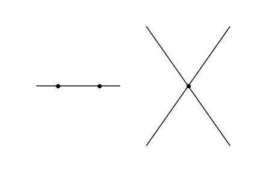

# 对偶问题
写到拉格朗日对偶，已经见识了一些“对偶”发挥威力的地方，因此归纳下目前学过的对偶的情况，梳理“dual”的含义。
首先，翻译一篇论文，原文详见[http://fme.upc.edu/ca/arxius/butlleti-digital/riemann/071218_conferencia_atiyah-d_article.pdf?utm_medium=social&utm_source=qq][1]，这篇文章给出了历史上在数学和物理方面比较经典的对偶理论，详实精彩。以下是译文（注：译文中会以括号内写注释的方式来解释一些概念，字体颜色是灰色）：

**数学和物理中的对偶**

**摘要**：对偶是数学中最历史悠久、成果丰富的思想之一。本文调查它的历史，揭示对偶是如何被推广以及如何指导了数学的发展，并给出一些最近对偶在物理和数学上应用的新发现和新猜想。

**引言**：数学上的对偶不是一个定理，而是一种“原理”。它有一个简单的起源，有力而实用，已经有数百年历史。随着时间的推移，对它的改进和修正使得它在许多新情况下都可以运用，几何、代数、解析、物理都有它的身影。基本上来说，对偶给出了看待同一个事物的两种不同视角的观点。原则上来说，像这样可以“一物两观”的事物都是对偶的。

平面上的线性对偶：对偶开始于经典的几何中平面上的线性对偶。平面上有点、线。两点之间有唯一的连线。除了平行的情况，两条直线之间必有一个交点。如下图所示

人们不喜欢平行这一例外，钻研后发现，如果在无穷远处增加一些点，那么就能得到一个对偶性极佳的“投影平面”：点和线完美对称。（注：两点决定一条直线 与 两线决定一点 完美对偶）这就是经典的投影对偶原理，一个定理的对偶描述也是定理，因此可以称其为对偶定理。

线性代数。在线性代数对偶中，有*对偶向量空间*中的“对”：

$<\xi,x>=\sum_i\xi_i x_i$

例如，令 $n=3$ 。如果取合适的 $\xi$ ，那么等式 $<\xi,x>=0$ 给出了一个 $x$ 上的线性条件，它决定了一个三维向量空间上的平面（注：三维空间中的平面形式 $ax+by+cz=0$ ）。另一方面，如果固定 $x$ 并令 $\xi$ 变化，那么可以得到一个对偶空间上的平面。以上是向量空间，如果我们用[*齐次坐标*](nt.md)提出其中的因子（降维），我们会得到投影平面上的直线。所以投影几何和线性代数之间的关系非常简单：我们写了等式并识别了哪些与非零标量因子不同的。

**线性分析**

## 线性代数中的对偶
### 点积
### 叉积

## LP中的对偶

## 拉格朗日对偶

## 凸集中的对偶

## 信号中的对偶

[1]:http://fme.upc.edu/ca/arxius/butlleti-digital/riemann/071218_conferencia_atiyah-d_article.pdf?utm_medium=social&utm_source=qq
