# Introduction to Reinforcement learning

这一部分介绍关于强化学习（RL）的基本概念。书本可以参考：[Reinforcement Learning: An Introduction](https://web.stanford.edu/class/psych209/Readings/SuttonBartoIPRLBook2ndEd.pdf), [Algorithms for Reinforcement Learning](https://sites.ualberta.ca/~szepesva/papers/RLAlgsInMDPs.pdf)

RL是有many faces的，是很多领域的交叉，包括：计算机（machine learning）/神经科学（rewward system）/心理学（classical conditioning）/经济学(bounded rationality)/数学(operations research)/工程(optimal control)，它是解决一类问题的比较普适的一种方法，是关于决策的科学。

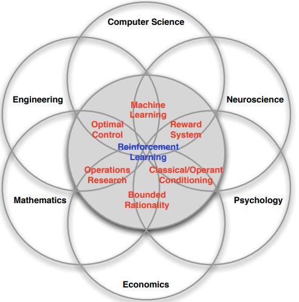

RL和其他机器学习方法的区别：

- There is no supervisor, only a reward signal
- Feedback is delayed, not instantaneous
- Time really matters (sequential, non i.i.d data)
- Agent’s actions affect the subsequent data it receives

一些例子：

- Fly stunt manoeuvres in a helicopter
- Defeat the world champion at Backgammon
- Manage an investment portfolio
- Control a power station
- Make a humanoid robot walk
- Play many different Atari games better than humans

RL问题定义：

- A reward Rt is a scalar feedback signal
- Indicates how well agent is doing at step t
- The agent’s job is to maximise cumulative reward

RL基于 reward hypothesis：

Reward Hypothesis 是指 All goals can be described by the maximisation of expected cumulative reward

用自己黑话说就是效益得是可以量化的。Reward 是一个标量，是一个好坏的度量指标，然后Agent 的终极目标就是尽可能的最大化整个过程的累计奖励（cumulative reward），所以很多时候要把目光放长远一点，不要捡个芝麻丢个西瓜，要明白曲线救国也不是不可以的。

比如：

- Control a power station
    - +ve reward for producing power
    - −ve reward for exceeding safety thresholds

RL是针对序列决策的 sequential decision making

目标：*select actions to maximise total future reward*

行为是由长期影响的，Reward是延迟的，可能牺牲现在的reward来获取更长期的reward是更好的。

比如：

- A financial investment (may take months to mature)
- Refuelling a helicopter (might prevent a crash in several hours)
- Blocking opponent moves (might help winning chances many moves from now)

基本过程，agent会根据观测做出动作并分析reward。一个agent和env的互动

- At each step t the agent:
    - Executes action At
    - Receives observation Ot
    - Receives scalar reward Rt
- The environment:
    - Receives action At
    - Emits observation Ot+1
    - Emits scalar reward Rt+1
- t increments at env. step

history是observation，actions，rewards的序列。

Ht = O1, R1, A1, ..., At−1, Ot, Rt

- 下一步发生什么需要依据history：
    - The agent selects actions
    - The environment selects observations/rewards

**State** is the information used to *determine what happens next*. state is *a function of the history*:

$S_t$ = f ($H_t$)

The environment state $S^e_t$ is the environment’s private representation. 不过环境状态对于agent通常是不可见的。即使可见，也可能包括不相干的信息。比如 whatever data the environment uses to pick the next observation/reward.

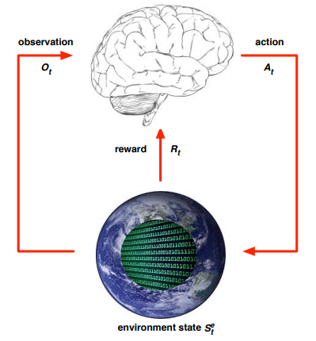

agent state $S^a_t$ 是agent的 内部表达，比如 whatever information the agent uses to pick the next action。 可表达为history的函数：

$S^a_t$ = f ($H_t$)

Information state，比如Markov state， 包含了从history获取的所有可用的信息，定义一个State是Markov的，当且仅当：

P[St+1 | St] = P[St+1 | S1, ..., St]

在给定现在的条件下，未来与过去无关。$H_{1:t}$ → $S_t$ → $H_{t+1:∞}$

state 一可知，history就可以不需要了。环境状态 $S^e_t$ 是Markov，history是Markov。

小结下state，参考了：[一条咸鱼的强化学习之路2之强化学习基本概念与MDP](https://zhuanlan.zhihu.com/p/26608059)。State可分为三种：

- 第一种是Environment State,是真正的环境所包含的信息，Agent一般情况下是看不到或凭agent自身能力不能完全地获取其信息的。即便环境信息整个是可见的，也许还会包含很多无关信息；
- 第二种是Agent State，指Agent用来选择下一个行动的信息源，也是我们算法进行所需要的那些信息，个人理解是Agent自己对Environment State的解读与翻译，它可能不完整，但我们的确是指望着这些信息来做决定的；
- 第三种是Information State，又称为Markov state, 包含了History中所有的有用信息。感觉这只是个客观的概念，并没有和前两种State形成并列关系，只是一个性质。它的核心思想是“在现在情况已知的情况下，过去的事件对于预测未来没用”，也就相当于是现在的这个状态已经包含了预测未来所有的有用的信息，一旦你获取了现在的有用信息，那么之前的那些信息都可以扔掉了！这就是Markov的特性，这里我们说Environment state是Markov，History也是Markov。后边很多的问题出于能解的角度应该都会当成Markov状态来看。

agent对环境的了解有 Full observability 和 partial observability

Full observability: agent *directly* observes environment state

$$O_t = S^a_t = S^e_t$$

Agent state = environment state = information state

Formally, this is a Markov decision process (MDP)

Partial observability: agent indirectly observes environment，比如，

- A robot with camera vision isn’t told its absolute location
- A trading agent only observes current prices
- A poker playing agent only observes public cards

Now agent state $\neq$ environment state

Formally this is a partially observable Markov decision process (POMDP)

Agent must construct **its own state representation** $S^a_t$, 比如：

- Complete history: $S^a_t$ = Ht
- Beliefs of environment state: $S^a_t$ = (P[$S^e_t = s^1$], ..., P[$S^e_t = s^n$])
- Recurrent neural network: $S^a_t = σ(S^a_{t-1}W_s + O_tW_o)$

小结下environment，对于Environment，可细化分为两种：

- 第一种是完全可观测环境（Fully Observable Environment），顾名思义，是指agent可以完全观测到环境状态的情形，此时Agent State = Environment State = Information State，这是一个很理想化的情况，现实中很多复杂问题是不具备这个条件的。同时根据定义，此时的环境状态是一个Markov Decision Process（MDP）
- 第二种是部分可观测环境（Partially Observable Environment），这种情况是相对于上边的情形来说的，即Agent不能完整的获取环境信息状态，所以此时Agent State ≠ Environment State。而此时的环境状态称为部分可观测MDP。所以此时想要解决问题的话Agent必须自己对环境进行解读，自己去探索。

下面看看agent内部的机制。首先agent由以下内容组成：

- Policy: agent’s behaviour function
- Value function: how good is each state and/or action
- Model: agent’s representation of the environment

Policy就是agent的行为，是从state到action的映射，比如：

- Deterministic policy: a = π(s)
- Stochastic policy: π(a|s) = P[At = a|St = s]

Value function 是对未来reward的预测，用来评价状态的好坏，因此是在动作间去做选择，比如：

$$v_π(s) = \mathbb{E}_π[R_{t+1} + γR_{t+2} + γ^2R_{t+3} + ... | S_t = s]$$

第三部分 agent中的model是用来预测环境的下一步的。P predicts the next state；R predicts the next (immediate) reward，比如

$$P^a_{ss'} = \mathbb{P}[S_{t+1} = s'| S_t = s, A_t = a]$$
$$R^a_s = \mathbb{E}[R_{t+1} | S_t = s, A_t = a]$$

例子：

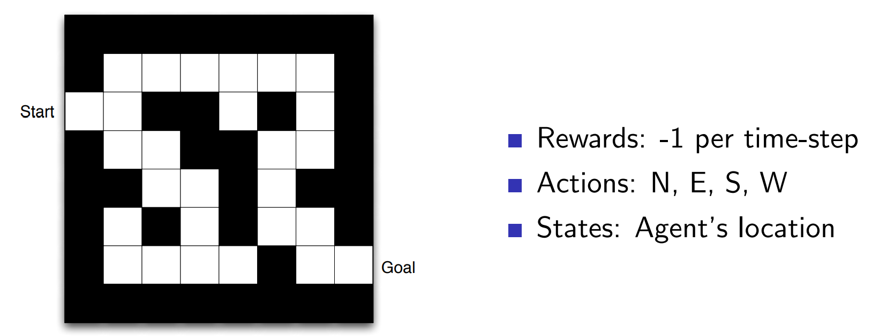

policy 如下所示：

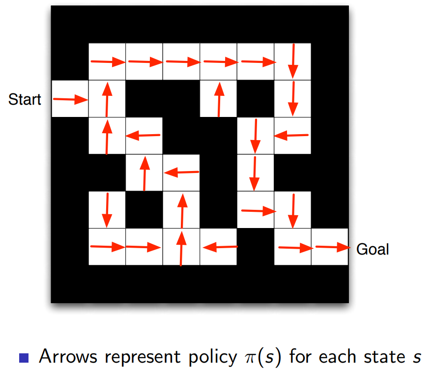

根据 trial and error 可以判断出每个状态的整体reward，如下图

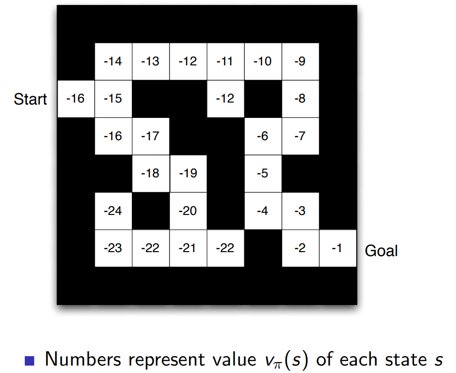

上图是根据单步reward图逐步尝试得到的：

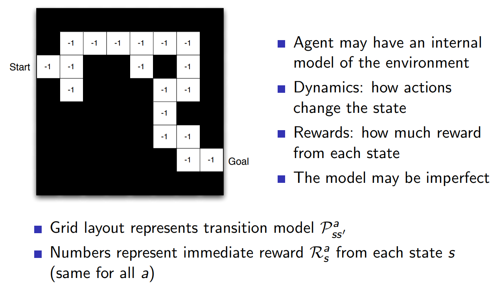

Agent 有几种不同的类型：

- Value Based：这类是没有明确的policy的，而是直接根据value function来判读状态变化的好坏，并以此来学习，比如上面的迷宫，每个迷宫格最后都会得到一个value，这样最后agent就可以判断什么样的决策是好的了。
- Policy Based：有policy，没有value function。比如上面例子，有箭头的图。根据最后能不能到Goal，可以决定所采取的policy
- Actor Critic：整合两种
    - Policy
    - Value Function
    
上面是agent的一种分类，还可以从model方面来进行分类：

- Model Free：不直接对环境建模，不去显式地表达环境，直接根据policy和value function的结果来判断最后的决策
    - Policy and/or Value Function
    - No Model
- Model Based：需要对环境建模以使agent能判断reward等
    - Policy and/or Value Function
    - Model

关于agent的一个小结图：

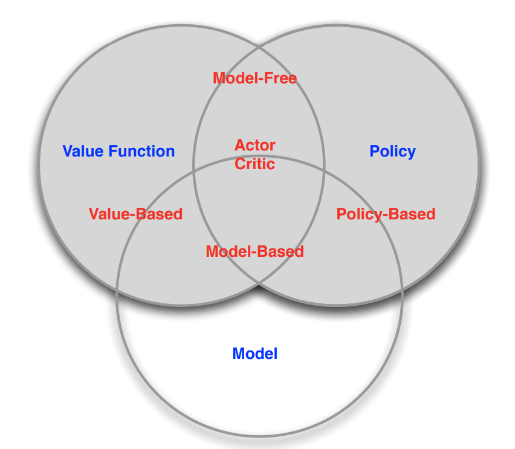

另外，在序列决策中，强化学习和计划有些区别（Two fundamental problems in sequential decision making）

- Reinforcement Learning:
    - The environment is initially unknown
    - The agent interacts with the environment
    - The agent improves its policy
- Planning:
    - A model of the environment is known
    - The agent performs computations with its model (without any external interaction)
    - The agent improves its policy 
    - a.k.a. deliberation, reasoning, introspection, pondering, thought, search

比如，强化学习例子：

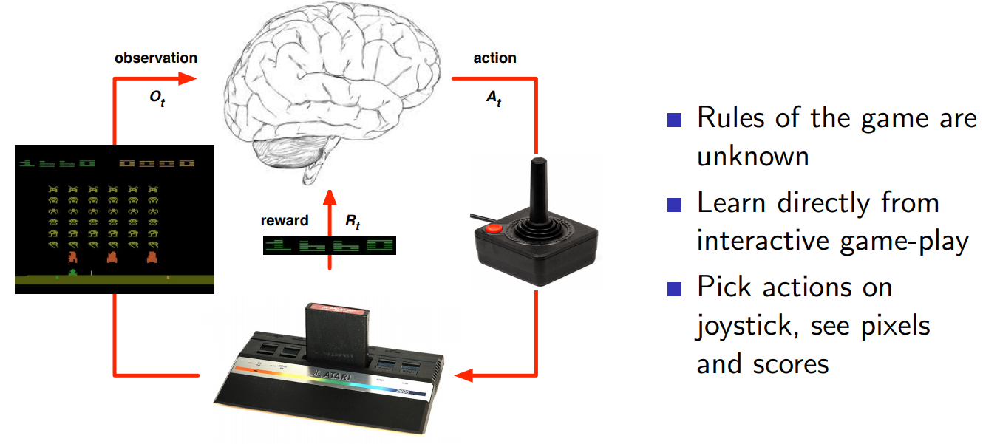

planning的例子：

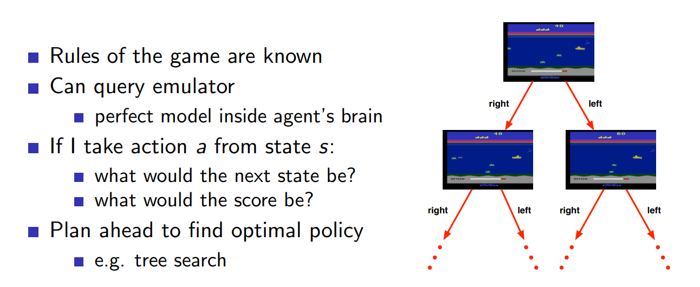

小结下，对于Agent，主要涉及到三个组成要素：策略（Policy），价值函数（Value Function）和模型（Model），但要注意这三要素不一定要同时具备。

- Policy：是Agent的行为指南，是一个从状态（s）到行动（a）的映射，可以分为确定性策略（Deterministic policy）和随机性策略（Stochastic policy），前者是指在某一特定状态确定对应着某一个行为a = π（s），后者是指在某一状态下，对应不同行动有不同的概率，即π（a|s）=P[At = a | St = s ]，可以根据实际情况来决定具体采用哪种策略。
- Value Function：价值函数是对未来总Reward的一个预测，即如果我进入这个状态或者我采取这个行动的话能有多大的甜头或者风险。继而在做了计算以后选择更好的action。
- Model：模型是指Agent通过对环境状态的个人解读所构建出来的一个认知框架，它可以用来预测环境接下来会有什么表现，比如，如果我采取某个特定行动那么下一个状态是什么，亦或是如果这样做所获得的奖励是多少。不过模型这个东西有些情况下是没有的。所以这就可以将Agent在连续决策(sequential decision making )行动中所遇到的问题划分为两种，即Learning problem 和 Planning problem。对于前者，没有环境的模型，Agent 只能通过和环境来互动来逐步提升它的策略。对于后者，环境模型已经有了，所以你怎么走会产生什么样的结果都是确定的了，这时候只要通过模型来计算那种行动最好从而提升自己策略就好。

有关Agent的分类，从采取的方法上可以分为Value Based，Policy Based 和Actor Critic。第一种顾名思义就是基于价值函数的探索方式，第二种就是基于策略的探索方式，第三种就是前二者合体。另外，从是否含有模型上Agent又可分为Model Free 和Model Based。

小结下本文：

- Reinforcement learning is like trial-and-error learning
- The agent should discover a good policy
- From its experiences of the environment
- Without losing too much reward along the way

- Exploration finds more information about the environment
- Exploitation exploits known information to maximise reward
- It is usually important to explore as well as exploit

exploration和exploitation的区别，举一些例子：

- Restaurant Selection
    - Exploitation Go to your favourite restaurant
    - Exploration Try a new restaurant
- Online Banner Advertisements
    - Exploitation Show the most successful advert
    - Exploration Show a different advert
- Oil Drilling
    - Exploitation Drill at the best known location
    - Exploration Drill at a new location
- Game Playing
    - Exploitation Play the move you believe is best
    - Exploration Play an experimental move
    
最后一个概念区别：prediction和control

- Prediction: evaluate the future
    - Given a policy
- Control: optimise the future
    - Find the best policy
    
预测的例子：

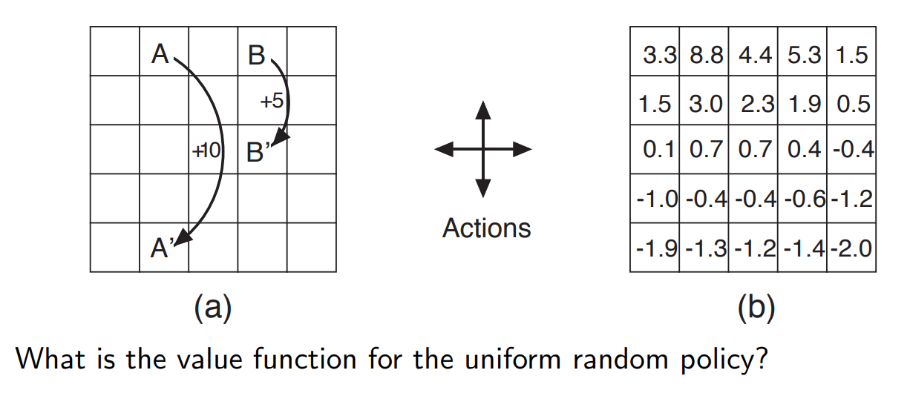

control的例子：

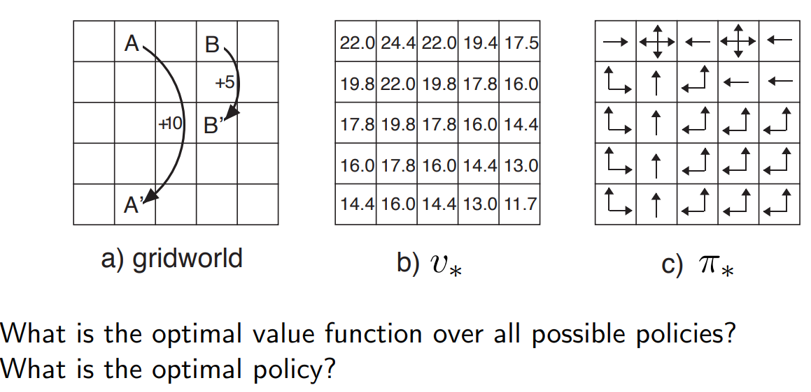

David Silver 的这一系列课程主要分为两大部分，第一部分是介绍强化学习的基本概念，第二部分是一些实例分析。

- Part I: Elementary Reinforcement Learning
    1. Introduction to RL
    2. Markov Decision Processess
    3. Planning by Dynamic Programming
    4. Model-Free Prediction
    5. Model-Free Control
- Part II: Reinforcement Learning in Practice
    1. Value Function Approximation
    2. Policy Gradient Methods
    3. Integrating Learning and Planning
    4. Exploration and Exploitation
    5. Case study - RL in games
