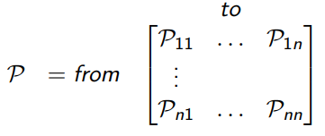
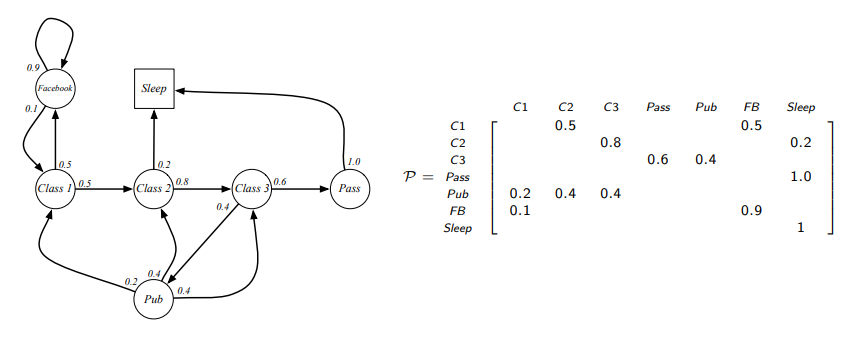
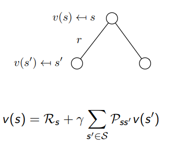
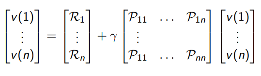

# Markov decision processes

马尔可夫决策过程描述了强化学习的环境，环境是fully observable的，当前state完全能描述the process。几乎所有的RL问题都可以表示为MDPs，比如：

- Optimal control primarily deals with continuous MDPs
- Partially observable problems can be converted into MDPs
- Bandits are MDPs with one state

## Markov process

当且仅当 $P[S_{t+1}|S_t]=P[S_{t+1}|S_1, \cdots, S_2]$，可称一个状态时Markov的。

- 状态从历史中获取了所有相关信息；
- 状态可知，那么历史信息就可以丢弃了
- 即 The state is a sufficient statistic of the future

马尔可夫状态和后续状态，有状态转移矩阵定义如下：
$$P_{ss'}=P[S_{t+1}=s'|S_t=s]$$

那么所有状态之间的转换可以构成状态转移矩阵。

马尔可夫过程时一个无记忆的随机过程，马尔可夫链可以定义为一个元组 <S,P>

- S 是状态集合
- P 是状态转移矩阵

例子：

## Markov reward process

Markov reward process 是一个带values的马尔可夫链，可定义为元组<S,P,R,$\gamma$>

- S是有限状态集
- P是状态转移矩阵
- R是reward函数 $R_s = E[R_{t+1}|S_t=s]$
- $\gamma$ 是折算系数 ，取值范围[0,1]

决策中我们关心的是total reward。定义return $G_t$ 为从时段t开始的 total discounted reward 
$$G_t=R_{t+1}+\gamma R_{t+2}+\cdots = \sum _{t=0}^\infty \gamma ^k R_{t+k+1}$$

- discount $\gamma$ 反映的是未来reward的折现值。
- The value of receiving reward R after k+1 time-steps is $\gamma ^k R$
- This values immediate reward above delayed reward.
    - $\gamma$ 接近0 表示 ”myopic” evaluation 即重视短期收益
    - $\gamma$ 接近1 表示 ”far-sighted” evaluation  即重视长期收益
    
为什么要discount？

- 因为我们无法完全了解未来，而discount是一种比较简洁的数学上处理的方式，
- Avoids infinite returns in cyclic Markov processes
- 关于未来的不确定性没法完全表示
- 如果reward 是financial的，立即的收益可能会比延迟收益更让人关注
- 人们的行为是更倾向于immediate reward的
- 也有可能不用discount，比如当所有序列已知

value function v(s) 给出了状态s的长期价值，定义一个MRP的状态价值函数v(s)为从状态s开始的期望反馈。
$$v(s)=E[G_t|S_t=s]$$

看例子：还是上面的马尔可夫链的return，假设从$S_1=C_1$ with $\gamma =1/2$ 开始。
$$G_1=R_2+\gamma R_3 + \cdots+\gamma ^{T-2}R_T$$

MRPs的Bellman方程：是强化学习的一个基础，基本上是一个递归的思路。

value function可以分为两个部分：

- immediate reward $R_{t+1}$ （t+1表示immediate reward是因为环境响应约定为t+1）
- discounted value of successor state $\gamma v(S_{t+1})$
$$v(s)=E[G_t|S_t=s]
=E[R_{t+1}+\gamma R_{t+2}+\gamma ^2 R_{t+3}+\cdots|S_t=s]
=E[R_{t+1}+\gamma (R_{t+2}+\gamma R_{t+3}+\cdots)|S_t=s]
=E[R_{t+1}+\gamma G_{t+1}|S_t=s]
=E[R_{t+1}+\gamma v(S_{t+1})|S_t=s]$$

理解下贝尔曼方程
$$v(s)=E[R_{t+1}+\gamma v(S_{t+1})|S_t=s]$$
可以看作一个单步的决策树

Bellman方程矩阵形式：
$$v=R+\gamma Pv$$

v是列向量，每项一个状态：

Bellman方程可以直接求解，
$$v=(1-\gamma P)^{-1}R$$

对n个状态，计算复杂度是 $O(n^3)$，直接求解只能针对小MRPs，对于大型的MRPs，求解方式有：

- 动态规划
- 蒙特卡洛evaluation
- Temporal-Difference Learning

## Markov Decision Process

MDP 是 一个MRP **with decisions**。它是一个environment，其中，所有states是Markov的。

MDP是这样一个元组：<S,A,P,R, $\gamma$>

- S is a finite set of states
- A is a finite set of actions
- P is a state transition probability matrix, $P^a_{ss'} = P [S_{t+1} = s'| S_t = s, A_t = a]$
- R is a reward function, $R^a_s = E [R_{t+1} | S_t = s, A_t = a]$
- γ is a discount factor γ ∈ [0, 1].

Policy就是a distribution over actions given states：
$$\pi (a|s)=P[A_t = a|S_t = s]$$

- policy 完全定义了agent的行为，比如a表示向左还是向右 policy就是状态s时 a向左和向右的概率
- MDP policies 取决于当前状态（not history）
- 即policies是stationary（time-independent）的，$A_t \sim \pi(\cdot|S_t), \forall t>0$

给定一个MDP M=<S,A,P,R,$\gamma$>，和policy $\pi$，state序列 $S_1, S_2, \cdots$ 是马尔可夫过程$<S, P^{\pi}>$，state和reward 序列 $S_1, R_2, S_2, \cdots$是马尔可夫reward过程$<S,P^{\pi},R^{\pi},\gamma>$

其中，
$$P^{\pi}_{s,s'}=\sum_{a\in A}\pi(a|s)P^a_{ss'}$$
$$R^{\pi}_s=\sum_{a\in A}\pi(a|s)R^a_s$$
