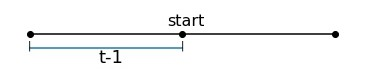
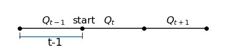

# 贝叶斯定理在结合预报信息的发电调度中的应用

## 贝叶斯定理简介
先验、似然、后验都是什么鬼？条件概率、条件期望、条件无关又都是啥？贝叶斯公式、全概率公式、贝叶斯定理都是怎么回事？我试着从表面给予一些解释。

## 入库径流中的贝叶斯定理
关于水库常规发电调度的基本情况，已经做过阐述，这里不再展开，把问题聚焦到调度的一个重要因素——**入库径流**。

神鬼莫测的大自然对于我等渣渣来说，确实是神秘的存在，奈何我们要用水库的水做一些凡人必需的事情，像供水、防洪、发电等等，那么我们就要强行理解一波径流的规律，毫无疑问，模型是我们理解它的一种有利手段。

首先我们可以通过统计模型去分析，来得到一些径流的概率分布情况，比如我们通常认为，径流量的概率分布是符合P-III分布的，P-III分布的概率密度曲线如下图所示，这可以被称为先验知识。针对一个时段的入库流量为多少的概率$P(Q_t)$，我们可以选择将其看做一个由前面的历史信息决定的数值，$P(Q_t|Q_{t-1},Q_{t-2},...,Q_0)$ 作为先验概率，上式中$Q_t$表示t时段的实测流量，如果将径流过程看做一阶马尔科夫链，则上式等价于$P(Q_t|Q_{t-1})$ 。

再者，我们可以通过数据挖掘或者对不同尺度水循环的物理机制研究开发水文模型来了解径流规律，水文界的大神们创造出了各种工具，像Budyko模型、新安江模型、VIC模型等等，这些模型都为我们了解未来径流的信息提供了知识。但是不管我们怎么去进行预报，没有发生的入库径流过程对于我们来说，依然是一个随机过程，对于单一时段的预报来说，就是一个随机变量。因此，水文模型的计算结果可以看做是对先验知识的补充，即调整因子，或者从另一个角度理解，我们可以把它看做是我们做的实验，实际的径流分布无从得知，那么我们通过实验得到了结果，这个结果是我们能得到的最好的结果了，因此可以通过它来推断实际的分布，就是似然估计，那么我们就可以对径流得到一个似然概率$P(H_t|Q_t)$ ，式中，$H_t$为t时段的预报流量，$Q_t$为实测径流。

根据贝叶斯公式，后验概率就可以得到了。
P（猜测|真实）∝ 猜测本身的可能性 x 此猜测生成我们的观测到的数据的可能性，即先验概率 x 似然概率

现在回到问题，我们已知了历史径流数据，并且利用水文模型以及降雨预报数据计算得到了预报径流数据，我们怎么看待未来将要发生的径流。
说到底，我们只是能预测未来的流量，通过能得到的**所有信息**来得到这个值，我们认为是最好的，但是这个值依然只是一个概率值，而不是一个真实的值。我们把，$P(Q_t|H_t,Q_h)$ 为实际流量为$Q_t$的概率，其中，$Q_h$表示{$Q_{t-1},Q_{t-2},...,Q_0$}，那么根据贝叶斯公式，可以得到

$P(Q_t|H_t,Q_h)=\frac{P(H_t,Q_h|Q_t)*P(Q_t)}{P(H_t,Q_h)}$

接下来开始进行一些简单的推导。有一个十分重要的前提，就是$H_t$和$Q_h$在$Q_t$的条件下是**条件无关**的，可以这么理解：未来的径流完全不影响现在的预报和历史的实测径流值。

首先根据“条件无关”的条件可得$P(H_t,Q_h|Q_t)=P(H_t|Q_t)*P(Q_h|Q_t)$

所以，有$P(Q_t|H_t,Q_h)=\frac{P(H_t|Q_t)*P(Q_h|Q_t)*P(Q_t)}{P(H_t,Q_h)}$

等式右侧分子的后两项乘数$P(Q_h|Q_t)*P(Q_t)=P(Q_t|Q_h)*P(Q_h)$，

将$P(Q_h)$ 换到分母上，得到 $P(Q_t|H_t,Q_h)=\frac{P(H_t|Q_t)*P(Q_t|Q_h)}{P(H_t,Q_h)/P(Q_h)}$

现在单独分析分母上的除式$P(H_t,Q_h)/P(Q_h)$

根据全概率公式有$P(H_t,Q_h)=\sum_iP(H_t,Q_h|Q_{t_i})*P(Q_{t_i})$

根据“条件无关”，进而得到$P(H_t,Q_h)=\sum_iP(H_t|Q_{t_i})*P(Q_h|Q_{t_i})*P(Q_{t_i})$

所以再根据贝叶斯公式有$P(H_t,Q_h)/P(Q_h)=\sum_iP(H_t|Q_{t_i})*P(Q_{t_i}|Q_h)$ 。

综上，得到$P(Q_t|H_t,Q_h)=\frac{P(H_t|Q_t)*P(Q_t|Q_h)}{\sum_iP(H_t|Q_{t_i})*P(Q_{t_i}|Q_h)}$

如果我们的先验知识认为径流序列为一阶马尔科夫链，那么公式自然就变为了：
$P(Q_t|H_t,Q_{t-1})=\frac{P(H_t|Q_t)*P(Q_t|Q_{t-1})}{\sum_iP(H_t|Q_{t_i})*P(Q_{t_i}|Q_{t-1})}$

有了这个公式，我们就得到了综合尽可能多的信息的未来径流数据了。实际上贝叶斯公式本身和信息论的知识就有着“不清不楚”的关系，这个有待后期学习了信息论的知识再回头看待这个事情。再重新看一下公式中各个变量是什么意思：左侧是我们想要求得的实测径流为某个值的概率。右侧中，$P(H_t|Q_t)$ 表示实测径流为Q_t时预报径流的条件概率；$P(Q_t|Q_{t-1})$ 表示上一阶段径流为$Q_{t-1}$ 时实测径流为$Q_t$ 的条件概率。右侧中的这两个值都是通过历史数据统计得到的，这就是统计学发挥作用的时候。

## 贝叶斯公式用于发电调度的“水调”模块
在经典的水调（即所谓“以水定电”的过程）中，我们通常以发电量最大为调度目标，虽然这一目标在进入电调之后就基本上没什么用了，但是我们仍然使用这个目标，具体原因在另外的博文里面再进行讨论，这里先忽略这个问题。贝叶斯公式用于发电调度，显然是预报和调度结合的显随机调度。关于显随机调度，目前来看（*这个随着个人阅读论文的情况会变化*）主要包括SDP（stochastic dynamic programming）、BSDP（bayesian）等，接下来在分析中针对单库调度把他们串起来。单库的问题搞清楚了之后，再来分析梯级的情况。

首先分析单个水库单一时段的调度（如下图所示），考虑中期调度，旬为周期，日为单位时段，在其中某个时段的计算中要进行时段决策，先以第一个时段为例，来分析这个过程，当前时段的实测径流是已知的。

t-1时段是上一个时段，即历史时段，start表示当前时刻开始进行下一个时段的调度决策，即面临时段——t时段的调度决策，首先t时段的实测径流是未知的，在没有预报径流的条件下，使用的显随机优化调度方式就是所谓随机动态规划调度，此方式可以计算发电期望值，但是在显随机优化的条件下，如何选择最优决策是一个问题，这个问题稍后表述。对于面临时段的径流描述，通常假定径流过程为平稳过程，采用一阶马尔科夫链对径流进行描述，$P(Q_t|Q_h)=P(Q_t|Q_{t-1})$，t-1时段的径流已知，因此对t时段，通过转移概率矩阵可以得到一个离散的径流分布，现在可以把t时段径流当做已知的了，即Q(t)已知，接下来求解一个时段的发电效益$b_t$：

$B=b_t=f(k_t,Q_t,l_t)$

其中，$k_t$表示时段初的水库状态（假设初水位也是不固定的），对于单库单时段而言，就是t-1时段末或t时段初的水库状态，$l_t$ 是时段末的水库状态（即决策变量），$f(.)$ 是效益函数。我们希望得到的是最好的$l_t$，它使得对于所有 $Q_t$ （即$Q_t$的各个取值和对应概率带入效益计算公式），有期望效益最大。即我们的目标函数是

$max f(k_t,Q_t,l_t)=max_{i,k} \sum_j [f(k_{t_i},Q_{t_j},l_{t_k})*P(Q_{t_j}|Q_{t-1})]$

即在$l_t$的各个方案$l_{t_i}$ 中选出一个使得各个径流 $Q_{t_j}$ 最大的方案，值得注意的是，因为$Q_t$是一个随机变量，因此，计算得到的最优决策是带有随机性质的最优决策，它对于实际方案的分析是不充分的，我们还需要进一步分析随机动态规划的计算结果来进行调度决策。比如，我们可以针对效益较大的几个方案，比较他们在不同径流条件下的方差，来看看哪些方案更加优秀；再比如，我们可以对所有决策，在所有概率下进行聚类分析，看看能不能得到一些发电调度方案的规律，在计算量上，在稳定性上，在一些水电站常用经济运行指标上，他们之间存不存在一些特点或者特征，对它们的敏感性分析又能得到什么，这些数据分析（由于分析的对象是针对很多方案的多指标分析，因此可能是很大数据量的分析）都是可以进行的；并且这些在使用了贝叶斯公式对径流信息改进之后，或者说在加入了预报之后又会发生什么变化等等，这些规律如果能分析一下，得到一些隐藏在随机之中的统计性质的规律，也是很不错的成果。这个是后话了。

现在我们对径流的理解不只停留在一阶马尔科夫链上了，我们通过水文预报获取到了更多关于径流的信息，如果能把这些信息用在调度决策上，即我们有后验的知识后，对调度决策而言理由就更充分了，因此我们采用考虑贝叶斯定理的径流概率分布来做随机动态规划显式优化调度，根据之前的描述，我们得到了贝叶斯定理运用后的概率分布，值得注意的是$H_t$也是随机变量，所以在计算过程中，要时刻注意这一点。也就是说在下面的公式中，只有$Q_{t-1}$ 是确定的值，其他值都是随机变量，随机变量在带入式子中进行计算时，自然就是以向量变量的形式存在的了（式子怎么用向量表示？自己推一下）。

$max f(k_t,Q_t,H_t,l_t)=max_{i,k} \sum_x [P(H_{t_x}|Q_{t-1})*\sum_j [f(k_{t_i},Q_{t_j},l_{t_k})*P(Q_{t_j}|Q_{t-1},H_{t_x})]]$

在上式的求和符号中，j和x分别表示的是面临时段实测径流和预报径流的各个取值，计算中，首先，固定$H_{t_x}$，这个时候，每个固定的 $H_{t_x}$ 的值对应的概率是$P(H_{t_x}|Q_{t-1})$（这个是为什么呢？为什么不能直接有概率$P(H_{t_x})$？），之后，对于每一个固定的$Q_{t_j}$，有对应概率为之前所推导的后验概率$P(Q_{t_j}|Q_{t-1},H_{t_x})$，期望自然可以求得。

现在对多时段进行分析，分析两个时段的事件变化情况，径流分别采用一阶马氏链和加入预报的一阶马氏链进行分析，如下图所示

$Q_{t+1}$ 表示的是第二个未来时段的实测入库径流量，由于$Q_t$是随机变量，因此$Q_{t+1}$ 实际上是与随机变量相关的随机变量。
两阶段的效益函数可以表示为：

$B=b_t+b_{t+1}=f(k_t,[Q_t,Q_{t+1}],l_{t+1})$

现在如果按照发电量最大的方式选择径流方案，采用随机动态规划算法进行计算，则模型如下。

对于第一种径流采用常规的SDP方法。对于每一个t时段末的水位$l_{t_k}$，都需要计算出一个最优解，作为当前阶段之前的整体过程的子过程的最优解。

$max f(k_t,Q_t,l_{t_k})=max_{i,k} \sum_j [f(k_{t_i},Q_{t_j},l_{t_k})*P(Q_{t_j}|Q_{t-1})]$

所以动态规划递推公式（对于每一个末水位）为：

$maxf(k_t,[Q_t,Q_{t+1}],l_{{t+1}_i})=max_{k}[maxf(k_t,Q_t,l_{t_k})+f(l_{t_k},Q_{t+1},l_{{t+1}_i})]$

对于两阶段，则再比较所有末水位方案即可，即：

$max_i(maxf(k_t,[Q_t,Q_{t+1}],l_{{t+1}_i}))$

现在有了一个转移概率，那么径流作为随机变量，每个确定的值都对应一个概率值，所以在计算等式右侧后半部分时，应该对应有一个概率值，这个概率值作为计算条件之一写入公式，即计算效益的期望值：

$maxf(k_t,[Q_t,Q_{t+1}],l_{{t+1}_j})$
$=max_k[maxf(k_t,Q_t,l_{t_k})+f(l_{t_k},Q_{t+1},l_{{t+1}_j})]$
$=max_k[maxf(k_t,Q_t,l_{t_k})+max \sum_x P(Q_{t_x}|Q_{t-1})*[\sum_{i} f(l_{t_k},Q_{{t+1}_i},l_{{t+1}_j})*P(Q_{{t+1}_i}|Q_{t_x})]]$

从上式可以看出，如果我们再递推一个阶段，那$P(Q_{{t+1}_x}|Q_t)$，$Q_t$的值可以取多个，转移概率直接根据马氏链n步转移概率，可以根据第一个时段的流量后推至第n步。

对于第二种径流采用所谓BSDP方法，推求其正递推公式：

$maxf(k_t,[Q_t,Q_{t+1}],[H_t,H_{t+1}],l_{t+1})$
$=max[maxf(k_t,Q_t,H_t,l_{t_k})+f(l_{t_k},Q_{t+1},H_{t+1},l_{t+1})]$
$=max[maxf(k_t,Q_t,H_t,l_{t_k})+max_j \sum_x [P(Q_{t_x}|Q_{t-1})*\sum_y[P(H_{{t+1}_y}|Q_{t_x})* \sum_i [f(l_{t_k},Q_{{t+1}_i},l_{{t+1}_j})*P(Q_{{t+1}_i}|Q_{t_x},H_{{t+1}_y})]]]]$

因为 $H_{t+1}$ 的概率也受 $Q_t$ 的影响，所以计算中首先要给出它的概率，然后才能用贝叶斯后验概率。

然而预报信息的准确性和预报的预见期之间是存在异方差特性，即预见期越长，预报精度越差，至于选择多长的预见期较好，这又是另外一个问题了，因此，选择一个较短的预见期，并且假设预见期内的预报精度都较高，具备参考价值可以简化问题的分析。此处选择一周时间尺度作为中期发电计划制作的周期，并利用此段时间内的预报信息进行问题分析，采用贝叶斯理论描述径流状态转移过程，根据前述推导过程可以计算得到不同效益规模下的发电计划。
