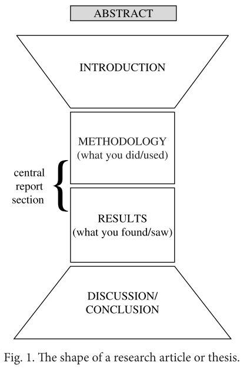

# Writing the Abstract

## Structure

摘要的结构和内容近几十年来是有变化的。在SCI在线数据库之前，Abstract是印在文章顶部，作用是鼓励读者能读下去，给读者一个简单的preview。Abstract不被认为是文章的独立单元。

互联网使情况发生了变化，摘要数据库能帮助研究人员检索文献，读者会根据摘要来判断是不是要继续读下去。所以不像以前读者是在已经有了文章的前提下看摘要，Abstract现在需要能说服读者让读者愿意读这个文章，让他们去下载阅读这个文章。

摘要是竞争attention的，读题目地比读摘要地多，读摘要地比读论文地多。摘要相对来说是一个独立的小环节，需要能让读者理解关键点以及文章的结果，是整篇文章的代表。

摘要的风格和长度取决于自己要投稿的地方，另外，写完整个文章之后再来写摘要是不错的选择。摘要的内容不必完全是新的，可以部分来自于文章的内容，将他们修改到Abstract的风格。

有两类摘要模板，其一和summary很像，是非常结构化的。它处理了所有研究文章的主要子部分：Background/Method/Results/Conclusions。第二种是更常见的，主要关注研究的一两个部分，通常是Method和Results。

通常问题越小，越应该采用第二类模板，因为读文章的人通常都比较清楚论文背景，所以不必在背景上多写，第二种更常见。另外期刊对于摘要的长度是有要求的，所以要结合期刊要求来写。

接下来依然是经典三问：如何开始？内容应该包含什么信息，什么顺序组织？如何结束？

## Grammar and Writing Skills

首先是时态。论文要处理的gap/problem 通常是一般过去式：

- The main problem, however, is… 
- We examine why these models have difficulty with… 
- However, this assumption is not valid when… 
- This is complicated by… 
- However, this assessment cannot be based solely on… 
- Although it is known theoretically that…

当谈到论文做了什么时，通常使用一般现在时：

- This paper presents a new methodology for… 
- In this paper we apply… 
- This study reports an improved design for… 
- In this paper we extend an existing approach to… 
- We consider a novel system of… 
- The implications for learning algorithms are discussed… 
- New numerical results are presented here for…

当谈到methodology时，或者研究期间做了什么时，通常使用一般过去时，比如：

- Two catalysts were examined in order to… 
- Samples were prepared for electron microscopy using… 
- A crystalliser was constructed using… 
- The effect of pH was investigated by means of… 
- The data obtained were evaluated using… 
- A permeameter was used to investigate…

在methodology中也有用一般现在时的，尤其是在谈到文中用到的公式，比如：

- Numerical examples are analysed in detail… 
- The calculated wavelengths are compared to… 
- Several models are created using… 
- The accuracy is evaluated by… 
- A detailed comparison is made between… 
- The method is illustrated on blends of homopolymers…

Results 的内容可以用一般现在时，不过一般过去时用的更多。比如：

- We find that oxygen reduction may occur up to 20 microns from the interface… 
- The model consistently underpredicts… 
- The ratio shifts towards… 
- We show that this theory also applies to… 
- The most accurate readings are obtained from… 
- We find that this does not vary… 
- These examples illustrate that overpotential is better described in terms of…

- The Y-type was found to produce… 
- The hydrocarbons showed a marked increase in…
- No dilation was observed… 
- This was consistent with… 
- Organised fibers were found after 6 weeks… 
- These profiles were affected by… 
- This finding correlated with…

Avhievements 可以用现在完成时，像在Discussion/Conclusion中的那样，也可以用一般现在时。

- We have obtained accurate quantitative LIF measurements… 
- This investigation has revealed that… 
- We have devised a strategy which allows… 
- We have demonstrated the feasibility of this approach by… 
- A novel material has been produced which… 
- Three-dimensional FE predictions have confirmed that… 
- Considerable insight has been gained concerning…

- This process can successfully be combined with… 
- The framework described here is both simple and universal… 
- The value of our approach lies in… 
- This provides a powerful tool for… 
- This novel film is mechanically robust and is able to… 
- The algorithm presented here ensures that…

Applications 一般是一般现在时：

- This process is suitable for the production of… 
- This framework can be used to evaluate… 
- This approach can be applied to… 
- This demonstrates potential for general applicability to… 
- These profiles may serve as a predictor for… 
- This framework can be used to evaluate…

摘要一般都有字数限制，大部分是80-150字，写一段，更长的有150-250字。

写的时候，第一版摘要的草稿可以先不考虑字数限制。决定了要使用的摘要的模板之后，先把重要内容写出来，然后再逐渐地简化到规定字数。

想一想读者搜索论文时候可能用到地短语，关键字，确保这些字都会出现在Abstract中，这样别人搜索地时候会更容易搜到这篇论文。摘要中可以稍微不技术一点，这样可以使读者的范围更广泛。