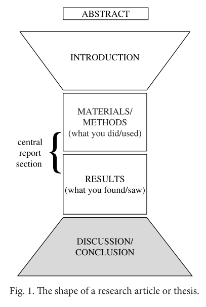

# Writing the Discussion/Conclusion

按照这部书讲解的顺序，abstract是最后一章，不过按照论文的顺序，这一部分就是文献的最后一部分了。

## Structure

不同的期刊这部分的表示也有不同，有些期刊是Discussion，有些是Results and Discussion，Conclusions，前两种要Discussion的内容是相似的，最后一种通常是把Conclusion单独拿出来，专注于Discussion地某些方面精简地写两段。

许多在Introduction中出现的内容在最后 Discussion/Conclusion 环节会以逆向的顺序再次出现，即Introduction通常从一个general，broad focus到narrower report section，而Discussion/Conclusion 则是从narrow section 重新回到一个wider，more general 的 focus。Discussion 在核心报告部分的信息的基础上回应了Introduction中提到的点。

先回归下Introduction中的四个部分：

1. 
    - ESTABLISH THE IMPORTANCE OF YOUR FIELD
    - PROVIDE BACKGROUND FACTS/INFORMATION (possibly from research) 
    - DEFINE THE TERMINOLOGY IN THE TITLE/KEY WORDS
    - PRESENT THE PROBLEM AREA/CURRENT RESEARCH FOCUS
2. PREVIOUS AND/OR CURRENT RESEARCH AND CONTRIBUTIONS
3. 
    - LOCATE A GAP IN THE RESEARCH 
    - DESCRIBE THE PROBLEM YOU WILL ADDRESS 
    - PRESENT A PREDICTION TO BE TESTED
4. DESCRIBE THE PRESENT PAPER

开始Introduction的时候，作者通过提供背景信息等方式建立一个明确的主题来帮助读者进入到文章中。Discussion/Conclusion中，反向来说的话，就是怎么帮助读者走出文章。

Introduction的时候，写了关于其他研究者的工作，为读者创建了一个研究的map，以使他们能看到已经存在了什么样的工作；在 Discussion/Conclusion 则要定位在这个research map中的位置。还有在Introduction中locate了一个gap，即以往研究还有不足的地方；在Discussion/Conclusion中，就要对应地表明这篇文章回应了这些gap或者解决了这些问题到什么程度了。在Introduction的最后，会写到这篇文章，给读者创建了一个访问这篇文章核心报告内容的接口；在Discussion/Conclusion部分，就会先回顾下工作的一些方面，然后创建一个接口来帮助读者走出核心报告部分。

然后还是经典三问：

- How do I start the Discussion/Conclusion section? What type of sentence should I begin with?
- What type of information should be in this section, and in what order?
- How do I end this section?

## Grammar and Writing Skills

在 Discussion/Conclusion 部分有一个很重要的语言领域：MODAL VERBS，即情态动词

比如 may, might, could, can, should, ought to, need to, have to 还有 must。有些情态动词在正式写作中是不会使用的，比如表示permission时候的can或may(e.g. Can I borrow your pen?) ，这些这里就不讨论了。

情态动词常用来修改句子中的“truth value”，比如：

The drop in pressure **was** due to a crack in the pipe.

没有情态动词说明告诉读者了一件事，而有证据能证明它，如果没有，那么就要：

The drop in pressure **may have been** due to a crack in the pipe.

如果比较确定但又没有证据，就：

The drop in pressure must have been due to a crack in the pipe.

情态动词在Results 和 Discussion 中都很实用。因为这些部分会写到结果的原因，解释，以及implications，有些东西会需要possible 原因，或者obvious解释，或者probable implication。比如以下是一个典型的句子：

Th e kinetics can be described by these equations, suggesting that the electrons are transferred directly. Th is might involve a supercharge mechanism, but the data could also be described by electron transfer via a hopping mechanism.

情态动词难用的原因有两类。首先，一词多义。比如当想用should时，要确保自己知道something is likely to happen (or to have happened)，还是 it is advisable for it to happen.
第二，大多数情态动词不遵循一般的语法规则。比如否定式的时候意思会变化：He must go home 和 He has to go home 意思是一样的，但是He must not go home 表示 he is not allowed to go home, 这就和 He doesn’t have to go home 不一样了。

ABILITY/CAPABILITY 类型：

||||
|-|-|-|
|Present Simple|CAN|This software can distinguish between different viruses.|
|Present Simple negative| CANNOT|Until 18 months a child cannot use symbols to represent objects.|
|Past Simple| COULD COULD HAVE|It was found that the gun could shoot accurately even at 300 meters. If we had extended the time period we could have produced more crystals.|
|Past Simple negative|COULD NOT  COULD NOT HAVE|1n 1990, 80% of households could not receive digital television. The subjects reported that they could not have fallen asleep without medication.|

POSSIBILITY/OPTIONS 类型：

||||
|-|-|-|
|Present Simple|MAY MIGHT COULD CAN|A rubber seal may/might/could/can be useful at this location.|
|Present Simple  negative|MAY NOT MIGHT NOT (but not COULD NOT or CANNOT)|A rubber seal may not/might not be useful at this location.|
|Past Simple| MAY HAVE MIGHT HAVE COULD HAVE (but not CAN HAVE)|The fall in pressure may have been/might have been/could have been caused by leakage.|
|Past Simple Negative|MAY NOT HAVE MIGHT NOT HAVE (but not COULD NOT HAVE or CANNOT HAVE)|The fall in pressure may not have been/might not have been caused by leakage.|

PROBABILITY/BELIEF/EXPECTATION 类型：

||||
|-|-|-|
|Present Simple|SHOULD OUGHT TO|The material should remain stable if it is kept below 30°C.|
|Present Simple negative|SHOULD NOT OUGHT NOT TO|The material should not decompose unless heated above 30°C.|
|Past Simple|SHOULD HAVE OUGHT TO HAVE|By the time the cobalt is added, the crystals should have dissolved.|
|Past Simple negative|SHOULD NOT HAVE OUGHT NOT TO HAVE|This was unexpected; the material should not have decomposed at this temperature.|

VIRTUAL CERTAINTY 类型：

||||
|-|-|-|
|Present Simple|MUST HAVE TO|Our results indicate that contamination must be due to the presence of sea water in the pipe.|
|Present Simple negative|CANNOT|It is clear that contamination cannot/could not be due to the presence of sea water in the pipe.|
|Past Simple|MUST HAVE|Our results indicate that contamination must have been due to the presence of sea water in the pipe.|
|Past Simple Negative|CANNOT HAVE COULD NOT COULD NOT HAVE|It was clear that contamination could not be/ cannot have been/could not have been due to the presence of sea water in the pipe.|

ADVICE/ OPINION 类型：

||||
|-|-|-|
|Present Simple|SHOULD OUGHT TO|The apparatus should be disconnected from the mains during repairs.|
|Present Simple negative|SHOULD NOT OUGHT NOT TO|This material should not be exposed to sunlight|
|Past Simple|SHOULD HAVE OUGHT TO HAVE|The apparatus should have been disconnected from the mains during repairs.|
|Past Simple Negative|SHOULD NOT HAVE OUGHT NOT TO HAVE|This material should not have been exposed to sunlight|

NECESSITY/OBLIGATION 类型

||||
|-|-|-|
|Present Simple|MUST NEED TO HAVE TO|The apparatus must/needs to/ has to be disconnected from the mains during repairs.|
|Present Simple negative|NEED NOT DO NOT NEED TO DO NOT HAVE TO|The apparatus need not/does not need to/does not have to be disconnected from the mains during repairs.|
|Past Simple|NEEDED TO HAD TO|We needed to/had to heat the valves before use.|
|Past Simple negative|DID NOT NEED TO DID NOT HAVE TO NEED NOT HAVE|We did not need to/did not have to heat the valves before use. We need not have heated the valves before use|

## Writing Task: Build a Model

第一句：Prior work has documented the effectiveness of psychosocial intervention in improving quality of life (QoL) and reducing stress in patients suffering from various disorders; Epstein,18 for example, reports that orthopedic patients participating in a two- week multimedia intervention programme improved across several QoL indices, including interpersonal conflict and mental health.

个人理解：

回顾前人研究成果。

Key：

**the writer revisits previous research**

为什么要以revisiting previous research 作为discussion的开始？

和之前讨论到的类似，一个部分的开始应该给读者一个容易进入的入口。在Results环节，这么做的方式主要有两种：**offering an overview of the section by previewing the content of that subsection with some general statements** 以及 **referring back to something from the previous sections** to link it with the new one。在Results部分，提到过是以总结或引用用到的方法开始的。不过Discussion中是很难给出一个overview的，因为Discussion包含的领域比较广泛，所以很多Discussions/Conclusions 会以回顾之前部分的内容为例。包括：

- 回顾 Introduction 来重述paper的目标, 重要的背景信息, 最初的 prediction/theory/ assumption 或者 论文要解决的问题
- 回顾 Methodology 以提醒所遵循的程序的基本原理或程序本身的总结
- 回顾the Results，总结别人或者本文的结果

那么到底选择哪一种？

一种方式是选择自己工作最显著的方面。如果最显著的方面是对Introduction中提到的gap做出了回应，那么recalling 这个gap就是比较好的选择。如果是对方法的改进是文章的主要内容，那么回顾methodology就是比较好的选择。如果结果有显著的提升，那么回顾results是比较不错的。所以根据自己的情况选择即可。

可以使用和被revisit的地方相似的语言，这样提供一个echo来告知读者revisit的是什么。

第二句：However, these studies have either been short- term studies or have not focused on patients whose disorder was stress-related. 

个人理解：

说明他们研究的不足。

Key：

**the writer revisits the Introduction to recall specific weakness in the methodology used in previous studies.**

既然论文的贡献是前人研究和这里的区别，那么作者首先就revisit下gap来回顾以往研究的现在要解决的weakness。然后再转到以往具体的差别细节上。

对重要背景信息的复述也是很常见的，这样能给出research的motivation。

第三句：In this study we tested the extent to which an extended three-month stress management programme improved QoL among a group of patients being treated for stress-related skin disorders such as eczema.

个人理解：

本文做了什么的一个概述。

Key：

**the writer revisits the methodology used in this study.**

revisit methodology 详细程度到什么样呢？

使用和methodology中相同的语言会帮助读者想起方法中的基本原则，回顾方法的显著的特点也是很常见的。虽然会说methodology的细节，但是这里不要增加新的信息，这里只recall。

描述methodology用什么时态？

用一般过去时，一般现在时和现在完成时来recall methodology和results。如果增加了Conclusion，一般现在时和现在完成时比较常见，比如We use/have used holographic data to reconstruct the three-dimensional structure.

第四句：We found that in virtually all cases, participation in our three-month stress management programme was associated with substantial increases in the skills needed to improve QoL.

个人理解：

本文的主要发现。

Key：

**the writer revisits and summarises the results.**

这和results的overview一样么？

如果在Results中提供了results的overview，这里句子的结构和内容都可以很相似。一个总结结果的句子可能也需要，最后Abstract中也会用到。

所以为什么这里还要总结results？

Discussion的核心作用之一就是跳出results，引导作者到从结果中得到的conclusion以及更广阔的implications or generalisations。所以总结结果是一个很好的起点。

第五句：These findings extend those of Kaliom, confirming that a longer, more intensive period of stress-management training tends to produce more effective skills than when those skills are input over a shorter period via information transfer media such as leaflets and presentations (Kaliom et al., 2003).

个人理解：

本文发现的东西的贡献在哪。

Key：

**the writer shows where and how the present work fits into the research ‘map’ of this fi eld**

这是Discussion这部分独特的特点。在Introduction的简洁的文献综述中，已经给读者一个目前整个研究map了。现在需要展示给读者是如何将本文的研究放置到map里的。在Discussion中，有必要把当前研究和其他工作的关系显式地表达出来。

那么有什么方法来将文章的工作嵌入到map中呢？

有很多不同的形式，比如可能是不同的方法产生相似结果，可能是进一步验证了某个方法，可能是攻击了某个想法，可能提供了一个完全新的方法等等，这在具体词汇中有更清楚的介绍，稍后记录。

怎么知道那些研究和文章同属于一个map？在Discussion中能提到一些之前没有提过的前人的研究么？

methodology和results中已经提到了一些研究成果了，应该focus到这些成果上。虽然也可以提到一些之前没提过的，但是尽量不要。应该决定好文章的工作到底影响了哪些研究，就关注到这些研究上比较好。

第六句：In addition, the improvements noted in our study were unrelated to age, gender or ethnic background.

个人理解:

强调本文的优点

Key：

**the writer recalls an aspect of the results that represents a positive achievement or contribution of this work.**

另一个Discussion的重要作用是清楚地focus到工作地achievement或contribution。说明achievement地特点，使用正面地语言来清楚地展示benefits或advantages。不要shy 地陈述自己的achievements，虽然作者自己肯定是清楚有什么贡献的，但是如果不明确的说出来，读者可能意识不到achievement的价值。

这和mapping的时候的内容不一样么？

意图是一样的，但是具体内容上是有差别的。Mapping 展示了achievements能fit into到研究地图中的哪个位置，但是achievement本身是没有被陈述以让读者明确里面的价值，以及这是如何影响目前的knowledge的。

第七句：This study therefore indicates that the benefits gained from stress-management intervention may address QoL needs across a wide range of patients.

给出本文说明了什么科学问题。

Key：

**the writer focuses on the meaning and implications of the achievements in this work.**

如果Results implication的内容已经在Results部分提过了，这里不重复么？

在Results部分，最后的内容已经提到了一些结果implications的东西。值得注意的是第一个关于这些implications（比如 suggesting that/indicating that）的comment称为 pivotal move，其作用是将论文从核心的报告环节走出到Discussion/Conclusion。一个Discussion中常见的错误是不继续这条路线走。仅仅用不同的语言重新陈述结果是不够的。在Discussion部分，有责任说明为什么这样的结果会发生，并提供一种机制来解释发现背后的东西。这些suggestions，explanations和implications在这里refined，developed，并discussed。

research writing 和 report writing之间的一个重要区别就是research的目标不仅仅是获取描述结果，它是为了让这些结果在现存的知识框架内有意义，并提出对这些结果的implications有价值，即这些结果在领域内意味着什么。这些结果是如何和最初提到的问题关联的？结果和其他研究者报告的内容之间一致么？如果结果不是所期待的，要试着解释为什么。有另外的方式来解释结果么？读者需要知道他们从这篇研究中能很有效地得到什么样可靠的信息，而这正是作者的工作。**Saying what your results *are* is the central function of the Results section; talking about what they *mean* is the central function of the Discussion.**

如果我不确信我的结果的implications呢？

如果看看Discussion中implications描述的方式，会发现其中的语言和Results中描述implications的语言是一样的。It seems that/suggesting that/indicating that are 是很常用的，并且对情态动词 may 和 could 等有很高的依赖。这是因为科学研究从来没有终点，说可以知道所有事情；所以研究的下一步会更完善并且发展上一个。也因此，大多数科研论文作者很谨慎，不使用不严谨的generalisations。

第八句：Most notably, this is the first study to our knowledge to investigate the effectiveness of extended psychosocial intervention in patients whose disorder is itself thought to be stress-related.

个人理解：

进一步突出自己的贡献。

Key：

**the writer notes that one of the achievements or contributions of this work is its novelty.**

在一些例子中，MAPPING和ACHIEVEMENT是非常相似的，因为显著的achievements之一正是本论文这样的研究是以前没有的。

很难绝对确定没有人做过同样的事情，所以尽量加上 to our knowledge。

第九句：Our results provide compelling evidence for long-term involvement with such patients and suggest that this approach appears to be eff ective in counteracting stress
that may exacerbate the disorder.

个人理解：

承接上句，详细阐述下。

Key：

**the writer refines the implications of the results, including possible applications.**

进一步发展工作的implications包括未来结果被实现的方式或者应用。这里第九句的例子中，结果意味着长期involvement 可以作为future treatment的一方面。

如果研究工作没有明显的应用呢？

许多研究是没有明显的实际应用的。不过仍然有必要想一想两个方面，确认是不是真没什么应用。首先，看看Introduction的开始部分，相关研究领域的第一句和第一段。这能帮助来查看研究究竟有什么实际应用价值，因为在Introduction中，第一句通常会给出研究领域为什么重要或者为什么有用。另一个方法是该领域的相关文献的Discussion部分中找。

当然，也有可能研究在目前阶段就是没什么实际用途，或者也真是仅仅一种研究。这就不需要硬找了。

第十句，第十一句：However, some limitations are worth noting. Although our hypotheses were supported statistically, the sample was not reassessed once the programme was over.

个人理解：

然后要转折到论文不足之处，这样也能为future research留下接口。并概述自己文章的不足之处是什么。

Key：

**the writer describes the limitations which should direct future research.**

这里继 methodology，Results之后第三次提到了limitations。这里应该focus到哪些limitations上呢？

在论文Discussion部分中提到研究的limitations的原因是指出未来工作的方向。因此这里应该强调未来能进一步研究的limitations，而不是本身研究的一些，在较近的未来还不能解决的limitations。试着将这部分写成对研究社区的邀请，邀请他们来继续或者改进自己的这个方向的研究。

请注意，正如前面提到的limitations一样，positive的结果(our hypotheses were supported statistically)经常会在和limitations近邻的地方被提到，这样以减少它的负面影响，所以，在这种情况下，positive 结果和limitations会在同一句话中被提到。

第十二句：Future work should therefore include follow-up work designed to evaluate whether the skills are retained in the long term and also whether they continue to be used to improve QoL.

个人理解：

阐述future work的可能方向。

Key：

**the writer suggests a specific area to be addressed in future work.**

注意这一句中的therefore，它连接了limitation和future research。

为什么应该fix未来工作的方向呢？为什么不鼓励人们自己决定呢？

因为一篇文章不会去回答研究领域的所有可能的问题，因此当写Discussion的时候，应该保持一个broader picture。research的下一步在哪？最好的研究会为研究指引方向。邀请研究社区来follow自己的work到一个具体的方向有很多作用。首先，为研究者提供了一个明确的项目，这比一个模糊的建议更加吸引人，并因此更可能被执行。第二，它鼓励了对自己工作的一致的延续，这样别人会直接引用自己的文献，这对自己的江湖地位是有益的。还有，别人也做这个问题会对自己的工作提供更多有用的数据等信息。

## Vocabulary

这部分词汇主要是以下几大方面：

1. REVISITING PREVIOUS SECTIONS 
2. SUMMARISING/REVISITING KEY RESULTS 
3. REFINING THE IMPLICATION/S

这部分需要的大部分词汇都能在以前的部分中找到，所以这里就不赘述。比如REFINING THE IMPLICATION/S可以在Results部分找到。

如果使用和之前用到的相同的词并没有不好，这是一种对前文的响应，反而是一种优点。

如果以回顾methodology或者introduction开始，也会顺便总结重要的结果。结果是支撑conclusion的重要证据，在读者的角度，保证这些结果清晰是非常重要的。

4. MAPPING (RELATIONSHIP TO EXISTING RESEARCH)

包括向读者展示研究fit into到研究地图中的位置。比如 consistent with 以及 provides support for

Discussion/Conclusion 中出现的名称和研究的选择对读者是很显著的，他们要能把研究归纳，并理解这篇文章的研究是如何和以往的研究联系起来并有何不同的。会比较前人和自己的工作来验证自己的工作。

This/Our study/method/result/ approach is:

- analogous to 
- comparable to 
- compatible with 
- consistent with 
- identical (to)
- in contradiction to 
- in contrast to in good agreement (with) 
- in line with 
- significantly different (to/from) 
- the first of its kind 
- (very/remarkably) similar (to) 
- unlike

This/Our study:

- broadens 
- challenges 
- compares well (with) 
- confirms 
- contradicts
- corresponds to 
- corroborates 
- differs (from) 
- extends 
- expands 
- goes against 
- lends support to 
- mirrors 
- modifies 
- proves 
- provides insight into 
- provides support for 
- refutes 
- supports 
- tends to refute
- verify

5. ACHIEVEMENT/CONTRIBUTION

achievement/contribution 通常用现在完成时，尤其是在Conclusion部分。比如 We have demonstrated/described/investigated/developed/shown/studied/ focused on etc.

科学写作中不常允许使用感叹号，但是表达exciting可以通过一些词汇。这里的词汇主要分为两个部分，歧义是感叹号系列的，表明结果是很令人兴奋的，另一方面，是比较cooler的，不过还是positive的。

!-substitutions

- compelling 
- crucial 
- dramatic 
- excellent
- exceptional 
- exciting
- overwhelming
- perfect
- powerful
- remarkable 
- striking 
- surprising
- extraordinary
- ideal 
- invaluable 
- outstanding
- undeniable
- unique
- unusual
- unprecedented
- vital

Positive language

- accurate 
- advantage
- appropriate 
- attractive
- beneficial 
- better
- clear 
- comprehensive 
- convenient 
- convincing 
- correct 
- cost-effective
- easy 
- effective
- efficient 
- encouraging
- evident
- exact
- feasible 
- flexible
- important 
- low-cost 
- novel
- productive
- realistic 
- relevant
- robust
- simple
- stable 
- straightforward 
- strong
- successful 
- superior 
- undeniable 
- useful 
- valid 
- valuable

Useful verbs:

- assist 
- compare well with 
- confirm 
- could lead to 
- enable 
- enhance 
- ensure 
- facilitate 
- help to 
- improve
- is able to 
- offer an understanding of 
- outperform
- prove
- provide a framework
- provide insight into
- provide the first evidence
- remove the need for 
- represent a new approach to 
- reveal
- rule out
- solve
- succeed in 
- support 
- yield

6. LIMITATIONS/CURRENT AND FUTURE RESEARCH

这种情况经常发生在彼此非常接近的地方(有时甚至在同一句话中)，因为目前工作的局限性为今后的工作提供了方向和建议。LIMITATIONS 相关的词汇可以在之前记录中查到，FUTURE WORK 比如：
should be replicated 还有 further work is needed.

最后这部分提到的不足是为未来研究铺路的，对研究社区的邀请会提升自己工作的地位，告诉大家在这个领域有很多工作可以做。

注意使用will或者现在进行时(e.g. we will integrate/we are integrating this technique with the FEM implementations)来说明自己的意图或者正在进行的工作；should用来邀请他人研究(This technique should be integrated with the FEM implementations)。

a/the need for at present encouraging fruitful further investigations further work is needed further work is planned future work/studies should future work/studies will in future, care should be taken in future, it is advised that… holds promise interesting it would be benefi cial/useful
possible direction promising recommend remain to be (identifi ed) research opportunities should be explored should be replicated should be validated should be verifi ed starting point the next stage urgent worthwhile

7. APPLICATIONS/APPLICABILITY/IMPLEMENTATION

如果研究能被应用，这里应该提到。相关的词汇比如：have potential 还有 may eventually lead to. 把APPICATIONS包括在内能让自己工作的价值走出目前一个具体的狭小的范围。APPLICATIONS和FUTURE WORK都提供了自己的这篇研究文章和世界的其余部分之间的连接，因此也通常作为研究论文的结束。

如果有应用，要指明可能的应用，在许多情况下，这可以从前面的Introduction中得到。记得使用情态动词could, should 还有 may.

eventually in future soon possible
apply have potential implement lead to
produce use utilise

