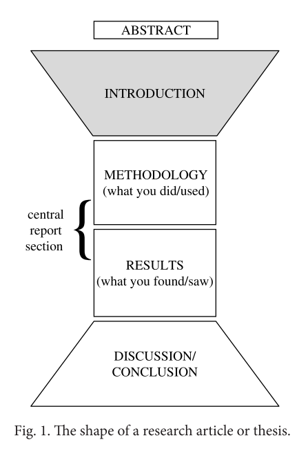

# how to write an introduction

首先，开始之前，要明确自己做了什么，发现了什么，所以最好的写introduction的时间是在自己有一个草稿之后，不过个人理解，还是得先明确下各部分结构，草稿逻辑才会更好，这是一个互相迭代的过程，所以明确结构和梳理自己的内容是可以同步进行的。

## structure

一般会认为introduction是以描述要解决的问题，即工作的目标开始的，不过这并不是大多数文章开始的方式，开始之前，通常会问3个问题：

- 一般大家都是如何开始introduction的
- 在introduction中应该有什么样的信息，顺序如何
- 一般如何结束introduction

如下图所示，论文的目标是通过introduction让读者进入这篇文章，然后在最后discussion时候让读者走出。然后再introduction的最后要让读者能顺利地接入方法的部分。

introduction的“宽进窄出”的形式是在说introduction开始的时候要general一些，然后逐渐地收缩到自己focus的范围，而对于discussion则正相反。

对于introduction来说，有四个方面需要注意：

1. tense pairs
2. signalling language
3. passive/active use
4. paragraphing

首先，是时态。

- 一般现在时/正在进行时：一般现在时在论文中通常用来表明**被接受的事实**，“被接受”这一判断由自己来执行，比如在Results部分，如果使用一般过去时，那么更多的是说自己获得的结果，如果是用一般现在时，那么更强调一种比较general的结论
- 一般过去时/现在完成时：一般过去时表达现在已经不做某件事或者某件事不是太重要，现在完成时则表示一种持续发生的，或者**对现在有影响**的。时态的含义从时态名上可以看出来，而后者含义区别在论文中尤其要注意。

关于sinalling language，就是要注意写作中前后联系。写完一个句子，要让读者能联想到接下来会发生什么。所以连接处是写作的危险地带。

- 一种比较好的避免gap出现的方式，就是overlap，即重复上句中的部分内容；
- 另一种方法是用代词或者指代形式来将前面的句子总结起来；
- 第三种方法是用分号，或者用从句的形式，将较短的句子整合成长句
- 第四种方法是用一个信号指示句连接词来表明一句和下一句之间的联系，或者一句中的一部分和下一句之间的联系，比如therefore和however等。

第四种方法中常用的信号词有：

原因类：

The experiment was unsuccessful ________ the measuring instruments were inaccurate. 

The experiment was unsuccessful ________ the inaccuracy of the measuring instruments.

- due to (the fact that)
- on account of (the fact that) 
- in view of (the fact that)
- as
- because
- since

结果类：

The measuring instruments were calibrated accurately, ________ the experiment was successful.

- therefore
- consequently
- hence
- as a result (of which)
- which is why
- so

so不能用作句子开头，太不正式了。

比较/区别类：

British students are all vegetarians, __________ Norwegian students eat meat every day.

- however
- whereas
- but
- on the other hand 
- while
- by contrast

用while的时候要注意它的“同时”的含义，因此如果需要避免歧义，可以使用别的词。

让步类：

(a) _______ it was difficult, a solution was eventually found.

(b) _______ the difficulty, a solution was eventually found.

(c) It was difficult; ________ a solution was eventually found.

- (a) Although
- (a) Even though 
- (a) Though
- (b) Despite 
- (b) In spite of 
- (b) Regardless of 
- (b) Notwithstanding
- (c) nevertheless 
- (c) however 
- (c) yet
- (c) nonetheless 
- (c) even so

进一步类：

We used a batch processing system because it was more effective; ___________ it was faster

- in addition 
- moreover
- furthermore
- apart from that/which 
- also
- secondly (etc.)
- in the second place (etc.)
- what is more

关于主动被动。

一个常见的问题是能不能用we，we这个词在论文中可以用来指代自己的研究团队，但是不能指代人类等，如果想说人们...，可以使用It结构(It is known/ thought that…)，而不是用We know/think that… 。

另外，常用被动语态来替代we，尤其是在核心的report部分。

另外，I也是要避免使用的，如果需要表达自己做了什么，最好使用here，in this study这样的词来让读者明白在指代自己的工作。也可以使用一些指代词来替代I或者we。比如This article或者the present paper等。

但是被动语态有个问题就是没有明确的指明某些工作到底是作者做的还是其他研究人员的成果，因此读者可能会有疑惑，所以相比于单纯的被动语态(x is presented)，更好地是使用（This article/the present paper）。

最后关于paragraphing。

分段对于自己写作或阅读都是十分重要的。分段的两种常见错误是短句单句成段以及段落太长，这都不是好的组织。

如何理解分段是如何进行的，可以想象一个24小时往巴黎的旅程，一种选择是直接飞过去，下飞机，然后瞎逛；另一种选择是先坐直升机在巴黎上空游荡下，这样可以先明确下自己的主要游览目标。

这和阅读类似，对一个文章或段落，比较高效的阅读方式是先快速浏览，浏览的目标是快速找到 **what it is about and where the various pieces of information are located**，即大意和有价值的信息在哪。

那么如何高效快速地浏览？

1. 读题目，并尝试预测下期望看到什么样的信息
2. 看作者的姓名，关于他知道什么，这会帮助预测论文的内容
3. 检查下论文发表的时间，这也有助于估计内容
4. 阅读摘要能了解研究者做了什么以及发现了什么
5. 快速阅读第一段，不用理解每个词
6. 快速浏览每一段的第一句
7. 快速看每个图表，读图标标题并找出表达了什么样的可视化数据
8. 读最后一段，尤其是summary和conclusion这样的段落

skim就是几分钟内就能看完，否则就是阅读了。

skim对写作有什么用？

学术论文的段落通常会**以一个主题句作为开始**，这个句子会给出一段话的主旨，告诉读者这段话要说什么，**其他句子都是和这个idea相关联的，它们discuss it，describe it, define it in more detail, argue about it，give examples of it, rephrase it**, etc. 

因此，通过读各段的段首句就可以快速了解论文想表达什么，所以自己写论文的时候也要尽量遵循这个约定。

在写作中，写下每个想要讨论的idea或concept，检查它们的逻辑顺序，列出几点对每点想要讨论的内容，这会帮助创建有逻辑和连接性好的段落。

## build a model

接下来创建一个introduction的model，然后用关键点来帮助写作。model就是一个框架，不包含具体的内容，能快速套到自己的文章中用。

这步等到自己做的时候再开始。

## vocabulary

然后是一些introduction部分的 vocabulary。这部分主要包括四个方面，list如下，可以日常积累自己所看到的文章中词汇到这些表中。

### ESTABLISHING SIGNIFICANCE

包括类似Much research in recent years这样的短语。

- (a) basic issue
- (a) central problem 
- (a) challenging area 
- (a) classic feature 
- (a) common issue
- (a) considerable number
- (a) crucial issue
- (a) current problem 
- (a) dramatic increase 
- (an) essential element 
- (a) fundamental issue 
- (a) growth in popularity 
- (an) increasing number 
- (an) interesting field 
- (a) key technique
- (a) leading cause (of) 
- (a) major issue
- (a) popular method
- (a) powerful tool/method 
- (a) profitable technology 
- (a) range (of) 
- (a) rapid rise
- (a) remarkable variety 
- (a) significant increase 
- (a) striking feature 
- (a) useful method 
- (a) vital aspect
- (a) worthwhile study 
- economically important 
- (has) focused (on)
- for a number of years 
- for many years 
- frequent(ly) 
- generally
- (has been) extensively studied 
- importance/important 
- many
- most
- much study in recent years 
- nowadays
- numerous investigations
- of great concern 
- of growing interest
- often
- one of the best-known
- over the past ten years
- play a key role (in) 
- play a major part (in)
- possible benefits
- potential applications 
- recent decades
- recent(ly) 
- today
- traditional(ly) 
- typical(ly)
- usually
- (an) advantage
- well-documented
- attracted much attention
- well-known
- benefit/beneficial
- widely recognised
- commercial interest
- widespread
- during the past two decades 
- worthwhile

Here are some examples of how these are used:

- A major current focus in population management is how to ensure sustainability of…
- Numerous experiments have established that ionising radiation causes…
- Low-dose responses to radiation have generated considerable recent research interest.
- Analysis of change in the transportation sector is vital for two important reasons: …
- PDA accounts for over 95% of all pancreatic cancers. 
- It is generally accepted that joints in steel frames operate in a semi- rigid fashion.
- Nanocrystalline oxide fi lms are attracting widespread interest in fi elds such as…
- The importance of strength anisotropy has been demonst rated by… 
- Convection heat transfer phenomena play an important role in the development of…
- For more than 100 years researchers have been observing the stress- strain behaviour of…
- Much research in recent years has focused on carbon nanotubes.

### PREVIOUS AND/OR CURRENT RESEARCH AND CONTRIBUTIONS

包括所有过去时的动词，来描述以前的研究者做了什么，不要仅仅用did，showed，found这样的词，应该用一些更具体地描述到底做了什么的词，比如calculated，monitored等

- achieve
- address 
- adopt 
- analyse 
- apply 
- argue
- assume
- attempt
- calculate
- categorise carry out choose claim classify collect compare concentrate (on) conclude conduct confi rm consider construct correlate deal with debate defi ne demonstrate describe design detect determine
develop
discover discuss enhance establish estimate evaluate examine explain explore extend fi nd focus on formulate generate identify illustrate implement imply improve incorporate indicate interpret introduce investigate measure model monitor note observe prefer
obtain
overcome perform point out predict present produce propose prove provide publish put forward realise recognise recommend record report reveal revise review show simulate solve state study support suggest test
undertake use utilise

Here are some examples of how these are used:

- This phenomenon was demonstrated by… 
- In their study, expanded T-cells were found in… 
- Initial attempts focused on identifying the cause of… 
- Weather severity has been shown to… 
- Early data was interpreted in the study by… 
- The algorithm has been proposed for these applications… 
- The results on pair dispersion were reported in… 
- Their study suggested a possible cause for… 
- An alternative approach was developed by…

### GAP/PROBLEM/QUESTION/PREDICTION

描述以前研究还没做的东西，还没强调的问题，而要写的论文做了的东西，比如However, few studies have focused on…

ambiguous computationally demanding confused defi cient doubtful expensive false far from perfect ill-defi ned impractical improbable inaccurate inadequate incapable (of) incompatible (with) incomplete inconclusive inconsistent inconvenient incorrect
(the) absence of (an) alternative approach (a) challenge (a) defect (a) diffi culty (a) disadvantage (a) drawback (an) error (a) fl aw (a) gap in our knowledge (a) lack (a) limitation (a) need for clarifi cation (the) next step no correlation (between) (an) obstacle (a) problem (a) risk (a) weakness ineff ective ineffi cient inferior infl exible insuffi cient meaningless misleading non-existent not addressed not apparent not dealt with not repeatable not studied not suffi ciently + adjective not well understood not/no longer useful of little value over-simplistic poor problematic questionable redundant restricted time-consuming unanswered uncertain unclear uneconomic unfounded unlikely unnecessary unproven unrealistic unresolved unsatisfactory unsolved unsuccessful unsupported
(to be) confi ned to (to) demand clarifi cation (to) disagree (to) fail to (to) fall short of (to) miscalculate (to) misjudge (to) misunderstand (to) need to re-examine (to) neglect (to) overlook (to) remain unstudied (to) require clarifi cation (to) suff er (from)
few studies have... it is necessary to... little evidence is available little work has been done more work is needed there is growing concern there is an urgent need… this is not the case unfortunately

Here are some examples of how these are used:

- Few researchers have addressed the problem of… 
- Th ere remains a need for an effi cient method that can… 
- However, light scattering techniques have been largely unsuccessful to date.
- Th e high absorbance makes this an impractical option in cases where…
- Unfortunately, these methods do not always guarantee… 
- An alternative approach is necessary. 
- Th e function of these proteins remains unclear. 
- Th ese can be time-consuming and are oft en technically diffi cult to perform.
- Although this approach improves performance, it results in an unacceptable number of…
- Previous work has focused only on… 
- However, the experimental confi guration was far from optimal.

(to) attempt (to) compare (to) concentrate (on)
(to) conclude (to) describe (to) discuss (to) enable (to) evaluate (to) expect
(is) organised as follows: (is) set out as follows: (is/are) presented in detail (our) approach (the) present work (this) paper (this) project (this) report (this) section (this) study
(were/are) able to accurate/accurately eff ective/eff ectively effi cient/effi ciently excellent results innovation new novel method powerful practical

### THE PRESENT WORK

包含自己的目的，以及对文章的设计，比如 the aims of the present work are as follows:...

(to) facilitate (to) illustrate (to) improve (to) manage to (to) minimise (to) off er (to) outline (to) predict (to) present (to) propose (to) provide (to) reveal (to) succeed
(this) work begin by/with close attention is paid to here overview
simple straightforward successful valuable
aim
goal intention objective purpose

Here are some examples of how these are used:

- Th is paper focuses on… 
- Th e purpose of this study is to describe and examine… 
- In order to investigate the biological signifi cance… 
- In this paper we present… 
- New correlations were developed with excellent results… 
- In the present study we performed… 
- Th is paper introduces a scheme which solves these problems. 
- Th e approach we have used in this study aims to… 
- Th is study investigated the use of… 
- In this report we test the hypothesis that… 
- Th is paper is organised as follows:…

## Writing an Introduction

具体实践就是结合自己的论文来执行了。