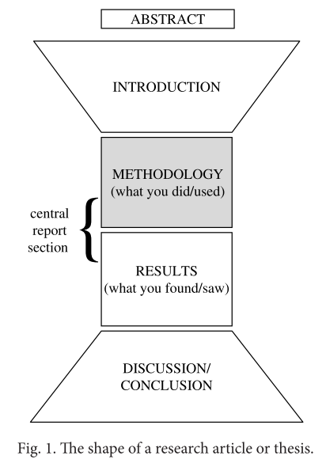

# Writing about Methodology

## Structure

这部分不同的学科，不同的期刊名字会有所不同，有：

- Materials and Methods
- Procedure
- Experiments
- Experimental
- Simulation
- Methodology
- Model

这里是核心report部分的第一part，第二part是results，这一part主要汇报做了什么还有用了什么。

大多数期刊会公布一个Guide，这里面会对各部分有一些简单的要求。对于methodology部分，通常会提到要提供足够多的细节，以使工作能够被重现。但是这部分写作不仅仅使记录做了什么。面对的读者可能对方法并不足够了解，要能使方法的信息让每个读到它之后都能执行它并获得相似的结果，还能理解并接受其过程。

首先，先问三个问题：

- 如何开始 Methodology/Experiments section? 用什么类型的句子开头?
- 这部分应该用什么类型的信息，以什么样的顺序展开？
- 如何结束这一部分？

因为methodology这部分要包括自己做了什么的详细描述，所以第二个问题就有了一部分答案，当然这还不够，接下来先看看语法和技巧。

## Grammar and Writing Skills

在methodology中有三个语言方面的内容需要注意：

- PASSIVES AND TENSE PAIRS
- USE OF ‘A’ AND ‘THE’
- ADVERBS AND ADVERB LOCATION

### 被动语态，时态比较

主动语态被动语态的例子：

- The dog bit the policeman.              active 
- The policeman was bitten by the dog.    passive

不过写学术论文的时候，当把主动语态转为被动语态时，并不使用by us或by me这种说法。所以更像这种：

- We/I collected the samples.           active
- The samples were collected.           passive

在开始写做了什么之前，应该检查下目标期刊的Giude for Authors，来检查下应该用主动语态，还是被动语态来写。一般情况下，都要用被动语态来写，时态通常使一般现在时，或者一般过去时。

使用被动语态时有两种常见的错误。

首先，看两个句子：

- (a) A flexible section is inserted in the pipe.    Present Simple passive 
- (b) A flexible section was inserted in the pipe.   Past Simple passive

写作的时候要能区别一般流程是什么，以及自己做了什么。比如上面句a，用一般现在时，就是描述了什么是normally done的，而句b用一般过去时就是描述了自己做了什么。

当然两句都是被动语态，且不用指定主语，因此时态就特别重要了，指出哪些是自己做的，哪些是一般的过程。所以时态不正确会让人很疑惑。

另外，当时态是一般过去时时，也有可能无法区分自己做的还是其他研究者做的。强调自己工作的一种方法是加 in this study, in our experiments 这样的话。

小结下刚提到的几种情况：

||想要表达的内容|论文中要这样表达|
|-|-|-|
|1|X was (collected/ substituted/ adjusted etc.) by me in the procedure or work that I carried out|Either move to the active (We collected/adjusted/ substituted etc.) or add words or phrases such as here/in this work/in our model or use a ‘dummy’ subject such as This experiment/The procedure|
|2|X was (collected/ substituted/ adjusted etc.) by the person whose procedure or work I am using as a basis for, or comparing with, my own|Give a research reference and/ or add words/phrases such as in their work/in that model|
|3|X is (collected/substituted/ adjusted etc.) normally, i.e. as part of a standard procedure|You may need a research reference even if it is a standard procedure, depending on how well- known it is. Use phrases such as as|
|4|X is (collected/substituted/ adjusted etc.) as you can see in Fig. 1, but it was collected/ substituted/adjusted etc. by me|Move to the active (We collected/adjusted/substituted etc.) if you can or make sure that you come out of the Present Simple passive when you stop describing the figure|
|5|X is (collected/substituted/ adjusted etc.) by me in the procedure/work that I carried out, but my fi eld requires authors to write procedural descriptions in the Present Simple tense. (Th is is quite common in pure mathematics)|Either move to the active (‘We collect/adjust/substitute etc.) or add words or phrases such as here/in this work/
in our model or use a ‘dummy’ subject such as Th is experiment/The procedure|

简单概括下，

- 当想说“我做了什么”时，要写“在本研究中”
- 当想说“别人做了什么，我用”的时候，要给一个引用，或者写“在他们的工作中”
- 当想说“某个步骤是常规步骤”时，要引用，或者用as这样的句子
- 当停止描述figure时，要从一般现在被动语态出来
- 需要用一般现在时来描述自己的动作时，用“在我们的模型中”之类

### Use of ‘a’ and ‘the’

a 和 the 的区别是英语语法使用中经常遇到的问题。单数的可数名词是需要限定词的，但是限定词有：the, a, my, this, one, some. 到底什么情况下用什么，有两个问题需要考虑。首先，哪些名词是可数的？然后，用a还是the？

先看第一个问题。可数不可数并不那么容易，因为有些平常被认为不可数的也可能有可数的使用情况。比如：There have been three deaths this year from pneumonia. 所以当对一个词，比如industry，要考虑下是意味着一般意义的工业（不可数），还是一个特定的工业（可数）。

第二个问题，使用a还是the？泛指还是特指并不是一个很好的分界的方法。应该考虑这样的问题：为什么第一次说一些事的时候用a，而当再次指代它时会用the？比如：I had a cheese sandwich and an apple for lunch. The sandwich was fine but the apple had a worm in it.

区别在于第一次说的时候只有说的人自己知道，但是第二次说的时候说者和听者就都知道了，而其中出现的worm对于听者则是第一次出现，所以用a。因此，这里对a还是the，可以总结一条规则：USE **THE** IF OR WHEN YOU AND YOUR READER BOTH KNOW WHICH THING/PERSON YOU MEAN. 也就是只要读者和作者都知道的东西，无论第几次出现，都是the，比如：I bought a new computer but the keyboard was faulty. 因为电脑已经提到了，所以键盘自然是被想到的事情。

还有一些更有用的规则：USE **THE** IF THERE IS ONLY ONE POSSIBLE REFERENT

比如：Cairo is the capital of Egypt.

USE **A** IF IT DOESN’T MATTER or YOU DON’T KNOW or YOUR READER DOESN’T KNOW WHICH THING/ PERSON YOU ARE REFERRING TO.

比如：A 35 ml brown glass bottle was used to store the liquid. (It doesn’t matter which 35 ml brown glass bottle was used.)

有时，a和the表达的意思是完全不同的，比如：

- (a) Th is eff ect may hide a connection between the two. (There may possibly be a connection between the two but if there is, we cannot see it.) 
- (b) Th is eff ect may hide the connection between the two. (There is definitely a connection between the two but we may not be able to see it because of this effect.)

还有（∅ is used here to indicate the plural of a）：

- (a) The nodes should be attached to ∅ two adjacent receptor sites. (There are many receptor sites and any two adjacent ones will do.)
- (b) The nodes should be attached to the two adjacent receptor sites. (There are only two receptor sites.)

另一个要注意的点是 a，the以及 ∅ 都可以用来表示一个general的事实：

- The electroencephalograph is a machine for measuring brain waves.
- An electroencephalograph is a machine for measuring brain waves. 
- Electroencephalographs are machines for measuring brain waves.

最后一点，用于元音名词之前时，a要用an替代，注意不是字母拼写，而是发音，比如：an MRI scan，因为M的发音是“em”，还有 a UV light，U的发音是“yoo”

### Adverbs and adverb location

副词的错误是不那么容易被发现的，因为语法上可能没有错误，而是在意义上词不达意。副词的位置有时会产生歧义，比如(Look at that dog with one eye can either mean USING one eye or HAVING one eye)，第二，副词会附加到句子意料之外的部分，因此要小心副词的位置，尤其是一个句子中用到连续多个副词时。比如：He gave a lecture about liver cancer at the hospital last January. 这是说lecture还是cancer在医院里？是cancer cases发生在一月还是lecture发生在一月？

副词位置有一些规则，但是很复杂，使用不便。所以为了方便，还是尽量避免多个副词聚集在一起，调整下顺序。如果副词关系到整个句子，可以考虑放到句首，比如：Last January he gave a lecture about liver cancer at the hospital，如果还是觉得有歧义，可以考虑将句子分开：Last January he gave a lecture at the hospital; his subject was liver cancer

## Writing Task: Build a Model

现在考虑给methodology创建一个模板了。创建了模板之后，就可以结合Key来实战了。

同样地，模型只有能用到其他方面时候才有用，所以不要包含具体的专业词汇。

找出每一句中作者做了什么的一种方法是可以想象拿掉这一句，会对全文产生什么样的影响，然后这句话再重新出现，对这句话又有什么样的认识。

第二种方法是用查看语法和词汇，主要动词的时态是什么？最常用的时态是什么？和前面句子的时态一致么？如果不一致，为什么会改变时态？作者选择用了哪些词？

模板没有银弹，在查看Key之后，会不断修改。

### 第一句

The current investigation involved sampling and analysing six sites to measure changes in groundwater chemistry. 

先是自己的分析：

用了一般过去时，说明是自己做的内容，用了一系列详细的动作词--sampling, analysing, measure等来表达做什么。

这句话如果没有了，那么后面显然就不知所云了，提纲挈领的一句，这句话又重新加上，就可以看到第二局很顺利地承接了这一句。

Key:

作者给出了一个**general overview of the entire subsection, including the purpose of the investigation**。

这是一个对methodology的一个introduction。有时候，有的作者回立刻给出一个materials的整体描述，这在research focus比较narrow，且读者都是熟悉自己领域的时候是合适的，更多时候更友好的一种方式是以introductory material开头较好，其目的是让读者能够平滑地进入到methodology这一部分。介绍methodology常用方式有三种：

- 给出一个general overview，列出自己工作的参数，比如测试的数目，the equipment /material/soft ware used 还有 the purpose of the investigation. 这些能帮助读者快速的获取这一部分的 general idea
- 提供关于the materials的背景信息，或者materials/equipment的来源
- 回顾之前部分提到的内容，通常回选择重述下工作的目的作为开头

这种top-down的顺序基本上是大家都会选择的方式，而不会去选择bottom-up的方式。Remember: show your reader the wall before you begin to examine the bricks.

### 第二句

The sites were selected from the London Basin area, which is located in the south-east of England and has been frequently used to interpret groundwater evolution$^{2,3,4}$.

先是自己的分析：

首先，用了一般过去被动语态，表明是自己的选择；还有从句，从句中是一般现在时，表示一个常识内容；还有现在完成时，表示到现在这是一种常用的方法，因此有一些引用来支撑自己的说法。

如果没有这句话，似乎还是能读下去，并没有像第一句影响这么大，说明这是一个对第一句的补充，我想这也是前两句分段在一起的原因；再重新加回这句话，能让我们了解更多关于sites的内容。

Key：

**提供背景信息，并通过引用别人的工作来佐证自己的选择**。

为什么要佐证自己的选择？

因为对于读者来说，他需要知道为什么要这样选择，否则他们会有疑惑，这样就很难接受自己的工作。

许多人认为这一节只是对所做或使用的事情的客观描述；但事实上，这一小节是有很强的说服和沟通的因素的。我们不仅在诸如“thoroughly”或“with care but”这样的语言中看到这一点，而且在佐证自己选择的频率上也看到了这一点。描述自己的方法时，不仅仅要说明**This is exactly what I did/used**，还要说明**I had good reasons for those decisions**。

有时候会用背景信息来佐证选择，比如因为其某些特性而选择某种特定的材料，这时候要描述清楚这些属性是什么。

### 第三句

A total of 18 samples was collected and then analysed for the isotopes mentioned earlier.

自己分析：

一般过去时，表面自做；然后这句话同样也是段首提纲挈领，没有它，后面的句子是不通的。

Key：

**提供了对方法或过程本身的overview**

每一段第一句通常都意味着开启了新主题，且这句提供一个introductory的作用。做到让作者和读者有共同的图景。这样的句子通常以这样的短语开始：Most of the tests 或者 In all cases

### 第四句

Samples 1–9 were collected in thoroughly-rinsed 25 ml brown glass bottles which were filled to the top and then sealed tightly to prevent contamination. 

自己分析：

这句全是一般过去时，更加详细地用一系列动词来表明自己做了什么；没有这句话对前句没有进一步交待，后句主语也没有所指了，是一句承上启下的句子。

Key：

**提供关于做了什么，用了什么的信息，并表明采取了谨慎的措施**

那么需要细节到什么程度？如果不确定读者是否完全熟悉自己的细节，那就要尽可能地给出更多详细的内容。如果想要让别人能很好地复现自己的结果，那么尽量详细是比较好的。

另外，就是用了thoroughly, filled to the top 以及 tightly 这类词来和读者交流，这是在向读者表明自己采取了谨慎的措施。因为这是为了让读者能更好地接受自己地结果，而接受结果地前提就是要接受自己地方法。

### 第五句

The filled bottles were shipped directly to two separate laboratories at Reading University, where they were analysed using standard methods suitably miniaturised to handle small quantities of water. $^5$

自己分析：

仍然是自己做的内容的阐述，一个从句来给出更多信息。用bottles这个中心词来承接上句。到此，完成一个段落，应该也是避免段落过长。

Key：

**继续描述做的内容的细节，仍然用谨慎的语言交流**

### 第六句

Samples 10–18 were prepared in our laboratory using a revised version of the precipitation method established by the ISF Institute in Germany.$^6$

自己分析：

完成对第三句的呼应，作为新一段的开端句。

Key：

**通过引用文献中的现存方法来描述自己做了什么**

引用文献的原因是通常情况下，一篇文章都不会从头到尾创建一个新方法，基本都是在别人研究的基础上进一步完善的，所以引用别人的内容，这样就不用给出过多的细节。

但是为什么给了引用还要自己再描述下方法呢，为什么读者不去自己找那些文献呢？

因为让读者去找论文不是太合适，并且描述即便是和之前的方法相同的过程，实验，材料等，也是一种科研上的约定俗成。注意用一般现在时来和自己的工作一般过去时区分开就行了。

让读者能区分出自己所做和别人所做的区别也是一项很重要的工作。是和前人完全相同，是相似，还是完全不同，这意味着这篇文章的贡献有多少。

还有有一些methodology的细节会在results阶段才提及，而在methodology部分只提供一些基本的参数，更多细节会在results部分进一步展开。

### 第七句

This method obtains a precipitate through the addition of BaCl2.2H2O; the resulting precipitate can be washed and stored easily.

同样是对第六句的补充。不过需要注意时态变了，使用的是一般现在时，说明是对已有的方法的一个阐述。

Key：

**提供关于方法更详细的信息，说明它是一个好的选择**

佐证是贯穿这一部分的事情，其目的是回答可能存在的质疑，保证读者认可作者所作的选择。

### 第八句

The samples were subsequently shipped to ISF for analysis by accelerator mass spectrometry (AMS).

自己分析：

又是新一段的提纲挈领句，是对第三句完成之后的下一步的内容的说明，也是自己做的内容。

Key：

**提供关于方法的更多细节**

### 第九句

All tubing used was stainless steel, and although two samples were at risk of CFC contamination as a result of brief contact with plastic, variation among samples was negligible.

自己分析：

补充第八句。

Key：

**提到了方法中可能会遇到的困难**

如果完全不提及自己方法的不足，可能意味着你自己不清楚它的问题，这样并不好，所以更专业的做法是提及它们。

另外，这次遇到的问题也是下次改进的重要方向。

但是要注意要说明这些问题不会对现在的结果造成致命影响，所以可以用一些词汇来表达：minimises the problem, minimises your responsibility, maximises the good aspects 还有 suggests a solution 等。

最后汇总一下methodology这部分的model：

- In Sentence 1 the writer offers a general overview of the subsection.
- In Sentence 2 the writer provides background information and justification.
- In Sentence 3 the writer provides an overview of the procedure/method itself.
- In Sentence 4 the writer provides details about what was done and used and shows that care was taken.
- In Sentence 5 the writer continues to describe what was done in detail, using language which communicates that care was taken.
- In Sentence 6 the writer describes what was done by referring to existing methods in the literature.
- In Sentence 7 the writer provides more detailed information about the method and shows it to have been a good choice.
- In Sentence 8 the writer provides more details of the method.
- In Sentence 9 the writer mentions a possible difficulty in the methodology.

总的来说是四个方面

1. 
    - PROVIDE A GENERAL INTRODUCTION AND OVERVIEW OF THE MATERIALS/METHODS 
    - RESTATE THE PURPOSE OF THE WORK 
    - GIVE THE SOURCE OF MATERIALS/EQUIPMENT USED 
    - SUPPLY ESSENTIAL BACKGROUND INFORMATION
2. 
    - PROVIDE SPECIFIC AND PRECISE DETAILS ABOUT MATERIALS AND METHODS (i.e. quantities, temperatures, duration, sequence, conditions, locations, sizes)
    - JUSTIFY CHOICES MADE 
    - INDICATE THAT APPROPRIATE CARE WAS TAKEN
3. RELATE MATERIALS/METHODS TO OTHER STUDIES 
4. INDICATE WHERE PROBLEMS OCCURRED

可以从这个model中选择对自己有用的部分，不用完全按照这个model来行文。

## Vocabulary

### PROVIDE A GENERAL INTRODUCTION AND OVERVIEW OF THE MATERIALS/METHODS and GIVE THE SOURCE OF MATERIALS/ EQUIPMENT USED

对方法的一个概述，比如：In this study, most of the samples were tested using a… ，同样相应的词汇需要日常积累。

这部分描述自己做了什么的动词有三类。第一是和学术研究相关的比较普适类的词汇，比如：attempt, consider, conduct, determine, investigate, report, suggest, verify；第二类是自己具体做了什么的词，比如calculate, extract, isolate, formulate, incorporate, modify, plot, simulate；第三类是自己领域的一些词。

- all (of)
- both (of) 
- each (of) 
- many (of) 
- most (of) 
- the majority(of)
- (the) tests
- (the) samples 
- (the) trials
- (the) experiments
- (the) equipment 
- (the) chemicals
- (the) models 
- (the) instruments
- (the) materials
- is/are commercially available 
- was/were acquired (from/by)
- was/were carried out 
- was/were chosen 
- was/were conducted 
- was/were collected 
- was/were devised
- was/were found in
- was/were generated (by) 
- was/were modified 
- was/were obtained (from/by)
- was/were performed (by/in)
- was/were provided (by) 
- was/were purchased (from) 
- was/were supplied (by) 
- was/were used as supplied 
- was/were investigated

一些例句：

- The impact tests used in this work were a modified version of… 
- All reactions were performed in a 27 ml glass reactor… 
- All cell lines were generated as previously described in… 
- In the majority of the tests, buffers with a pH of 8 were used in order to…
- Both experiments were performed in a greenhouse so that… 
- The substrate was obtained from the Mushroom Research Centre… 
- SSCE glass structures were used in this study to perform… 
- The cylindrical lens was obtained from Newport USA and is shown in Fig. 3.
- The material investigated was a standard aluminium alloy; all melts were modified with sodium.
- Topographical examination was carried out using a 3-D stylus instrument.
- The experiments were conducted at a temperature of 0.5ºC

### SUPPLY ESSENTIAL BACKGROUND INFORMATION

提供必要背景信息，以使别人能复现出自己的结果。

- opposite 
- out of range (of)
- below 
- above 
- parallel (to/with)
- on the right/left
- (to) bisect
- near side/end 
- side 
- downstream (of)
- boundary 
- on the front/back
- higher/lower 
- horizontal 
- circular 
- equidistant 
- on either side 
- is placed 
- is mounted (on) 
- is aligned (with)
- extends
- is attached to
- facing 
- within range (of) 
- under
- over 
- perpendicular (to) 
- to the right/left
- (to) converge 
- far side/end
- edge
- upstream (of) 
- margin 
- at the front/back 
- upper/lower 
- vertical
- rectangular e
- qually spaced 
- on both sides 
- is situated
- is coupled (onto) 
- is connected (to) 
- is surrounded (by)
- is covered with/by
- underneath 
- on top (of) 
- adjacent (to)
- (to) intersect 
- tip
- border
- in the front/back
- inner/outer
- lateral 
- conical
- on each side 
- is located
- is fastened (to) 
- is fixed (to)
- is fitted (with) 
- is joined (to)
- end
- in front (of)
- occupies
- is positioned 
- is embedded
- is encased (in)

Here are some examples of how these are used:

- Porosity was measured at the near end and at the far end of the polished surface.
- The compression axis is aligned with the rolling direction… 
- The source light was polarised horizontally and the sample beam can be scanned laterally.
- The mirrors are positioned near the focal plane. 
- Electrodes comprised a 4 mm diam disk of substrate material embedded in a Tefl on disk of 15 mm diam.
- The intercooler was mounted on top of the engine… 
- The concentration of barium decreases towards the edge… 
- Similar loads were applied to the front and side of the box… 
- A laminar flow element was located downstream of the test section of the wind tunnel…

### PROVIDE SPECIFIC AND PRECISE DETAILS ABOUT MATERIALS AND METHODS (i.e. quantities, temperatures, duration, sequence, conditions, locations, sizes)

这部分就是要详细描述自己具体做的内容，相比于done，used这样的词，更具体地动词可以更好地表达做了什么。三类动词，学术研究通用词/技术类动词/相对平常一些的技术词

- was adapted 
- was added
- was adopted 
- was adjusted
- was applied 
- was arranged was assembled was assumed was attached was calculated was calibrated was carried out was characterised was collected was combined was computed was consolidated was constructed was controlled was converted was created was designed was derived was discarded was distributed
was divided was eliminated was employed was estimated was exposed was extracted was fi ltered was formulated was generated was immersed was inhibited was incorporated was included was inserted was installed was inverted was isolated was located was maintained was maximised was measured was minimised was modifi ed was normalised was obtained
was operated was optimised was plotted was positioned was prepared was quantifi ed was recorded was regulated was removed was repeated was restricted was retained was sampled was scored was selected was separated was simulated was stabilised was substituted was tracked was transferred was treated was varied was utilised

### JUSTIFY CHOICES MADE

说明做的一些选择的原因。

- because* 
- by doing…, we were able to 
- chosen for (+ noun)
- chosen to (+ infi nitive)
- for the purpose of (+ -ing or noun)** 
- for the sake of (+ -ing or noun)
- in an attempt to (+ infi nitive)
- in order to (+ infi nitive)
- it was possible to (+ infi nitive) 
- offer a means of (+ -ing) 
- one way to avoid... 
- our aim was to (+ infi nitive)
- provide a way of (+ -ing) 
- selected on the basis of… 
- so as to (+ infi nitive) 
- so/such that 
- so (+ -ing ) 
- thereby (+ -ing ) 
- therefore*
- thus (+ -ing) 
- to (+ infi nitive) 
- to take advantage of 
- which/this allows/allowed etc. 
- with the intention of (+ -ing)

Here are some examples of how these are used:

- To validate the results from the metroscale model, samples were collected from all groups.
- The method of false nearest neighbours was selected in order to determine the embedding dimension.
- For the sake of simplicity, only a single value was analysed. 
- By partitioning the array, all the multipaths could be identifi ed. 
- Zinc oxide was drawn into the laminate with the intention of enhancing delaminations and cracks.
- The advantage of using three-dimensional analysis was that the out-of- plane stress fi eld could be obtained.
- Because FITC was used for both probes, enumeration was carried out using two diff erent slides.
- The LVDTs were unrestrained, so allowing the sample to move freely.
- The cylinder was constructed from steel, which avoided problems of water absorption.

### INDICATE THAT APPROPRIATE CARE WAS TAKEN

提供一些形容词、副词来帮助构建句子时有足够的灵活性。

### RELATE MATERIALS/METHODS TO OTHER STUDIES

说明哪些部分是和别人一样的，哪些地方是有所不同的。

### INDICATE WHERE PROBLEMS OCCURRED

这部分主要是最小化问题，最小化自己的责任，而且最大化自己的好的方面，及对问题的解决方案。