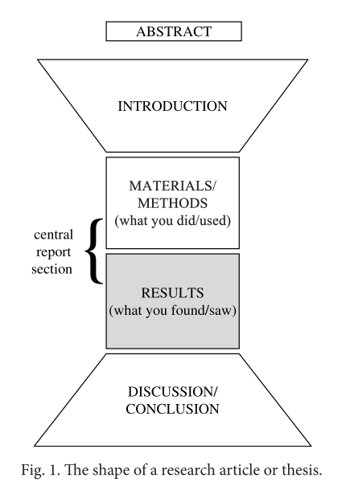
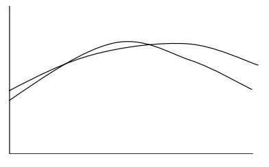

# Writing about Results

## Structure

不同学科Results的名称会有所不同，比如Analysis，Data Analysis等。几种常见的类型：

|Option 1|Option 2|Option 3|Option 4|
|-|-|-|-|
|Results or Data Analysis|Results or Data Analysis|Results and Discussion|Results or Data Analysis|
|Discussion|Discussion|Ø |Discussion and Conclusion(s)|
| Conclusion(s) |Ø| Conclusion(s) |Ø|

结果这部分主要是报告对自己发现了什么的一些评论。如果标题包括Discussion，那么就要包含讨论的部分。标题是什么可以参考自己的要投期刊的说明。

大多数情况下，结果这部分会以图，表，公式等形式给出。那这部分究竟写什么？为什么要写这部分？

首先，结果值得写，有创新，但是很难仅仅通过表和图直接就看出来；

第二，有必要将自己的结果和研究的目标关联起来；

第三，有时候会需要提供一些背景信息来解释自己的结果，或者和其他研究对比；

此外，结果不是完美的，有哪些存在的问题，解释是有必要的。

还有一个最重要的原因之一是作者必须要将自己对结果的理解和解释分享交流给读者。结果自己是不会说的。读者不必完全同意自己，但是作者有必要分享自己的想法和理解。

接下来还是经典三问：

- How do I start the Results section? What type of sentence should I begin with?
- What type of information should be in this section and in what order? 
- How do I end this section?

首先，还是看看语法和写作技巧。

## Grammar and Writing Skills

几个Results种需要注意的方面。

- SEQUENCE
- FREQUENCY
- QUANTITY
- CAUSALITY

### Sequence

为了其他研究者能准确地复现研究的工作，需要描述自己做实验以及发现了什么的顺序。Time sequence 意味着每步需要花多少时间以及在顺序中发生在哪里。

不能只用then或者next，这些词告诉了读者顺序，但是不能提供每个工作花费多长时间，下一个事件发生的有多块以及发生在顺序中的哪个地方。一个清楚的对时间序列的理解能帮助读者更好地重复它们。描述顺序的词或短语可以分为八组。

- 第一组是发生于实验之前的，或者开始观察实验结果之前的词，比如 It was apparent **beforehand** that a reduction in temperature would be a desirable outcome.
- 第二组表示第一个开始的实验，或者第一组结果的：**At the beginning** the temperature was stable, as predicted.
- 第三组是给出事件发生顺序的词，但还每给出更多信息：The temperature increased to 49°C and **then** dropped to 30°C. 
- 第四组是描述两个事件之间只有很短的事件间隔：Th e temperature increased to 49°C but **soon** dropped to 30°C.
- 第五组是长时间间隔或者发生在序列结尾的事件：Th e temperature increased to 49°C and later dropped to 30°C.
- 第六组比较重要，描述了同时发生的事情：Th e temperature dropped sharply when we reduced the pressure.
- 第七组表示序列结束：At the end there was a noticeable drop in temperature.
- 第八组表示实验结束后的事：At the end there was a noticeable drop in temperature but it was decided aft erwards to omit it from the input data

一些词汇：

- after
- afterwards 
- as
- as soon as 
- at first
- at that point 
- at the beginning
- at the end
- at the same time
- at the start
- beforehand
- before
- long
- earlier 
- eventually
- finally
- firstly 
- formerly 
- immediately 
- in advance 
- in the beginning
- in the meantime 
- in the end 
- initially 
- just then
- lastly
- later
- later on 
- meanwhile
- next 
- once
- originally
- previously
- prior to 
- secondly
- shortly after
- simultaneously
- soon 
- straight away
- subsequently
- then
- to begin with
- to start with
- towards the end
- upon 
- when
- while

### Frequency

结果发生的频率，如果总是会出现，说明是比较稳定的结果。在methodology中，如果没有写关于方法的频次，读者可能不能复现结果。在Results中，如果没有频次，也没法让别人比较结果。

频率的词有一定主观性，所以还是按照以往相关研究中常用的情况来写。下面是不同程度的频率词：

1. each/every time without exception on each/every occasion always invariably
2. habitually as a rule generally normally usually
3. regularly repeatedly
4. frequently oft en commonly
5. more oft en than not 
6. as oft en as not (neutral frequency)
7. sometimes on some occasions at times
8. occasionally now and then from time to time
9. rarely seldom infrequently
10. hardly ever barely ever almost never scarcely ever
11. on no occasion not once at no time never

### Quantity

对于结果的描述会引导读者思考的角度，比如同样一张图：

如果用 As can be seen in the fi gure, the two curves are very similar 描述，读者就会思考相似性，而如果是 As can be seen in the fi gure, the two curves are noticeably diff erent，那么读者就会更加关注于不同。

**Results do not speak for themselves!**, 读者想要了解的是结果背后说明的问题，并且如果不说明，读者的理解可能和作者有很大不同。

解释结果的方式多种，比如前面的frequency，还有就是 quantity language。这类语言可以用来表示数字，或者用来对数字评论。有五组这样的词：

1. The first group contains words or phrases which make the size/quantity look big: A considerable amount of residue remained in the pipe.
2. The second group contains words or phrases which make the size/ quantity look small: Barely 23% of the residue remained in the pipe.
3. The third group is used to emphasise how big/small/high/low the size/ quantity is: The amount that remained was even higher/even lower than predicted.
4. The fourth group is used to communicate that the size/quantity is similar/close to another: Almost all/Almost half of the residue remained in the pipe.
5. The fifth group is useful when you need to say something about the quantity but you do not want to commit yourself to an interpretation of how big or small it was: Some of the residue remained in the pipe

更多词汇：

1. words or phrases which increase the size/quantity: a great deal (of)
most
a number (of)
numerous
as many as (45)
over (half/25%)
appreciable
plenty
at least
much
considerable
substantial
greater (than)
signifi cant
marked
upwards of
more (than)
2. words or phrases which reduce the size/quantity: a few
little
a little
less
as few as 45
marginal
barely
negligible
below
only
few
slight
fewer (than)
small
hardly
under
infi nitesimal
3. words or phrases which emphasise how big/small/high/low the size/quantity is: appreciably
extremely (high/low)
by far
far (above/below)
considerably
particularly
easily (over/under)
so (high/low)
even (higher/lower)
substantially
exceptionally (high/low)
well (under/over)
4. words or phrases which communicate that the size/quantity is similar/close to another:
approximately
little (i.e. close to none)
close (to)
nearly
few
practically
few (i.e. close to none) just (over/under)
slightly virtually
5.words or phrases which communicate a reluctance to commit oneself to an interpretation of the size/quantity: fairly
reasonably
in some cases
relatively
moderate
some
quite
somewhat
rather
rather
to some extent

### Causality

两个事件之间因果关系的描述。

表达的程度也有不同，有强有弱，还有不确定的情况。

需要注意：

- to be **a** cause of or **a** result of something implies that other factors were also involved, whereas to be **the** cause of or **the** result of something implies that it is the only cause or result.
- *x results from y* means *x* is a consequence of *y*; whereas *result in y* means *y* is a consequence of *x*

一些词汇：

(be) a/the cause of (be) a/the consequence of (be) a factor in (be) a/the result of (be) due to accompany/(be) accompanied* account for/(be) accounted for aff ect/(be) aff ected arise from ascribe to/(be) ascribed to associate/(be) associated* attribute to/(be) attributed to bring about/(be) brought about cause/(be) caused come from connect to/(be) connected to* contribute to
create/(be) created derive/(be) derived eff ect/(be) eff ected elicit/(be) elicited give rise to generate/(be) generated infl uence/(be) infl uenced initiate/(be) initiated link/(be) linked* originate in produce/(be) produced relate/(be) related* result from result in stem from trigger/(be) triggered yield

有时候需要一些谨慎的词汇来减少自己可能犯错的责任以替换x caused y：

It appears that… It can/may* (therefore) be inferred/assumed that… It is (very/highly/extremely) probable/likely that… It is (widely/generally) accepted that… It is/may be reasonable to suppose/assume that … It is/may be thought/recognised/believed/felt that… It is/may/can be assumed that… It seems (very/highly) probable/likely that… It seems (likely) that… It would seem/appear that … Th e evidence points to the likelihood/probability that… Th e evidence suggests that… Th ere is a clear/good/defi nite/strong possibility that… Th ere is evidence to indicate that… Th is implies/seems to imply/may imply that… Apparently, (therefore), Th ere seems to be/is a tendency to It is thought/said/recognised that

还有就是增加一些修饰，比如frequency的，
x oft en caused y x commonly caused y x rarely caused y

quantity qualifier：

x caused y in many cases x caused y in some cases/to some extent x caused y in virtually all cases

或者情态动词：

x may have caused y x might have caused y x could have caused y

## Writing Task: Build a Model

第一句：Data obtained in previous studies using a fixed on-site monitor indicated that travel by car resulted in lower CO exposure than travel on foot.

第二句：According to Figo et al. (1999), the median exposure of car passengers was 11% lower than for those walking.

个人理解：

先是概况引述已有研究的结果，然后给出一个具体的研究的例子。

Key：

**the writer refers to the findings and conclusions obtained by other researchers**

为什么不直接开始描述自己的结果？

因为如果直接开始提供自己的结果，读者就需要自己去建立一个关于作者的结果的框架，那会是非常困难的事情。而这是应该由作者来完成的，即组织自己的信息来让读者更容易地处理它。所以以一个 reader-friendly 的方式开场是非常重要的，因此也通常会以介绍性材料开场。而且任何即将开始新的部分的时候，都最好在新部分和之前的部分之间有一个平滑的衔接。

有两类比较好的方法：

1. **offering an overview of the current section**：提纲挈领句。
2. **referring back to something from the previous section(s)**：回顾前面部分的某些东西，比如：
    - introduction中提到的本研究领域里的 general aims
    - 作者自己关注的具体的研究问题，或者 introduction中提到的 the aim of your project
    - the methodology
    - 最初的要验证的预测或假设，也是introduction中提到的
    - 本领域其他研究的结果，也是Introduction中提到的
    
为什么要re-state自己的研究问题或者project的目的呢？

最终，在Discussion环节，会需要说研究解决的问题到什么程度或者如何解决了Introduction中提到的目标，因此结果要和自己的目的非常相关，让论文首尾呼应起来。

那么为什么re-state 其他研究的发现呢？

因为自己的结果和别人的结果可能不同，可能相同，是需要进行比较才能说明的，开始的时候重述下别人的结果，有助于读者理解作者的结果和之前的研究之间的关系。

第三四句：In our study, modelled emission rates were obtained using the Traffic Emission Model (TEM), a CO-exposure modelling framework developed by Ka. Modelled results were compared with actual roadside CO concentrations measured hourly at a fixed monitor

个人理解：

这两句主要是描述自己建模的方法还有对自己结果将如何分析的一个概述。

Key：

**the writer refers back to his/her own methodology and adds more information about it.**

开始的时候总结下自己的methodology是不错的选择。这样做的原因之一是强调方法中提到的较重要的方面；另一个是提醒下读者关于methodology的内容，毕竟读者不是特别熟悉方法。另外，就是关于methodology的内容的细节延申会放到results这一部分，而不会放到前面的部分，因为前面只包括一些方法的基本框架。

背景信息在这里是常见且必须的，前面提到的方法里又一些东西可能不足以帮助获取到某一个具体的结果，那么这里就应该提到这些更具体的信息，以帮助解释为什么会有这样的结果出现。给出更多的背景信息是比给的信息少要好。

第五句：Figure 1 shows the results obtained using TEM.

个人理解：

接下来就是展示结果，先抛出一个结果。

Key：

**the writer invites the reader to look at a graph/figure/table etc.**

作者自然地会从上往下读文献，那为什么还要invite reader to look？

因为数据、图表的解释通常是有多方面多角度的，为了表达自己的理解，应该对结果做comments，否则读者理解可能就不同了。

第六句：As can be seen, during morning peak-time journeys the CO concentrations for car passengers were significantly lower than for pedestrians, which is consistent with results obtained in previous studies.

个人理解：

然后就是针对刚给出的图进行解释，注意用到一些表示程度的词，还有和以往研究的对比。

Key：

**the writer refers to specific results and compares them with those obtained in another study, using subjective, evaluative language (consistent with).**

需要和其他研究者结果比较吗？

平常写报告，阅读的对象通常是自己的导师，他们是非常清楚里面的细节的，因此只要描述下方法和结果就行了。

然而，当面对读者的时候，他们是不清楚的，所以首先要把自己的研究定位到领域世界观里的，**locate them on the ‘research map’ in your field**。这就意味着需要展示给读者结果是如何以及定位到哪里的，所以才需要和以前的结果去比较。然后在discussion部分，会去进一步发展这个“mapping”的动作。

results中应该以什么顺序来展示呢？

有必要以一些引导性的结果开始，逐步引申到更重要的部分。

为什么要使用评价性的语言，为什么不直接描述图表中的结果？

因为结果不会自己表达自己，当然没有必要在每个case都使用评价性的语言，有时候结果会被客观地给出。不过，如果完全不给出自己地评价，就没办法引导读者去接受他们。

第七句：‘However, the modelled data were not consistent with parallel FOM measurements for afternoon journeys.’ 

个人理解：

对于某些特别情况的说明。

Key：

**the writer offers a general statement about his/her results to begin a new paragraph.**

作者是知道哪些结果更有意思，更有意义，但是如果不主动把它展示给读者，读者是很难理解到相同的内容的。这里作者通过一个平滑的介绍，引出新的结果。

第八句：Although the mean CO concentrations modelled by TEM for afternoon journeys on foot were in line with those of Figo et al., a striking difference was noted when each of the three peak hours was considered individually (Fig. 2). 

个人理解：

和以往研究的异同，表明自己结果的贡献，然后引出另一个结果。

Key：

**the writer refers to specific results and compares them to those obtained in another study, using language that comments on the result(s)** (a striking difference).

有时候，需要描述一些结果的细节，需要选择结果中重要的，典型的，有意思的部分。

使用“striking”这样的词会不会显得不正式？

当然不会。在科研写作中，不会经常使用声明式的marks，比如“!”，即使结果是令人兴奋的。当想表达“wow!”的时候，就会用striking这样的词。

另外，although和but使用时也可以推敲下，比如以although开头，作者就能引导读者预测接下来的事情，而but就起不到这样的效果。

第九、十句：It can be observed that during the first hour (H1) of the peak period, journeys on foot resulted in a considerably lower level of CO exposure. Although levels generally exceeded those modelled for car journeys during H2, during the last hour (H3) the levels for journeys on foot were again frequently far lower than for car journeys.

个人理解：

比较详尽地对结果地分析，每一个值得注意的点都是什么。

Key：

**the writer selects specific results to describe in more detail, using language that comments on the results** (considerably lower, generally, frequently far lower).

需要解释结果么？

这取决于结果的复杂程度。可以通过提供一些背景信息来解释为什么这样的结果会出现。明确 the **explanation** of a result (why it occurred as it did) 和 the **evaluation** of a result (what the numbers mean) 以及 the **implication** of a result(what the result suggests or implies) 之间的区别。results这个阶段explanation 应该限制在对结果的直接评价上，更深入和广泛的讨论应该放在discussion/conclusion环节。

如何知道哪些结果要描述细节，为什么不全部都描述细节呢？

因为如果都同样详细地描述细节，那么就没有重要性程度的区别了，而有些结果就是比另一些结果要更典型，更关键，而在论文中是没法标红这样提醒高亮的，所以就用着笔的多少来表达强调。

这类结果比较典型的是这样描述：

‘…the SFS results are in very good agreement with their FE counterparts; for example, at midspan the values are almost identical.’ 

第十一句：‘A quantitative analysis to determine modelling uncertainties was applied, based on the maximum deviation of the measured and calculated levels within the considered period.’

个人理解：

继续进一步地抛出新的对结果的分析。

Key：

**the writer refers to the method used to analyse the results.**

为什么这部分不放在methodology中？

Results部分通常都有大量的关于methodology的描述。methodology中通常处理地是方法的基本结构和构成，这样的话，大部分细节都会在Results中介绍，这种方式在期刊中是很常见的。

第十二句：‘Based on this approach, the average uncertainty of the model prediction for this study slightly exceeds the 50% acceptability limit defined by Jiang.’ 

个人理解：

基于上面给出的方向给出具体的分析。

Key：

**the writer mentions a problem in the results and uses quantity language (slightly) to minimise its significance.**

为什么需要在结果中提到遇到的问题，这不会让读者质疑自己的结果么？

当然不会。不要忽视自己遇到的问题，除非非常确定自己遇到的问题桑不显著的。如果结果不完美，那么就应该提及这些，最小化它们的重要性，并给出一些可能的解决方案。如果没给出对问题的说明可能会显得作者不够专业，没有发现这些问题，这会对作者有一些负面影响；而如果能提及，会显得一切都在作者的掌控之中，而且也给Discussion环节指引了方向。

还有就是如果等到自己结果完美，那论文就发不出来了，要在结果值得拿出的时候就尽快地发表出来，不要等待完美。在写Results地时候提到遇到地问题，不要在Discussion中才提到。

所以如何在Results中讨论遇到地问题呢？

使用像**minimises the problem**, **suggests possible reasons for it** and/or **offers a solution or a way forward**这样的.

第十三句：‘Nevertheless, these results suggest that data obtained using TEM to simulate CO exposures may provide more sensitive information for assessing the impact of traffic management strategies than traditional on-site measurement.’ 

个人理解：

结果能告诉我们什么。

Key：

**the writer makes a reference to the implications and applications of the work s/he has done.**

这种句子不应该放在Discussion中么？

An examination of implications and applications 确实是Discussion的核心环节，但是大多数作者还是会在结果的最后ending部分给出一些对结果说明内容的介绍，这样就能从文章报告的核心部分转移到conclusion环节了，这里用的句子会有suggest,indicate这样的词。

以上可以总结为四个基本组成：

1. 
    - REVISITING THE RESEARCH AIM/EXISTING RESEARCH 
    - REVISITING/EXPANDING METHODOLOGY 
    - GENERAL OVERVIEW OF RESULTS
2. 
    - INVITATION TO VIEW RESULTS
    - SPECIFIC/KEY RESULTS IN DETAIL, WITH OR WITHOUT EXPLANATIONS
    - COMPARISONS WITH RESULTS IN OTHER RESEARCH 
    - COMPARISON/S WITH MODEL PREDICTIONS
3. PROBLEMS WITH RESULTS
4. POSSIBLE IMPLICATIONS OF RESULTS

## Vocabulary

针对前面提到的几个总结内容，分别给出常用词汇。

### REVISITING THE RESEARCH AIM/EXISTING RESEARCH

提醒读者之前提到的内容。比如As mentioned earlier，然后用可以和introduction中相同的话来呼应读者。

- as discussed previously, 
- as mentioned earlier/before, 
- as outlined in the introduction, 
- as reported, 
- in order to…, we examined… 
- it is important to reiterate that… 
- it is known from the literature that… 
- it was predicted that… 
- our aim/purpose/intention was to… 
- since/because…, we investigated… 
- the aforementioned theory/aim/prediction etc. 
- to investigate…, we needed to… 
- we reasoned/predicted that…

### GENERAL OVERVIEW OF RESULTS

介绍结果general的pattern或趋势，这样读者知道期待什么，比如in most cases

- generally speaking
- in general
- in most/all cases
- in the main
- in this section, we compare/evaluate/present…
- it is apparent that in all/most/the majority of cases, 
- it is evident from the results that… 
- on the whole 
- the overall response was… 
- the results are divided into two parts as follows: 
- using the method described above, we obtained…

### INVITATION TO VIEW RESULTS

不能总是写Figure 1 shows 这样的话，图表不会show things，但它们代表或总结了things。

- (data not shown) 
- (Fig. 1)
- (see also Fig. 1)
- (see Fig. 1)
- (see Figs. 1–3) 
- according to Fig. 1 
- as can be seen from/in* Fig.1
- as detailed in Fig.1 
- as evident from/in the figure 
- as illustrated by Fig. 1
- as indicated in. Fig.1
- as listed in Fig.1
- as shown in Fig.1
- as we can see from/in Fig.1… 
- can be found in Fig.1 
- can be identified from/in Fig.1
- can be observed in Fig. 1 
- can be seen from/in Figure 1 
- comparing Figs. 1 and 4 shows that… 
- data in Fig. 1 suggest that… 
- displayed in Fig. 1 
- evidence for this is in Fig. 1 
- from Fig. 1 it can be seen that… 
- inspection of Fig. 1 indicates... 
- is/are given in Fig.1 
- is/are represented (etc.) in
- is/are visible in Fig. 1 
- in Fig. 1 we compare/present etc…. 
- results are given in Fig.1
- we observe from Fig. 1 that…
- Figure 1:
    - contains
    - corresponds (to) 
    - demonstrates
    - displays
    - gives
    - illustrates
    - lists
    - plots
    - presents
    - provides
    - reports 
    - represents 
    - reveals
    - shows
    - summarises

### SPECIFIC/KEY RESULTS IN DETAIL

这类语言包括主观的评价(significantly lower/slightly lower) 和客观的描述(lower)。其实文献中客观的描述是比主观描述难找到的。因为客观的描述不能告诉读者他们还不知道的信息

客观类型的词：

- accelerate(d) 
- all 
- change(d) 
- decline(d)
- decrease(d) 
- delay(ed) 
- drop(ped) 
- exist(ed) 
- expand(ed) 
- fall/fell 
- find/found 
- increase(d)
- is/are/was/were constant 
- is/are/was/were different
- is/are/was/were equal 
- is/are/was/were found 
- is/are/was/were higher 
- is/are/was/were highest
- is/are/was/were identical 
- is/are/was/were lower 
- is/are/was/were present 
- is/are/was/were seen 
- is/are/was/were unaffected
- is/are/was/were unchanged
- is/are/was/were uniform
- match(ed) 
- none 
- occur(red)
- peak(ed) 
- precede(d)
- produce(d)
- reduce(d) 
- remain(ed) 
- constant
- remained the same 
- rise/rose 
- sole/ly 
- vary/varied

主观类型的词：

- abundant(ly)
- acceptable(ably)
- adequate(ly) 
- almost
- appreciable(ably)
- appropriate(ly)
- brief/(ly) 
- clear(ly) 
- comparable (ably)
- considerable(ably)
- consistent(ly) 
- distinct(ly)
- dominant(ly) 
- dramatic(ally) 
- drastic(ally)
- equivalent 
- essential(ly) 
- excellent excessive(ly) exceptional(ly) extensive(ly) extreme(ly) fair(ly) few
imperceptible(ibly) important(ly) in particular, in principle inadequate interesting(ly), it appears that large(ly) likelihood low main(ly) marked(ly) measurable(ably) mild(ly) minimal(ly) more or less most(ly) negligible(ibly) noticeable(ably) obvious(ly) only overwhelming(ly) poor(ly)
remarkable(ably) resembling satisfactory scarce(ly) serious(ly) severe(ly) sharp(ly) signifi cant(ly) similar simple(ply) smooth(ly) somewhat steep(ly) striking(ly) strong(ly) substantial(ly) sudden(ly) suffi cient(ly) suitable(ably) surprising(ly) tendency the majority of too + adjective unexpected(ly)
general(ly) good high(ly) immense(ly)
powerful(ly) quick(ly) radical(ly) rapid(ly)
unusual(ly) valuable very virtual(ly)

### COMPARISONS WITH RESULTS IN OTHER RESEARCH

包括和其他作者的结果比较，引用他们的结果来支持自己的结果，或与自己的结果比较，比如 is in line with 还有 correlate well with 这样的词。注意引用别人的结果时，确保引用的数字时正确的，别和自己的数字混淆了。另外，引用标识不一定非要在句子末尾。

- as anticipated 
- as expected
- as predicted by… 
- as reported by… 
- compare well with 
- concur 
- confirm 
- consistent with 
- contrary to 
- corroborate 
- correlate 
- disprove 
- inconsistent with 
- in line with
is/are better than is/are in good agreement is/are identical (to) is/are not dissimilar (to) is/are parallel (to) is/are similar (to) is/are unlike match prove refute reinforce support validate verify

### PROBLEMS WITH RESULTS

通常的做法是使用这类词：minor deficit 还有 not within the scope of this study will

### POSSIBLE IMPLICATIONS OF RESULTS

给出一些结果能展示的主要观点，并给出一些signal来衔接到Discussion环节。比如：This indicated/suggested/implied that and 还有 It seems therefore that 等。

- apparently 
- could* be due to 
- could* be explained by 
- could* account for 
- could* be attributed to 
- could* be interpreted as 
- could* be seen as 
- evidently
- imply/implies that 
- indicate/indicating that
- in some circumstances
- is owing to 
- is/are associated with
- is/are likely 
- is/are linked to
- is/are related to
- it appears that 
- it could* be concluded that… 
- it could* be inferred that
- it could* be speculated that
- it could* be assumed that
- it is conceivable that
- it is evident that
- it is logical that 
- it is thought/believed that 
- it seems that 
- it seems plausible (etc.) that
- likely
- may/might
- means that
- perhaps
- possibly/possibility
- potentially
- presumably 
- probably
- provide compelling evidence 
- seem to 
- suggest(ing) that 
- support the idea that 
- tend to 
- tendency 
- unlikely
- there is evidence for 
- we could* infer that 
- we have confidence that 
- would seem to suggest/indicate
