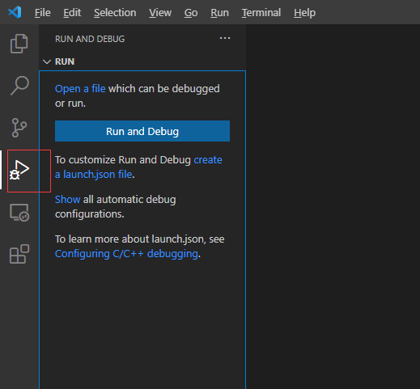
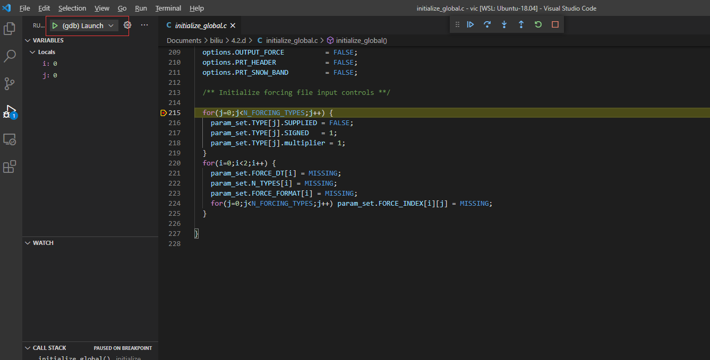

# Linux Ubuntu 一些必要的基础操作

linux是科研常用的操作系统，比如VIC model， WRF model等都是在linux下充分测试的。虽然我们不必像专业的计算机人员那样刨根问底，但是一些简单的常识性只是还是不可少的，这里就日常遇到的知识点做些记录说明。

一般来说，最开始接触linux系统的时候，都会听说过一本书——[《鸟哥的linux私房菜》](http://cn.linux.vbird.org/)，作为环境工程专业出身的鸟哥写的这本书那是非常适合我们这种非计算机专业的初学者的，可能的话还是阅读下比较好，至少了解下计算机的基本构成以及linux的安装（个人觉得如果个人PC上用Ubuntu的话，安装直接按照官方教程原样安装使用即可），然后就是linux的文件目录相关的基本概念，还有就是基本shell命令的使用，一般用的比较多的也就是bash了，bash相关命令记录会汇总到另一个文件里，另外，vim编辑器可能也是要好好讨论的一个内容，所以也会在另一个文件里简单记录一些vim的基础操作。本文就补充一些基本知识，一些基本的常用工具等，以知识点的形式配合记录一些命令的使用。
$\alpha$

## Ubuntu系统中的权限

主要参考：[一言不合就改成 777 权限？会出人命的！](https://juejin.im/post/5bad92cd6fb9a05cde1d6076)，这篇博客也是写python爬虫那本很火的书的作者崔庆才写的，值得一读。目的是了解下linux下用户、用户组、文件权限等基本知识。

Linux 系统中，是有**用户和用户组**的概念的，用户就是身份的象征，我们必须**以某一个用户身份来操作一个系统**，实际上这就对应着我们登录系统时的账号。而**用户组就是一些用户的集合**，我们可以**通过用户组来划分和统一管理某些用户**。比如我要在微信发一条朋友圈，我只想给我的亲人们看，难道我发的时候还要一个个去勾选所有的人？这未免太麻烦了。为了解决这问题，微信里面就有了标签的概念，我们可以提前给好友以标签的方式分类，发的时候直接勾选某个标签就好了，简单高效。实际上这就是用户组的概念，我们可以将某些人进行分组和归类，到时候只需要指定类别或组别就可以了，而不用一个个人去对号入座，从而节省了大量时间。在 Linux 中，**一个用户是可以属于多个组的，一个组也是可以包含多个用户的**，下面以一台 Ubuntu Linux 为例来演示一下相关的命令和操作。

查看所有用户：

```Shell
cut -d':' -f 1 /etc/passwd
```

然后查看所有用户组：

```Shell
cut -d':' -f 1 /etc/group
```

结果基本类似，因为每个用户在创建的时候都会自动创建一个同名的组作为其默认的用户组。

可以查看一个用户所属组，比如查看用户owen所属组，在我的电脑上有如下结果：

```Shell
$ groups owen
owen : owen adm cdrom sudo dip plugdev lpadmin sambashare
```

可以看到熟悉的sudo。sudo 组比较特殊，如果被分到了这个组里面就代表该账号拥有 root 权限，可以使用 sudo 命令。


当然也可以反过来看看一个用户组里面包含哪些用户，比如：

```Shell
$ members sudo
owen
```

不过这个命令不是自带的，所以需要安装members包。

```Shell
sudo apt-get install members
```

还有一个命令 -- id ，这也是比较常用的一个命令，可以用来查看用户的所属组别。

```Shell
$ id owen
uid=1000(owen) gid=1000(owen) groups=1000(owen),4(adm),24(cdrom),27(sudo),30(dip),46(plugdev),116(lpadmin),126(sambashare)

```

 这里gid表示主工作组，后面还有个 groups，它列出了用户所在的所有组。主工作组只有一个，而用户所属组的数量则不限。可以看到用户组的结果和使用 groups 命令看到的结果是一致的。
 
 然后是了解下如何创建用户和怎样为用户分配组别。
 
 添加一个用户命令如下，比如添加用户fayer：
 
 ```Shell
$ sudo adduser fayer
正在添加用户"fayer"...
正在添加新组"fayer" (1001)...
正在添加新用户"fayer" (1001) 到组"fayer"...
创建主目录"/home/fayer"...
正在从"/etc/skel"复制文件...
输入新的 UNIX 密码： 
重新输入新的 UNIX 密码： 
passwd：已成功更新密码
正在改变 fayer 的用户信息
请输入新值，或直接敲回车键以使用默认值
	全名 []:
```

会出现以上结果，让输入各类信息，按照提示输入即可。

因为都是系统级别的操作，所以命令都有sudo。添加一个组的命令如下，比如添加用户组family：

```Shell
sudo groupadd family
```

创建完了用户和组，得把它们关联起来，即把某个用户加入到某个组里面：

```Shell
sudo adduser fayer family
```

或者使用usermod命令

```Shell
sudo usermod -G family fayer
```

如果要添加多个组的话，可以通过 -a 选项指定多个名称：

```Shell
sudo usermod -aG <group1,group2,group3..> <username>
```

这样就为用户和用户组做好关联了。

接下来就是文件权限管理：

列出某个目录下文件详细信息的命令如下：

```Shell
$ ll
drwxr-xr-x 63 owen owen   4096 Jan  2 09:29  ./
......
```

或者

```Shell
$ ls -l
drwxr-xr-x 63 owen owen   4096 Jan  2 09:29  ./
......
```

省略号不是命令行里的结果，是这里没有列出所有的内容。可以看出，一行有一个文件或文件夹的信息，一共七列。

1. 文件的权限信息：由十个字符组成。
    - 第一个字符代表文件的类型，有三种，- 代表这是一个文件，d 代表这是一个文件夹，l 代表这是一个链接；
    - 第 2-4 个字符代表文件所有者对该文件的权限，r 就是读，w 就是写，x 就是执行，是有顺序的，永远是rwx，如果没有某个权限，就用-代替，如果是文件夹的话，执行就意味着查看文件夹下的内容，例如 rw- 就代表文件所有者可以对该文件进行读取和写入；
    - 第 5-7 个字符代表文件所属组对该文件的权限，含义是一样的，如 r-x 就代表该文件所属组内的所有用户对该文件有读取和执行的权限；
    - 第 8-10 个字符代表是其他用户对该文件的权限，含义也是一样的，如 r-- 就代表非所有者，非用户组的用户只拥有对该文件的读取权限。
2. 该文件夹连接的文件数
3. 文件所属用户
4. 文件所属用户组
5. 文件大小（字节）
6. 最后修改日期
7. 文件名

可以使用chmod命令来改变文件或目录的权限，比较常用的是数字权限命名，rwx对应一个二进制数字，比如101 就代表拥有读取和执行的权限，转为十进制的话，r 就代表 4，w 就代表 2，x 就代表 1，然后三个数字加起来就和二进制数字对应起来了。如 7=4+2+1，这就对应着 rwx；5=4+1，这就对应着 r-x。

举个例子，假如有一个文件file.txt 赋予 777 权限，可以写成：

```Shell
sudo chmod 777 file.txt
```

另外也可以使用代号来赋予权限，代号有 u、g、o、a 四中，分别代表所有者权限，用户组权限，其他用户权限和所有用户权限，这些代号后面通过+和-号可以控制权限的添加和删除，然后跟上权限类型即可。比如：

```Shell
# 给所有者移除 x 权限，也就是执行权限。
sudo chmod u-x file.txt
# 为用户组添加 w 权限，即写入权限。
sudo chmod g+w file.txt
```

如果是文件夹的话还可以对文件夹进行递归赋权限操作，比如将 share 文件夹和其内所有内容都赋予 777 权限：

```Shell
sudo chmod -R 777 share
```

现在把用户和用户组与文件关联起来，这里使用的命令就是 chown 和 chgrp 命令。比如：

```Shell
sudo chown fayer file.txt
sudo chgrp family file.txt
```

上述命令的意思是将 file.txt 的所有者换成 fayer，和将file.txt 所属用户组换成 family。另外同样可以使用 -R 来进行递归操作，如将 share 文件夹及其内所有内容的所有者都换成 fayer：

```Shell
sudo chown -R fayer share/
sudo chgrp -R fayer share/
```

如果想要修改用户名密码等，可以参考：https://www.linuxprobe.com/linux-ubuntu-teach.html

修改root密码：

```Shell
sudo passwd root
```

修改用户信息：

```Shell
sudo vi /etc/passwd          # 找到原先的用户名，将其改为自己的用户名
sudo vi /etc/shadow        # 找到原先用户名（所有的名字都要改），改为自己的用户名
```

如果要给普通用户sudo权限，可用参考：https://linux.cn/article-10576-1.html

想要用户使用 sudo 执行管理任务，只需在root身份下使用以下命令将它添加到 sudo 组：

```Shell
su
adduser fayer sudo
```

## 设置局域网固定ip

在局域网中为了保持服务器ip不变便于链接，设置固定ip。这里主要参考了：[如何在 Ubuntu 18.04 LTS 中配置 IP 地址](https://zhuanlan.zhihu.com/p/51941694)

查找netplan目录下默认的网络配置文件，文件后缀为.yaml，我的是叫01-network-manager-all.yaml的文件。如果没有可以使用sudo gedit 01-network-manager-all.yaml 自己创建。

```Shell
cd /etc/netplan
ls
```

编辑之前，先查看自己的网卡名称

```Shell
ifconfig
```

我的是 enp0s31f6，对应的ip是10.160.11.27

然后编辑网络配置文件 01-network-manager-all.yaml 文件：

```Shell
sudo vim 01-network-manager-all.yaml
```

内容如下：

```YAML
# Let NetworkManager manage all devices on this system
network:
  version: 2
  renderer: NetworkManager
  ethernets:
     enp0s31f6: #配置的网卡名称,使用ifconfig 查看得到
       dhcp4: no #dhcp4关闭
       addresses: [10.160.11.20/16] #设置本机IP及掩码，我的子网掩码255.255.0.0，所以/后面应该是16；在 Ubuntu 18.04 中，定义子网掩码的时候不是像旧版本的那样把 IP 和子网掩码分成两项配置。
       gateway4: 10.160.0.1 #网关可以通过route -n 命令查询
       nameservers:
         addresses: [192.168.202.1] #设置DNS, 输入systemd-resolve --status 命令，最底下能查看得到
```

特别要注意的是这里的每一行的空格一定要有的，否则会报错误而设置失败！且这个配置文件的每一行都必须靠空格来缩进，不能用 TAB 来代替，否则配置会不起作用。

设置完成后保存退出，然后使用如下命令使ip生效。

```Shell
sudo netplan apply
```

现在再使用ifconfig查看ip应该就能看到自己刚刚设置的地址了。

## 用 mobaxterm 连接 Ubuntu

比较方便好用的连接linux服务器的工具推荐：[mobaxterm](https://mobaxterm.mobatek.net/)。

首先看看如何安装python，这里以anaconda的安装为例，直接使用如下命令即可：

```Shell
$ cd /home/wvo5024
$ curl -O https://repo.anaconda.com/archive/Anaconda3-2019.10-Linux-x86_64.sh
$ bash  Anaconda3-2019.10-Linux-x86_64.sh
Anaconda3 will now be installed into this location:
/home/wvo5024/anaconda3
...
installation finished.
Do you wish the installer to prepend the Anaconda3 install location
to PATH in your /home/wvo5024 /.bashrc ? [yes|no] yes
$ source ~/.bashrc
$ python  --version
```

注意环境变量配置到用户文件里。

如果不在suders file名单里，那么就不能使用sudo命令来安装package，不过可以下载.sh包，然后执行bash命令来安装。

安装一个软件，比如anaconda，然后环境配置默认在用户文件夹下，进入配置文件下的环境需要执行下述语句：

```Shell
$ . ~/.bashrc
```

这样，就可以使用配置环境下的相关软件了，比如python,pip等。

## 管理远程会话

这一节主要参考了[Linux 技巧:使用 Screen 管理你的远程会话](http://www.linuxidc.com/Linux/2013-10/91612.htm)。

远程登陆到服务器运行长时间任务时，如果开了一个远程终端窗口，那么他执行时间太长时，断开连接会将进程杀死，这样就半途而废了。

首先看看为什么关掉窗口/断开连接会使得正在运行的程序死掉。

在Linux/Unix中，有这样几个概念：

进程组（process group）：一个或多个进程的集合，每一个进程组有唯一一个进程组ID，即进程组长进程的ID。
会话期（session）：一个或多个进程组的集合，有唯一一个会话期首进程（session leader）。会话期ID为首进程的ID。
会话期可以有一个单独的控制终端（controlling terminal）。与控制终端连接的会话期首进程叫做控制进程（controlling process）。当前与终端交互的进程称为前台进程组。其余进程组称为后台进程组。
根据POSIX.1定义：

挂断信号（SIGHUP）默认的动作是终止程序。
当终端接口检测到网络连接断开，将挂断信号发送给控制进程（会话期首进程）。
如果会话期首进程终止，则该信号发送到该会话期前台进程组。
一个进程退出导致一个孤儿进程组中产生时，如果任意一个孤儿进程组进程处于STOP状态，发送SIGHUP和SIGCONT信号到该进程组中所有进程。
因此当网络断开或终端窗口关闭后，控制进程收到SIGHUP信号退出，会导致该会话期内其他进程退出。

为了让程序能在断开连接后仍继续运行，可以使用screen工具，Screen是一个可以在多个进程之间多路复用一个物理终端的窗口管理器。Screen中有会话的概念，用户可以在一个screen会话中创建多个screen窗口，在每一个screen窗口中就像操作一个真实的telnet/SSH连接窗口那样。在screen中创建一个新的窗口有多种方式：

**直接在命令行键入screen命令**

``` Shell
screen
```

Screen将创建一个执行shell的全屏窗口。你可以执行任意shell程序，就像在ssh窗口中那样。在该窗口中键入exit退出该窗口，如果这是该screen会话的唯一窗口，该screen会话退出，否则screen自动切换到前一个窗口。

还可以在screen会话中继续创建新的窗口。在当前screen窗口中键入C-a c，即Ctrl键+a键，之后再按下c键，screen 在该会话内生成一个新的窗口并切换到该窗口。

可以暂时离开screen窗口，先按ctrl+a，然后再按ctrl+d即可。

重新连接会话可以先用screen -ls查看会话的编号，然后使用screen -r xxx（编号）即可回到会话。

更多命令可以参考：https://blog.csdn.net/perry_x/article/details/80459304

## 安装 IDE

### PyCharm for python

安装IDE，还是推荐pycharm，首先可以在本地下载安装包，这里使用这个链接: https://www.jetbrains.com/pycharm/download/download-thanks.html?platform=linux 下载的，然后再使用mobaxterm的upload上传到服务器文件夹中。

然后解压文件：

```Shell
tar -xzf pycharm-professional-2019.3.1.tar.gz
```

使用tar -xzf pycharm-professional-2019.3.1.tar.gz -C <指定文件夹> 可以解压到指定文件夹下，当然也可以解压后再移动到指定文件夹下，比如：

```Shell
mv pycharm-2019.3.1 ../programs/pycharm-2019.3.1
```

然后可以进入文件夹打开软件了：

```Shell
cd ../programs/pycharm-2019.3.1
cd bin
sh pycharm.sh
```

这时候稍等一会儿，会弹出pycharm的界面。可以一直默认。然后如果是专业版，需要激活，可以使用学生账号来激活，这是免费的。激活后就可以使用了。

### 安装用户共享的conda环境

在服务器上，重复安装某些公用的软件就没有必要了，所以可以考虑安装一个共享的。一般情况下在root用户下用apt-get install安装的软件对所有用户都是可用的。

这里以miniconda为例，简单记录下全局安装miniconda的过程，主要参考了：[张兴远知乎](https://www.zhihu.com/question/277053071/answer/391614802)

首先，用su命令进入root用户

```Shell
$ su
```

然后在root用户下，将miniconda安装到/opt/miniconda下。主要参考：https://blog.csdn.net/chch2010523/article/details/107605942

```Shell
cd /opt
# 下载安装包
wget https://mirrors.tuna.tsinghua.edu.cn/anaconda/miniconda/Miniconda3-latest-Linux-x86_64.sh
# 安装
sh Miniconda3-latest-Linux-x86_64.sh
# 执行安装时, 将安装位置改为 /opt/miniconda，即在Miniconda3 will now be installed into this location 这一步时，输入：
/opt/miniconda
# 剩下的默认按回车即可
```

接下来创建miniconda组，将用户（没创建用户的可以参考上面创建用户操作，这里用户以 owen411 为例）添加到改组：

```Shell
groupadd miniconda # 创建 miniconda 组
adduser owen411 miniconda # 将需要的用户添加至 miniconda 组
chgrp -R miniconda /opt/miniconda # 移交目录管理权
chmod 770 -R /opt/miniconda # 设置读写权限
chmod g+s /opt/miniconda # 设置组继承
chmod g+s `find /opt/miniconda/ -type d` # 设置子目录组继承
chmod g-w /opt/miniconda/envs # 关闭共享环境的写入权限
source /opt/miniconda/bin/activate # root用户下启动 miniconda 环境
conda create -n hydroDLShare python=3.7 # 创建共享环境
```

这样设置之后的效果是：由root用户创建的环境会保存在/opt/anaconda/envs中，所有anaconda组成员都可以访问。

参考的原文说“用户自己创建的环境则会保存至~/.conda/envs中，但是所有下载的pkg会共享在/opt/anaconda/pkgs中，即如果是别人装过的包（比如下载缓慢的PyTorch）则不用重新下载”，我实际执行的时候，发现用户是不能用这里的conda来创建环境的。所以还是暂时在自己的环境下去创建环境好了。

不过要想用户使用，还需要再给用户配置下配置文件。

可用在用户级别下配置，比如在owen411用户登陆条件下，进入其home的文件夹：

```Shell
cd
vim .bashrc
# 然后在配置文件中加上：
export PATH="/opt/miniconda/bin:$PATH"
```

这样就可用在owen411用户下使用conda了。

也可以修改系统级环境文件： /etc/profile ，这里暂时就不用这种方法了。

### VSCode for C/C++

主要参考 VSCode [GCC on Linux 文档](https://code.visualstudio.com/docs/cpp/config-linux)

去官网下载安装包：https://code.visualstudio.com/Download

下载到自己指定的文件夹后（我下载的版本是 code_1.54.3-1615806378_amd64.deb），使用dpkg命令安装即可。安装前最好update一下自己的软件列表（参考：https://blog.csdn.net/qq_40563761/article/details/84107480）

```Shell
sudo apt-get update
sudo dpkg -i code_1.54.3-1615806378_amd64.deb
```
安装完毕之后，使用code即可打开编辑器

```Shell
code
```

为了在VSCode中运行C/C++程序，需要安装 C/C++ for Visual Studio Code 插件。

当然首先保证自己的系统中有安装了C编译器gcc以及[调试器gdb](http://www.gdbtutorial.com/tutorial/how-install-gdb)。一般gcc和g++是默认安装的，不过最好使用下面的语句更新安装下

```Shell
sudo apt-get update
sudo apt install --reinstall build-essential
sudo apt-get install gdb
```

这样就准备好在VSCode中运行调试C/C++代码的工具了。


注意C/C++的编译不像python这类解释型语言，直接就能运行，需要比较多的操作，比如多文件一起编译的时候会使用make等工具。根据 https://blog.csdn.net/qq_32648921/article/details/107932642 中的介绍，vscode的多文件编译可以通过多种方式来实现，例如，直接的多文件编译，引入makefile生成多个task进行编译。

具体的实现这里参考了：[C++ Tutorial for Beginners #10: Debugging Makefile Project with Visual Studio Code IDE | (Linux GDB)](https://www.youtube.com/watch?v=9VpiGwp8Vos)

vscode下面打开项目文件夹后，如下所示操作，可以看到Run 和 Debug的配置相关项。



点击“create a launch.json file”，vscode会提示选择编译器，选择"C++(GDB/LLDB)"后 能自动生成一个launch.json文件。

修改"program"后的值，比如我的makefile运行完生成的运行文件是 "program": "${workspaceFolder}/Documents/biliu/4.2.d/vicNl",

主函数需要参数修改 args值："args": ["${workspaceFolder}/Documents/biliu/params/vic/global_param.STEHE"],

然后要提前运行make编译下程序。make常见的命令可以参考[这里](https://blog.csdn.net/ycycyyc_/article/details/107779483)。

如果之前还没有编译过，那么直接执行下面语句即可：

```Shell
sudo make
```

然后在自己想要调试的行处加上断点（鼠标放在那一行代码的左边会出现一个红点，点击即加上了断点），再点击下图所示的绿色按钮即可调试运行：


