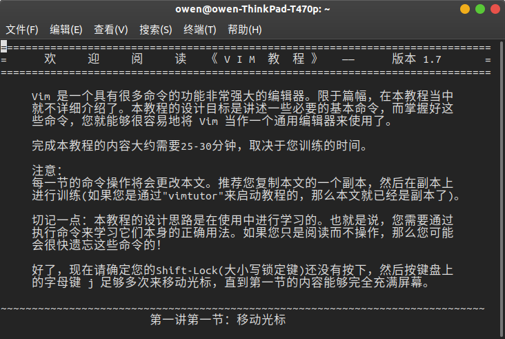

# Vim编辑器介绍

现在有很多很高级的IDE了，为什么要用vim这个旧东西？这可能是刚开始了解到这个东西的时候很多人的疑问。根据google结果--[为什么要学 vim](https://www.jianshu.com/p/cdab0f6a2e5b)，[写代码要用 Vim，因为越难入门的工具回报越大](https://36kr.com/p/5152627)，[为什么我要使用Vim](http://zhaozhiming.github.io/blog/2015/08/09/why-i-use-vi/)，可能有以下原因：

- vim是一个历史悠久的文本编辑器，熟练它之后，效率会变得很高，完全沉浸式的开发；
- vim虽然入门难，但是却非常灵活，通过vi配置可以将vim打造成任一种语言的IDE；
- vim很老，但是也说明了它的经典，掌握它就相当于几十年不用再换编辑器，这在人生中会节省不少时间；
- 有时候可能会遇到没有图形操作界面的情况，这时候想编辑文本，可能不得不用vim；
- 对号称“神之编辑器”的vim好奇；
- 装x；
- ......

个人觉得，没有什么完全是优点的工具，如果大部分时候用IDE挺好，也没必要去学习用vim，如果你只用少数语言，也不用折腾，总之没有必要的话确实不需要花时间，不过了解一点也是可以的，毕竟如果常常编程，也不太可能永远不会接触到vim。或者你要用性能好的服务器，只给你命令行访问方式，又想编辑，这时候也不得不用了。

接下来就记录一些关于vim的简单常识。首先关于概念的部分主要参考了[搭建基于 Vim 的 C++和 Python 开发环境[持续更新]](https://juejin.im/post/5cdc396af265da03576ee968)，[Vim 从入门到精通](https://github.com/wsdjeg/vim-galore-zh_cn)等。

## VIM 基本概念

Vim 是一个历史悠久的**文本编辑器**。Vim 采用**模式编辑**的理念，即它提供了多种模式，按键在不同的模式下作用不同。 你可以在**普通模式**下浏览文件，在**插入模式**下插入文本， 在**可视模式**下选择行，在**命令模式**下执行命令等等。起初这听起来可能很复杂， 但是这有一个很大的优点：不需要通过同时按住多个键来完成操作， 大多数时候你只需要依次按下这些按键即可。越常用的操作，所需要的按键数量越少。

和模式编辑紧密相连的概念是 **操作符** 和 **动作**。操作符 指的是**开始某个行为**， 例如：修改、删除或者选择文本，之后你要用一个 **动作 来指定需要操作的文本区域**。 比如，要改变括号内的文本，需要执行 ci( （读做 change inner parentheses）； 删除整个段落的内容，需要执行 dap （读做：delete around paragraph）。这些操作在vim教程中会有亲身体验的。

如果你能看见 Vim 老司机操作，你会发现他们使用 Vim 脚本语言就如同钢琴师弹钢琴一样。复杂的操作只需要几个按键就能完成。他们甚至不用刻意去想，因为这已经成为肌肉记忆了。这减少认识负荷并帮助人们专注于实际任务。

Vim 自带一个交互式的教程，内含你需要了解的最基础的信息，你可以通过终端运行以下命令打开教程：

```Shell
vimtutor
```
如果是中文版的系统，打开就是中文版的教程，如下图所示：



然后就可以愉快地按照提示开始了。不要因为这个看上去很无聊而跳过，**按照此教程多练习**。你以前用的 IDE 或者其他编辑器很少是有“模式”概念的，因此一开始你会很难适应模式切换。但是你 **Vim 使用的越多，肌肉记忆 将越容易形成**。

。。。这里留下30分钟以上来阅读并跟着做。。。

训练一遍之后回来。关于教程里的操作小总结可以参考：[Vim 入门教程](https://github.com/vim-china/hello-vim/blob/master/quick-start-guide.md)，这里也简单小结一小部分：

- 移动命令：上下左右对应kjhl，数字kjhl可以一次性多次移动，0可以到行首，$到行末，G到文初，gg到文末，w到下一个词首，e到下一个词尾，b到上一个词首；
- 操作命令：c删除并进入插入模式，d删除，y复制，p粘贴，操作二连击就是行操作 。可视模式下使用操作命令更直观，操作更精准可控。

另外，还有一些也非常好的vim的教程：[vim-adventure](http://vim-adventures.com/)，[openvim](https://www.openvim.com/)。

Vim 基于一个 vi 克隆，叫做 Stevie，支持两种运行模式："compatible" 和 "nocompatible"。在兼容模式下运行 Vim 意味着使用 vi 的默认设置，而不是 Vim 的默认设置。除非你**新建一个用户的 vimrc（vim配置文件） 或者使用 vim -N 命令启动 Vim**，否则就是在兼容模式下运行 Vim！请**不要在兼容模式下运行 Vim**。关于vim与vi的关系，可以google，这里先简单认识下，都是编辑器，vim是vi升级版。所以先只记住有vim就行了。因此下一步，首先创建自己的vimrc，这一步在前面的教程中最后一节会有涉及，这里就不再重复了。

然后终端执行vim，就可以打开了vim编辑器了。使用:

```Vim
:version
```

可以查看 vim 载入配置的优先顺序。关于vim配置的更多内容可以参考：[Vim 配置入门](http://www.ruanyifeng.com/blog/2018/09/vimrc.html)，Vim 的全局配置一般在/etc/vim/vimrc或者/etc/vimrc，对所有用户生效。用户个人的配置在~/.vimrc。关于vimrc更多内容参考接下来关于vim本身的内容。

## VIM基础

接下来这部分记录一些关于vim编辑器本身的内容。这部分可以参考：[ 笨方法学Vimscript](http://www.treelib.com/book-detail-id-47-aid-2896.html)。编程就是实现自己的idea。idea形成算法，而算法又发展为算法，并使 idea成真。而文本编辑器就是实现的工具，在和文本编辑器打交道期间，所做的事情包括：

- 将灵感记录到计算机上
- 重新考虑并修改灵感中的错误
- 用代码实现灵感
- 写文档记录某功能是如何及为什么那么实现
- 与其他人交流这个经验

Vim是一个功能相当强大的编辑器，当然，前提是你需要根据你的工作、喜好以及习惯定制 它。而Vimscript，就是一门用于定制Vim的脚本语言。另外，Vimscript其实 就是 Vim命令。比如在Vim中，保存一个文件使用命令:write（或者缩写 :w）并回车确认。Vimscript中的许多 命令都可用于日常文件编辑工作，必须勤加练习以记住那些命令才会有用， 仅仅是看过是无法运用自如的。

接下来就记录一些关于vim编辑器和vimscript的基础内容。不一一记录，而是跟着自己实际使用情况不断更新。

### 缓冲区、窗口、标签

Vim 是一个文本编辑器。每次文本都是作为**缓冲区**的一部分显示的。每一份文件都是在他们自己独有的缓冲区打开的，插件显示的内容也在它们自己的缓冲区中。

缓冲区有很多属性，比如这个缓冲区的内容是否可以修改，或者这个缓冲区是否和文件相关联，是否需要同步保存到磁盘上。

**窗口** 是缓冲区上一层的视窗。如果你想同时查看几个文件或者查看同一文件的不同位置，那样你会需要窗口。窗口可以水平或者竖直分割并且现有窗口的高度和宽度都是可以被调节设置的，因此，如果你需要多种窗口布局，请考虑使用标签。

**标签页** （标签）是窗口的集合。因此当你想使用多种窗口布局时候请使用标签。

如果你启动 Vim 的时候没有附带任何参数，你会得到**一个包含着一个呈现一个缓冲区的窗口的标签**（这句话有点绕，即**有一个窗口，它呈现一个缓冲区，这个窗口被一个标签包含**）。

### 已激活、已载入、已列出、已命名的缓冲区

用类似一下命令的形式可以启动vim：

```Shell
vim <file1>
```

这时候这个文件的内容将会被加载到缓冲区中，那么就有了一个**已载入的缓冲区**。如果在vim中保存这个文件，缓冲区内容会被同步到磁盘中。

由于这个缓冲区也在一个窗口上显示，所以他也是一个**已激活的缓冲区**。如果你现在通过 :e file2 命令加载另一个文件，file1 将会变成一个**隐藏的缓冲区**，并且 file2 变成**已激活缓冲区**。

通过使用 :ls 我们能够列出所有可以列出的缓冲区。

未命名的缓冲区是一种没有关联特定文件的缓冲区，这种缓冲区经常被插件使用。比如 :enew 将会创建一个无名临时缓冲区。添加一些文本然后使用 :w /tmp/foo 将他写入到磁盘，这样这个缓冲区就会变成一个已命名的缓冲区。

### 参数列表

**全局缓冲区列表**是 Vim 的特性。在这之前的 vi 中，仅仅只有参数列表，参数列表在 Vim 中依旧可以使用。

**每一个通过 shell 命令传递给 Vim 的文件名都被记录在一个参数列表中**。可以有多个参数列表：默认情况下所有参数都被放在全局参数列表下，但是你可以使用 :arglocal 命令去创建一个新的本地窗口的参数列表。对这部分理解可以参考：[VIM学习笔记 参数(Arguments)](https://zhuanlan.zhihu.com/p/39957182)

比如：

```Shell
vim file1.txt file2.txt file3.txt
```

在启动vim时，可以**指定多个文件做为参数**，例如以下操作系统命令将打开多个文件，并显示第一个文件，参数列表中的**所有文件名，都会同时存在于缓冲区列表**之中；但**并不是所有缓冲区列表中的文件名，也都会出现在参数列表之中**。例如，在启动vim之后，我们使用以下命令打开并编辑文件4：

```Vim
:e file4.txt
```

### 寄存器

寄存器就是**存储文本的地方**。我们常用的**「复制」操作就是把文本存储到寄存器**，「 粘贴」 操作就是把文本从寄存器中读出来。顺便，在 Vim 中复制的快捷键是 y，粘贴的快捷键是 p。

### 范围

范围 (Ranges) 其实很好理解，但很多 Vim 用户的理解不到位。

- 很多命令都可以加一个数字，用于指明操作范围
- 范围可以是一个行号，用于指定某一行
- 范围也可以是一对通过 , 或 ; 分割的行号
- 大部分命令，默认只作用于当前行
- 只有 :write 和 :global 是默认作用于所有行的

## Vim + C

其实我本身更需要 Vim + Python，不过从教程上看，这个教程[所需即所获：像 IDE 一样使用 vim](https://github.com/yangyangwithgnu/use_vim_as_ide)更适合上手，另外也不是完全用不到C和C++，所以先用这个学习了。

## Vim+ Python

前面说到了vim内容很多，不可能一下子学会，所以目标驱动是比较好的了解方式，因为最近是用python了，所以就以将vim打造成python ide作为目标来学习记录，这部分主要参考了：[Vim与Python真乃天作之合：打造强大的Python开发环境](https://segmentfault.com/a/1190000003962806)等。

### 安装

首先，输入下列命令检查自己的vim是否符合要求：

```Shell
$ vim --version
VIM - Vi IMproved 8.0 (2016 Sep 12, compiled Jun 06 2019 17:31:41)
包含补丁: 1-1453
修改者 pkg-vim-maintainers@lists.alioth.debian.org
编译者 pkg-vim-maintainers@lists.alioth.debian.org
巨型版本 无图形界面。  可使用(+)与不可使用(-)的功能:
+acl               +farsi             +mouse_sgr         -tag_any_white
+arabic            +file_in_path      -mouse_sysmouse    -tcl
+autocmd           +find_in_path      +mouse_urxvt       +termguicolors
-autoservername    +float             +mouse_xterm       +terminal
-balloon_eval      +folding           +multi_byte        +terminfo
+balloon_eval_term -footer            +multi_lang        +termresponse
-browse            +fork()            -mzscheme          +textobjects
++builtin_terms    +gettext           +netbeans_intg     +timers
+byte_offset       -hangul_input      +num64             +title
+channel           +iconv             +packages          -toolbar
+cindent           +insert_expand     +path_extra        +user_commands
-clientserver      +job               -perl              +vertsplit
-clipboard         +jumplist          +persistent_undo   +virtualedit
+cmdline_compl     +keymap            +postscript        +visual
+cmdline_hist      +lambda            +printer           +visualextra
+cmdline_info      +langmap           +profile           +viminfo
+comments          +libcall           -python            +vreplace
+conceal           +linebreak         +python3           +wildignore
+cryptv            +lispindent        +quickfix          +wildmenu
+cscope            +listcmds          +reltime           +windows
+cursorbind        +localmap          +rightleft         +writebackup
+cursorshape       -lua               -ruby              -X11
+dialog_con        +menu              +scrollbind        -xfontset
+diff              +mksession         +signs             -xim
+digraphs          +modify_fname      +smartindent       -xpm
-dnd               +mouse             +startuptime       -xsmp
-ebcdic            -mouseshape        +statusline        -xterm_clipboard
+emacs_tags        +mouse_dec         -sun_workshop      -xterm_save
+eval              +mouse_gpm         +syntax            
+ex_extra          -mouse_jsbterm     +tag_binary        
+extra_search      +mouse_netterm     +tag_old_static    
     系统 vimrc 文件: "$VIM/vimrc"
     用户 vimrc 文件: "$HOME/.vimrc"
 第二用户 vimrc 文件: "~/.vim/vimrc"
      用户 exrc 文件: "$HOME/.exrc"
       defaults file: "$VIMRUNTIME/defaults.vim"
         $VIM 预设值: "/usr/share/vim"
编译方式: gcc -c -I. -Iproto -DHAVE_CONFIG_H   -Wdate-time  -g -O2 -fdebug-prefix-map=/build/vim-8l5tlu/vim-8.0.1453=. -fstack-protector-strong -Wformat -Werror=format-security -U_FORTIFY_SOURCE -D_FORTIFY_SOURCE=1       
链接方式: gcc   -Wl,-Bsymbolic-functions -Wl,-z,relro -Wl,-z,now -Wl,--as-needed -o vim        -lm -ltinfo -lnsl  -lselinux  -lacl -lattr -lgpm -ldl     -L/usr/lib/python3.6/config-3.6m-x86_64-linux-gnu -lpython3.6m -lpthread -ldl -lutil -lm  
```

1. Vim编辑版本应该大于7.3。
2. 支持Python语言。在所选编辑器的功能中，确保你看到了+python。

如果满足上述要求，接下来可以安装Vim扩展了（稍后有记录）如果不满足，则需要[安装/升级](http://www.vim.org/download.php)。Debian或Ubuntu系统，可以使用下面的代码安装：

```Shell
sudo apt-get remove vim-tiny
apt-get update
apt-get install vim
```

从上面结果可以看到，我的结果里python3是可用的。可以在编辑器中运行

```Vim
$ :python3 import sys; print(sys.version)
3.6.9 (default, Nov  7 2019, 10:44:02) 
[GCC 8.3.0]
```

这行命令会输出你的编辑器当前的Python版本。如果报错，那么你的编辑器就不支持Python语言，需要重装或重新编译。

Vim编辑器安装完成后，我们来看看如何将其设置为Python开发的强大环境。

### Vim扩展

Vim本身能够满足开发人员的很多需求，但是它的可扩展性也极强，并且已经有一些杀手级的扩展，可以让Vim拥有“现代”集成开发环境的特性。所以，你所需要的第一件东西就是一个好用的**扩展管理器**。Vim的扩展通常也被成为bundle或插件。

Vim有多个扩展管理器，但是我们强烈推荐Vundle。你可以把它想象成Vim的pip。有了Vundle，安装和更新包这种事情不费吹灰之力。

我们现在来安装Vundle，打开终端，然后执行下列命令：

```Shell
git clone https://github.com/gmarik/Vundle.vim.git ~/.vim/bundle/Vundle.vim
```
该命令将下载Vundle插件管理器，并将它放置在你的Vim编辑器bundles文件夹中。现在，你可以**通过.vimrc配置文件来管理所有扩展**了。

将配置文件添加到你的用户的home文件夹中：

```Shell
touch ~/.vimrc
```

现在在.vimrc文件中设置Vundle，将下列内容添加到文件开头：

```VimL Script
set nocompatible              " required
filetype off                  " required

" set the runtime path to include Vundle and initialize
set rtp+=~/.vim/bundle/Vundle.vim
call vundle#begin()

" alternatively, pass a path where Vundle should install plugins
"call vundle#begin('~/some/path/here')

" let Vundle manage Vundle, required
Plugin 'gmarik/Vundle.vim'

" add all your plugins here (note older versions of Vundle
" used Bundle instead of Plugin)

" ...

" All of your Plugins must be added before the following line
call vundle#end()            " required
filetype plugin indent on    " required
```

这样，你就完成了使用Vundle前的设置。之后，你就可以在配置文件中添加希望安装的插件，然后打开Vim编辑器，运行下面的命令：

```VIm
:PluginInstall
```

这个命令告诉Vundle施展它的魔法——自动下载所有的插件，并为你进行安装和更新。

### 开始打造IDE

这里不可能列举Vim的全部功能，只能按需不断更新介绍一些Vim自带的强大功能，它们对于Python开发来说是非常有用的。

或许，Vim编辑器最重要的功能就是它不要求使用鼠标（除了GUI版本外）。一开始，你可能会觉得这是个非常糟糕的做法，但是只要你投入时间——是的，这很花时间——学习快捷组合键，就可以大幅提升工作流的速度。

#### 分割布局（Split Layouts）

使用 :sv <filename> 命令打开一个文件，你可以纵向分割布局（新文件会在当前文件下方界面打开），使用相反的命令:vs <filename>， 你可以得到横向分割布局（新文件会在当前文件右侧界面打开）。

你还可以嵌套分割布局，所以你可以在分割布局内容再进行分割，纵向或横向都可以，直到你满意为止。众所周知，我们开发时经常需要同时查看多个文件。
    
专业贴士：记得在输入完:sv后，利用tab补全功能，快速查找文件。
    
现在先到这，后面再持续补充。