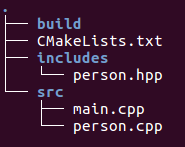
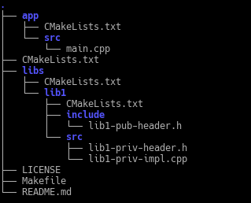

# CMake简介

C或C++程序的编译运行似乎总是让人觉得比较麻烦一些，这里就借了解CMake的机会，记录下这方面的基本知识。

## C++静态库与动态库

首先有必要了解一下库的意思。这部分主要参考：[C++静态库与动态库](https://www.runoob.com/w3cnote/cpp-static-library-and-dynamic-library.html)。

### 什么是库

库是写好的现有的，成熟的，可以复用的代码。现实中**每个程序都要依赖很多基础的底层库**，不可能每个人的代码都从零开始，因此库的存在意义非同寻常。

本质上来说库是一种**可执行代码的二进制形式**，可以被操作系统载入内存执行。库有两种：**静态库（.a、.lib）和动态库（.so、.dll）**。

所谓静态、动态是指链接。

一个程序编译成可执行程序的步骤：


### 静态库

之所以成为【静态库】，是因为在**链接阶段**，**会将汇编生成的目标文件.o与引用到的库一起链接打包到可执行文件中**。因此对应的链接方式称为静态链接。

静态库与汇编生成的目标文件一起链接为可执行文件，那么**静态库必定跟.o文件格式相似**。其实一个静态库可以简单看成是**一组目标文件（.o/.obj文件）的集合**，即很多目标文件经过压缩打包后形成的一个文件。

静态库特点:

-  静态库对函数库的**链接是放在编译时期完成**的。
-  程序在运行时与函数库再无瓜葛，**移植方便**。
-  **浪费空间和资源**，因为所有相关的目标文件与牵涉到的函数库被链接合成一个可执行文件。

Linux下使用**ar工具**、Windows下**vs使用lib.exe**，将目标文件压缩到一起，并且对其进行编号和索引，以便于查找和检索。一般**创建静态库的步骤**如图所示：


这里暂时只以linux下创建与使用静态库为例，实例参考了：[linux下C++静态链接库和动态链接库的具体创建和使用](https://github.com/wanghui1966/TestCppLib)：

文件下载到TestCppLib文件夹下，在此文件夹下进入控制台，先执行以下代码把之前做好的文件先删除：

``` bash
rm -f wind.o
rm -f libwind.a
```

然后开始制作静态库。首先，将代码文件编译成目标文件.o（StaticMath.o）：

``` bash
g++ -c wind.cpp -o wind.o
```

然后，通过ar工具将目标文件打包成.a静态库文件。Linux静态库**命名规范**，**必须**是"lib[your_library_name].a"：lib为前缀，中间是静态库名，扩展名为.a。注意带参数-c，否则直接编译为可执行文件。

```bash
ar -crv libwind.a wind.o
```

生成静态库 libwind.a。

大一点的项目会编写makefile文件（CMake等等工程管理工具）来生成静态库，输入多个命令太麻烦了。这个也是后面要记录的。接下来先使用下静态库。

Linux下使用静态库，只需要在**编译的时候**，**指定静态库的搜索路径**（-L选项）、**指定静态库名**（不需要lib前缀和.a后缀，-l选项）。

``` bash
g++ test.cpp -o test -static -L. -lwind
./test 
```

注意：

-  -L：表示要连接的库所在目录，因为这里在同一个文件夹下，所以就不必写相对路径了；
-  -l：指定链接时需要的动态库，编译器查找动态连接库时有隐含的命名规则，即在给出的名字前面加上lib，后面加上.a或.so来确定库的名称。

以上过程的代码都在TestCppLib文件夹下的脚本：test_static_lib.sh中有汇总。

### 动态库

静态库容易使用和理解，也达到了代码复用的目的，那为什么还需要动态库呢？因为空间浪费是静态库的一个问题。


另一个问题是静态库对程序的更新、部署和发布页会带来麻烦。如果静态库liba.lib更新了，所以**使用它的应用程序都需要重新编译、发布给用户**（对于玩家来说，可能是一个很小的改动，却导致整个程序重新下载，全量更新）。

动态库在程序编译时并不会被连接到目标代码中，而是**在程序运行时才被载入**。不同的应用程序如果调用相同的库，那么**在内存里只需要有一份该共享库的实例**，规避了空间浪费问题。动态库在程序运行是才被载入，也解决了静态库对程序的更新、部署和发布页会带来麻烦。用户只需要更新动态库即可，**增量更新**。

动态库特点总结：

-  动态库把对一些库函数的链接载入推迟到程序运行的时期。
-  可以实现进程之间的资源共享。（因此动态库也称为共享库）
-  将一些程序升级变得简单。
-  甚至可以真正做到链接载入完全由程序员在程序代码中控制（显示调用）。

Window与Linux执行文件格式不同，在创建动态库的时候有一些差异。

-  在Windows系统下的执行文件格式是PE格式，动态库需要一个DllMain函数做出初始化的入口，通常在导出函数的声明时需要有_declspec(dllexport)关键字。
-  Linux下gcc编译的执行文件默认是ELF格式，不需要初始化入口，亦不需要函数做特别的声明，编写比较方便。

这里还是以linux下的操作为例子，参考资料同上。

先删除之前的文件，然后开始创建库：

``` bash
rm -f wind.o
rm -f libwind.a
rm -f libwind.so
rm -f test
```

与创建静态库不同的是，不需要打包工具（ar、lib.exe），直接使用编译器即可创建动态库。

``` bash
g++ -shared -fpic -o libwind.so wind.cpp
```

上述代码也可以分成两步骤：

首先，生成目标文件，此时要加编译器选项-fpic，fPIC 创建与地址无关的编译程序（pic，position independent code），是为了能够在多个应用程序间共享；

然后，生成动态库，此时要加链接器选项-shared。

``` bash
g++ -fPIC -c wind.cpp
g++ -shared -o libwind.so wind.o
```

接下来就是使用动态库：

先引用动态库编译成可执行文件（跟静态库方式一样）：

```bash
g++ test.cpp -o test -L. -lwind
```

然后注意直接运行可能是会报错的，因为是运行时才加载动态库，所以程序需要知道动态库的位置，能够定位到共享库文件。此时就需要系统动态载入器(dynamic linker/loader)。对于elf格式的可执行程序，是由ld-linux.so* 来完成的，它先后搜索elf文件的 ：

- DT_RPATH段；
- 环境变量LD_LIBRARY_PATH；
- /etc/ld.so.cache文件列表；
- /lib/,/usr/lib 目录；

找到库文件后将其载入内存。

如何让系统能够找到它：

-  如果安装在/lib或者/usr/lib下，那么ld默认能够找到，无需其他操作。
-  如果安装在其他目录，需要将其添加到/etc/ld.so.cache文件中，步骤如下：
    -  编辑/etc/ld.so.conf文件，加入库文件所在目录的路径
    -  运行ldconfig ，该命令会重建/etc/ld.so.cache文件
- 或者配置环境变量LD_LIBRARY_PATH

``` bash
$ export LD_LIBRARY_PATH=.:$LD_LIBRARY_PATH
$ ./test
$ 会有运行结果
``` 

动态库还可以显式调用。上面介绍的动态库使用方法和静态库类似属于隐式调用，编译的时候**指定相应的库和查找路径**。C语言动态库比较容易：

在Linux下显式调用动态库：#include <dlfcn.h>，提供了下面几个接口：

-  void * dlopen( const char * pathname, int mode )：函数以指定模式打开指定的动态连接库文件，并返回一个句柄给调用进程。
-  void* dlsym(void* handle,const char* symbol)：dlsym根据动态链接库操作句柄(pHandle)与符号(symbol)，返回符号对应的地址。使用这个函数不但可以获取函数地址，也可以获取变量地址。
-  int dlclose (void *handle)：dlclose用于关闭指定句柄的动态链接库，只有当此动态链接库的使用计数为0时,才会真正被系统卸载。
-  const char *dlerror(void)：当动态链接库操作函数执行失败时，dlerror可以返回出错信息，返回值为NULL时表示操作函数执行成功。

对C++来说，情况稍微复杂。显式加载一个C++动态库的困难一部分是因为C++的name mangling；另一部分是因为没有提供一个合适的API来装载类，在C++中，您可能要用到库中的一个类，而这需要创建该类的一个实例，这不容易做到。

name mangling可以通过extern "C"解决。C++有个特定的关键字用来声明采用C binding的函数：extern "C" 。用extern "C"声明的函数将使用函数名作符号名，就像C函数一样。因此，只有非成员函数才能被声明为extern "C"，并且不能被重载。尽管限制多多，extern "C"函数还是非常有用，因为它们可以象C函数一样被dlopen动态加载。冠以extern "C"限定符后，并不意味着函数中无法使用C++代码了，相反，它仍然是一个完全的C++函数，可以使用任何C++特性和各种类型的参数。

"显式"使用C++动态库中的Class是非常繁琐和危险的事情，因此能用"隐式"就不要用"显式"，能静态就不要用动态。方法可以参考本文参考的原文。

## CMake

首先要搞清楚几个概念：[make makefile cmake qmake都是什么，有什么区别？](https://www.zhihu.com/question/27455963)

根据这个[post](https://www.zhihu.com/question/27455963/answer/89770919)：

- gcc是GNU Compiler Collection（就是GNU编译器套件），也可以简单认为是编译器，它可以编译很多种编程语言（括C、C++、Objective-C、Fortran、Java等等）。
- 当你的程序只有一个源文件时，直接就可以用gcc命令编译它。
- 但是当你的程序包含很多个源文件时，用gcc命令逐个去编译时，你就很容易混乱而且工作量大。
- 所以出现了make工具。make工具可以看成是一个智能的**批处理工具**，它本身并没有编译和链接的功能，而是用类似于批处理的方式—**通过调用makefile文件中用户指定的命令来进行编译和链接**的。
- makefile是什么？简单的说就**像一首歌的乐谱**，**make工具就像指挥家**，指挥家根据乐谱指挥整个乐团怎么样演奏，**make工具就根据makefile中的命令进行编译和链接的**。
- makefile命令中就包含了**调用gcc（也可以是别的编译器）去编译某个源文件的命令**。
- makefile在一些简单的工程完全可以人工手下，但是当工程非常大的时候，**手写makefile也是非常麻烦的**，如果换了个平台makefile又要重新修改。
- 这时候就出现了Cmake这个工具，cmake就可以**更加简单的生成makefile文件给上面那个make用**。当然cmake还有其他功能，就是可以**跨平台生成对应平台能用的makefile**，你不用再自己去修改了。
- 可是**cmake根据什么生成makefile**呢？它又要根据一个叫**CMakeLists.txt文件（学名：组态档）** 去生成makefile。
- 到最后CMakeLists.txt文件谁写啊？是自己手写的。
- 如果用IDE，类似VS这些一般它都能帮你弄好了。

### Introduction to CMake for C++

参考[Introduction to CMake for C++](https://medium.com/@varago.rafael/introduction-to-cmake-for-cpp-4c464272a239)，[How to Use Modern CMake for an App + Lib Project](https://code.egym.de/how-to-use-modern-cmake-for-an-app-lib-project-3c2ee6018cde)，了解CMake基本内容。

首先是一些关于CMake的基本概念：

C++有很多build system，CMake是一个最常用的跨平台的自动化软件项目构建的工具。

Make解析包含构建项目源码和各类库的命令的makefile文件来构建项目。CMake就是解析CMakeLists.txt文件，然后生成其他配置文件，再来用于构建项目。中间这一步也是跨平台的关键。使得CMake非常强大，这平台（native build system）有Make，有Visual Studio等。

CMakeLists.txt文件生成的configuration又称为native configuration file，生成它的东西叫generator。CMake有很多种generators。使用CMake可以简化构建过程，简单构建来自不同文件夹的不同文件类型的文件。

现在的CMake鼓励以module来思考构建。比如有一个可执行app（一个module），它依赖一个库lib1（另一个module），并且把lib1的接口和实现分开。

CMake中每个module都有target，有一系列属性，比如complier定义，sources，headers，libraries等。

target是这样创建的：利用add_executable或add_library，对于target的属性，可以通过这种方式修改：target_include_directories，target_compile_definitions等。

接下来就是一个简单的例子，项目名称rvarago-hello-cmake。

例子使用的是比较经典的文件结构：



build文件夹内开始是空的，后面会包含生成的makefile文件，构建之后的可执行文件等。CMake生成的东西可以都放在这个文件夹里，这样也方便清理。

includes文件夹里是接口头文件。

src中是源码。

因为文件比较少，所以可以在rvarago-hello-cmake文件夹下打开命令行，执行一下代码来构建项目，但是我们不这么做，因为要用CMake：

``` bash
g++ -o build/hello src/person.cpp src/main.cpp -I./includes -std=c++14
```

首先换到build文件夹，调用cmake工具以提供路径给CMakeLists.txt

如果没有安装cmake，那么需要先安装：

```bash
sudo apt  install cmake
```

安装完成后，build文件夹下执行：

```bash
cmake ..
```

然后可以发现build文件夹下已经生成了很多文件，包括Makefile。继续在该文件夹下执行：

```bash
make
```

然后可以看到build文件夹下已经有hello可执行文件了。运行可以看到结果：

``` bash
 ./hello
```

输出：Rafael Varago says hello to you!

modern cmake可以参考:[modern-cmake-template](https://github.com/rvarago/modern-cmake-template)

project结构如图：



### How to Build a CMake-Based Project

这部分参考：[How to Build a CMake-Based Project](https://preshing.com/20170511/how-to-build-a-cmake-based-project/)

前面介绍了CMake的基本概念，这里看看到底怎么样build一个CMake的项目。

先了解一些基本概念：

#### The Source and Binary Folders

CMake生成build pipelines，一个build pipeline可以是一个VS的.sln文件，也可以是linux下的makefile，或者Xcode的.xcodeproj等，有多种形式。

为了生成build pipelines，CMake需要知道source和binary文件夹。source文件夹包含CMakeLists.txt。binary文件夹是CMake生成build pipelines的地方。通常的做法是source文件夹下构建一文件夹build。具体形式如下图所示（图是mac下的，在linux下build pipeline一般是makefile）。


可以看到和前面给的小例子是一致的。一般构建结果都在build内，这样直接删除就能将build的内容清理掉。

也可以创建几个binary文件夹，使用不同的build systems或配置。

cache是一个重要概念。它是一个单独的txt文件CMakeCache.txt，这是cache变量存储的地方。cache变量包括项目定义的用户配置项，以及加速CMake运行的预计算信息。

一般生成的build pipeline不放到版本控制里，因为有一些硬编码的内容。从github等下载下来的项目重新build即可。

#### The Configure and Generate Steps

有几种方法来允许CMake。不论怎么运行它，主要是两步：

1. the configure step
2. the generate step.


在configure步骤中，执行CMakeLists.txt脚本。该脚本负责定义targets。每个target代表一个executable或library或其他build pipeline的输出。

configure步骤执行成功，即CMakeLists.txt运行无错误的话，CMake会使用脚本定义的targets生成一个build pipeline。生成的build pipeline的类型依赖于使用的generator的类型，即在makefile和vs条件下是不同的。

此外还有一些其他的内容在configure步骤中，比如Generates a header file到binary文件夹中以被C++代码included等。

另外，在一些复杂项目中，还有注入测试系统函数可用性或定义特殊的“install”target等。

如果在相同的binary文件夹中re-run CMake，因为有cache，所以会省略掉很多步骤。

#### Running CMake from the Command Line

一般步骤都是创建一个binary文件夹，即build文件夹，然后进入该文件夹，命令行运行cmake（注意有个..，这是指定source文件夹路径，因为一般都是把build当做source文件夹子文件夹，所以返回上一层就是source文件夹路径）。指定generator可以使用-G选项，不用-G的话，cmake会自动选择一个。比如：

``` bash
mkdir build
cd build
cmake -G "Visual Studio 15 2017" ..
```

如果有一些其他的配置项，也可以在命令行中执行。比如DEMO_ENABLE_MULTISAMPLE that defaults to 0，这里设置为1：

``` bash
cmake -G "Visual Studio 15 2017" -DDEMO_ENABLE_MULTISAMPLE=1 ..
```

可以通过运行 cmake -L -N .  （注意有个 . ）来查看项目定义的cache变量。

#### Building with Unix Makefiles

CMake默认是生成一个Unix makefile。当生成一个makefile时，应该定义CMAKE_BUILD_TYPE变量，比如

``` bash
cmake -G "Unix Makefiles" -DCMAKE_BUILD_TYPE=Debug ..
``` 

这是因为CMake生成的makefiles是single-configuration的。即不能像VS那样用相同的makefile build多个configurations，比如Debug和Release。一个makefile文件只能build一个 build类型。默认可用的类型有：Debug, MinSizeRel, RelWithDebInfo 和 Release。

如果不定义CMAKE_BUILD_TYPE，那么可能得到的是不可用的，还得rerun。

makefile有了之后，就可以通过运行make来build项目了。默认的make会build由CMakeLists.txt定义的每一个target。也可以在make中指定特定的target。

cmake的例子可以参考github项目[learning-cmake](https://github.com/Akagi201/learning-cmake)。

## 实践

如何使用第三方库：

很多安装的软件，在代码编译运行的时候都会报错，比如include的文件找不到，链接库找不到等等。
这是因为如果编译软件使用了外部库，事先并不知道它的头文件和链接库的位置。
得在编译命令中加上包含它们的查找路径。CMake中 . 可以使用 find_package 命令来解决这个问题，也可以借用第三方的pkg-config来解决。

find_package：可以通过命令 cmake --help-module-list 得到你的CMake支持的模块的列表。如果不在支持的列表中，则需要自己定义 Find<name>模块，将其放入工程的某个目录中，通过 SET(CMAKE_MODULE_PATH dir)设置查找路径，供工程FIND_PACKAGE使用。

pkg-config：以netcdf为例。netcdf安装后，在其lib文件夹下有pkgconfig.
首先需要在环境变量中配置PkgConfig的路径。比如这里netcdf的安装路径是/usr/local。
对于Ubuntu系统，可以用root权限打开/etc/profile文件，然后输入以下代码：

```bash
PKG_CONFIG_PATH=$PKG_CONFIG_PATH:/usr/local/lib/pkgconfig
export PKG_CONFIG_PATH
```

然后在CMakeLists.txt中写入以下语句，注意顺序很重要。

```bash
find_package(PkgConfig REQUIRED)
# 需要在环境变量中配置好.pc文件的路径
pkg_check_modules(NETCDF REQUIRED netcdf)
pkg_search_module(NETCDF REQUIRED netcdf)

add_executable(LearnC simple_nc4_rd.c)

# add_executable要在link、include等之前，否则会报错
# 把对应的库文件加载进来
target_link_libraries(LearnC ${NETCDF_LIBRARIES})
# 把头文件包含进来
target_include_directories(LearnC PUBLIC ${NETCDF_INCLUDE_DIRS})
target_compile_options(LearnC PUBLIC ${NETCDF_CFLAGS_OTHER})
```

如果还报错，有库没加进来，可以手动添加绝对路径，比如报错：
error while loading shared libraries: libnetcdf.so.15: cannot open shared object file
则可以添加：
target_link_libraries(LearnC /usr/local/lib/libnetcdf.so.15)