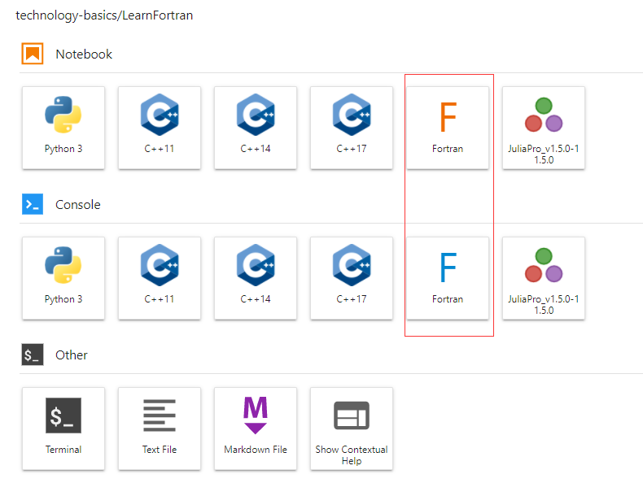

# 简单认识 Fortran

很多科学计算的代码仍然是 Fortran编写的，所以有必要了解一下，目前个人做到能看懂代码即可。

最简单的方式还是想在jupyter中使用 Fortran ，有不同的方式来实现：

- https://t-redactyl.io/blog/2020/01/using-jupyter-to-learn-fortran.html
- https://github.com/sourceryinstitute/jupyter-CAF-kernel
- https://github.com/mgaitan/fortran_magic

这里暂时采用第一种了，如果后面需要更多的 Fortran 计算，可以试试 docker 等。

第一步，windows下打开 Ubuntu 终端，然后安装gfortran编译工具：https://blog.csdn.net/yangle4695/article/details/51533770

```Shell
sudo apt-get update
sudo apt-get install gfortran
```

更多Fortran相关东西可以参考：[Fortran 2018 Examples](https://github.com/scivision/fortran2018-examples)

然后输入：

```Shell
gfortran -v
```

看是否安装成功。

第二步，进入当前conda环境：

```Shell
# 我的环境是/mnt/d/Code/elks/envs
conda activate /mnt/d/Code/elks/envs
```

然后执行下面的安装语句：

```Shell
# 我安装到/mnt/d/Code这个文件夹下
cd /mnt/d/Code
git clone https://github.com/brendan-rius/jupyter-c-kernel.git
pip install -e jupyter-fortran-kernel
cd jupyter-fortran-kernel
# 检查下是否安装了新的kernel
jupyter kernelspec install --user fortran_spec/
# 然后回到elks项目文件夹，打开jupyter
cd /mnt/d/Code/elks
jupyter lab
```

应该可以看到已经有 Fortran 的 kernel 了：



