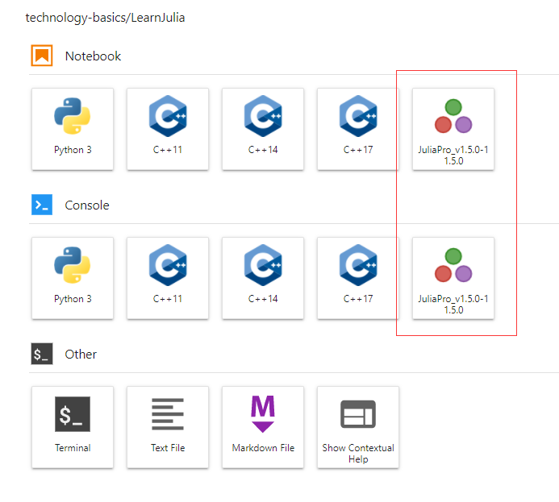

# Julia入门了解及下载安装

Julia是计算科学方面很好用的比较新的编程语言，我是因为看到机器学习和微分方程的结合在Julia中有比较好的现成的代码，可能和我做的东西有些联系，加上同学也在做相关的研究，觉得可以了解下。

参考资料：

- [Julia中文文档](https://cn.julialang.org/JuliaZH.jl/latest/)
- [ubuntu 安装 Julia下载环境变量使用](https://cloud.tencent.com/developer/article/1344002)
- [How to Add Julia to Jupyter Notebook](https://datatofish.com/add-julia-to-jupyter/)
- [一个简单的Julia教程（一）](https://zhuanlan.zhihu.com/p/41802723)
- [DiffEqFlux.jl – A Julia Library for Neural Differential Equations](https://julialang.org/blog/2019/01/fluxdiffeq/)

按照中文文档的推荐，首先查看：[Julia 1.0 正式发布 (Simplified Chinese)](https://julialang.org/blog/2018/08/one-point-zero-zh_cn/)，对语言有一个宏观的认识。下面两段话能够基本说明Julia的由来。

“Julia项目起初是因为这些强烈的需求而公开发起的开源项目：我们想要的是一个自由开源的语言，并且它同时拥有C的速度和Ruby的动态性；我们想要一个具有同像性（可以将语言的脚本本身当作数据进行处理）的语言， 它有着真正的和lisp一样的宏，但是却像Matlab一样有着显然的，类似于数学表达式的标记；我们想要一个既可以像Python一样作为通用编程语言的工具， 又可以像R那样适用于统计分析，能像Perl那样自然地处理字符串，能像Matlab那样给力地处理矩阵运算，它还要能像shell一样作为胶水将各种程序粘合在一起；我们想要一个简单易学的语言，同时它还能让最苛刻的魔法师们（hackers）开心。我们希望它是交互式的，但我们也希望它能被编译。”

“超过700人为Julia做出了自己的贡献，更多人创造了成千上万开源的Julia包。总而言之，我们创造了这样一种语言：
- 快速：Julia一开始就是为高性能而设计的。Julia可以通过LLVM而跨平台被编译成高效的本地代码。
- 通用：Julia使用多分派作为编程范式，使其更容易表达面向对象和函数式编程范式。标准库提供了异步I/O，进程控制，日志记录，性能分析，包管理器等等。
- 动态：Julia是动态类型的，与脚本语言类似，并且对交互式使用具有很好的支持。
- 数值计算：Julia擅长于数值计算，它的语法适用于数学计算，支持多种数值类型，并且支持并行计算。Julia的多分派自然适合于定义数值和类数组的数据类型。
- 可选的类型标注：Julia拥有丰富的数据类型描述，类型声明可以使得程序更加可读和健壮。
- 可组合：Julia的包可以很自然的组合运行。单位数量的矩阵或数据表一列中的货币和颜色可以一起组合使用并且拥有良好的性能。”

然后阅读：[Julia 语言入门指引](https://discourse.juliacn.com/t/topic/159)，做个入门。

新手第一步，下载安装。julia是跨平台语言，win, mac, linux都可以。

## Windows10下安装

主要参考：https://computationalthinking.mit.edu/Fall20/installation/

第一步，直接去官网下载，点击安装，默认路径即可；

然后打开Julia REPL（即刚安装好的Julia，菜单栏可看到），为了确保自己安装好了，输入1+1 试试看；

然后安装Pluto，在Julia窗口下输入]，从Julia mode进入Pkg mode，然后输入 add Pluto，这需要等待一段时间；

```Julia
]
add Pluto
```

这样就安装好了，可以关闭终端了，也可以直接按“Backspace”键回到Julia mode。

接下来就可以打开Pluto看看了，打开Julia REPL。

```Julia
using Pluto
Pluto.run()
```

这时候，默认的浏览器是chrome或者firefox，就能看到浏览器自动打开，进入Pluto.jl的欢迎页面。

可以打开界面上给的样例，不过这里暂时以参考的课程为主，在下面的box里面输入：https://github.com/mitmath/18S191/blob/master/homework/homework0/hw0.jl

然后打开即可看到一个julia notebook file的界面。

现在可以将这个file保存到自己本地，比如我新建一个文件夹：C:\Users\11445\Documents\JuliaNotebook\MIT18S191 ，复制地址到notebook上方的box里面，再输入文件名，选择“Choose”键即可。可以看到提示要不要从默认存储的文件夹（C:\Users\11445\.julia\pluto_notebooks）移动到指定的文件夹，选择确认即可。

然后就可以在文件夹中看到自己的文件了。

可以将Julia配置到环境变量下，这样可以在终端下打开了，推荐使用Windows现代终端：https://aka.ms/terminal

环境变量配置如下：

1. 按 Windows Key + R, 输入 rundll32 sysdm.cpl,EditEnvironmentVariables ，确定即可看到环境变量；
2. "用户变量" （或者 "系统变量" ）下, 找的 "Path" ，编辑；
3. 新建一个path变量，把Julia位置粘贴进去，比如我的是C:\Users\11445\AppData\Local\Programs\Julia 1.5.3\bin.

确定后即可在终端使用Julia了。

## Ubuntu18.04下安装

Julia有类似于Python下的anaconda的平台，直接使用这个即可：[juliapro](https://juliacomputing.com/products/juliapro.html)，使用这个要查看juliapro网页里给的文档。然后下载安装包（我下的时候版本是JuliaPro-1.5.0-1_build-113.sh file），进入网页的时候首先需要注册一下，按照要求做即可，下载之后，放到自己想要安装的文件夹下。

接下来，给权限：

```Shell
chmod 777 JuliaPro-1.5.0-1_build-113.sh
chmod 777 /mnt/d/Code
mkdir julia
chmod 777 /mnt/d/Code/julia
```

接下来命令安装的时候，需要指定安装的文件夹，这里我安装在 /mnt/d/Code 文件夹下，所以执行：

```Shell
./JuliaPro-1.5.0-1_build-113.sh /mnt/d/Code/julia/
```

需要一些安装时间，耐心等待，注意要保持网络连接。

接下来先试试julia是否安装成功。需要配置环境变量：

```Shell
export PATH=/mnt/d/Code/julia/JuliaPro-1.5.0-1/Julia/bin:$PATH
```

然后从命令行运行 julia 就可以启动了：

```Shell
julia

   _       _ _(_)_     |  Documentation: https://docs.julialang.org
  (_)     | (_) (_)    |
   _ _   _| |_  __ _   |  Type "?" for help, "]?" for Pkg help.
  | | | | | | |/ _` |  |
  | | |_| | | | (_| |  |  Version 1.5.0 (2020-08-01)
 _/ |\__'_|_|_|\__'_|  |  Official https://julialang.org/ release
|__/                   |
```

接下来安装jupyterlab的julia插件，首先在刚打开的julia环境下输入：

```Julia
using Pkg
```

然后安装：

```Julia
Pkg.add("IJulia")
```

会要求授权，我是用github授权的，之后就能下载一个 token.toml 的文件，然后根据命令提示，将其改名为: auth.toml，然后放到 /home/owen/.julia/servers/pkg.juliahub.com/auth.toml 文件夹下，因为我是windows下使用Ubuntu的，对应的home文件夹在：C:\Users\hust2\AppData\Local\Packages\CanonicalGroupLimited.Ubuntu18.04onWindows_79rhkp1fndgsc\LocalState\rootfs\home\owen ，所以将刚刚的auth.toml 文件放到 .julia/servers/pkg.juliahub.com/ 文件夹下。

如果慢了，julia已经退出安装IJulia了，就重新安装IJulia。

然后应该就能看到Jupyterlab里面有：



尝试新建一个notebook文件并使用它吧。
